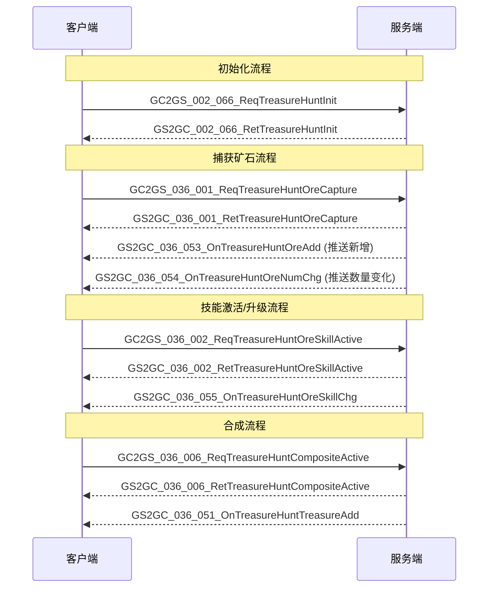
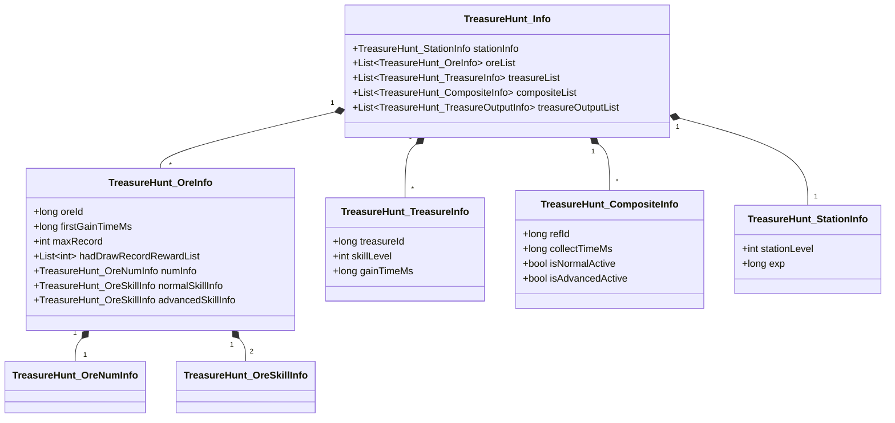

# 太空寻宝系统 - 协议文档

## 协议编号

模块编号：p036 (TreasureHuntOp)

主协议号：36 (0x24)

---

## 协议交互流程图



---

## 客户端请求协议 (GC2GS)

### GC2GS_036_001_ReqTreasureHuntOreCapture - 捕获矿石

**协议号**: 36-1

**说明**: 请求在指定区域捕获矿石

**请求字段**:

| 字段名 | 类型 | 说明 |
|-------|------|------|
| type | ETreasureHuntCaptureType | 捕获类型 (0普通/1单次一键/2多次一键/3数据分析) |
| isAdvance | bool | 是否高级捕获 |
| areaId | long | 区域ID |
| distance | long | 距离 |

**响应字段** (GS2GC_036_001_RetTreasureHuntOreCapture):

| 字段名 | 类型 | 说明 |
|-------|------|------|
| addExp | long | 获得经验值 |
| resultList | List\<TreasureHunt_CaptureResult\> | 捕获结果列表 |

**使用示例**:
```csharp
// 请求捕获矿石
NPPlayer.instance.treasureHuntComp.reqTreasureHuntOreCapture(
    ETreasureHuntCaptureType.NORMAL,
    false,  // 普通捕获
    areaId,
    distance,
    (isSucc, msg) => {
        if (isSucc) {
            Debug.Log($"捕获成功，获得经验: {msg.getAddExp()}");
        }
    }
);
```

---

### GC2GS_036_002_ReqTreasureHuntOreSkillActive - 激活矿石技能

**协议号**: 36-2

**说明**: 请求激活矿石的普通或高级技能

**请求字段**:

| 字段名 | 类型 | 说明 |
|-------|------|------|
| oreId | long | 矿石ID |
| isNormal | bool | true普通技能 / false高级技能 |

**使用示例**:
```csharp
NPPlayer.instance.treasureHuntComp.reqTreasureHuntOreSkillActive(
    oreId,
    true,  // 普通技能
    (isSucc, msg) => {
        if (isSucc) {
            Debug.Log("技能激活成功");
        }
    }
);
```

---

### GC2GS_036_003_ReqTreasureHuntOreSkillUpgrade - 升级矿石技能

**协议号**: 36-3

**说明**: 请求升级矿石技能

**请求字段**:

| 字段名 | 类型 | 说明 |
|-------|------|------|
| oreId | long | 矿石ID |
| isNormal | bool | true普通技能 / false高级技能 |

---

### GC2GS_036_004_ReqTreasureHuntTreasureSkillActive - 激活奇物技能

**协议号**: 36-4

**说明**: 请求激活奇物技能

**请求字段**:

| 字段名 | 类型 | 说明 |
|-------|------|------|
| treasureId | long | 奇物ID |

---

### GC2GS_036_005_ReqTreasureHuntTreasureSkillUpgrade - 升级奇物技能

**协议号**: 36-5

**说明**: 请求升级奇物技能

**请求字段**:

| 字段名 | 类型 | 说明 |
|-------|------|------|
| treasureId | long | 奇物ID |

---

### GC2GS_036_006_ReqTreasureHuntCompositeActive - 激活组合图鉴

**协议号**: 36-6

**说明**: 请求激活组合图鉴技能

**请求字段**:

| 字段名 | 类型 | 说明 |
|-------|------|------|
| compositeId | long | 组合图鉴ID |
| isNormal | bool | true普通技能 / false高级技能 |

**使用示例**:
```csharp
NPPlayer.instance.treasureHuntComp.reqTreasureHuntCompositeActive(
    compositeId,
    true,  // 普通技能
    (isSucc, msg) => {
        if (isSucc) {
            Debug.Log("组合图鉴技能激活成功");
        }
    }
);
```

---

### GC2GS_036_007_ReqTreasureHuntDrawOreRecordReward - 领取矿石记录奖励

**协议号**: 36-7

**说明**: 请求领取矿石记录达成奖励

**请求字段**:

| 字段名 | 类型 | 说明 |
|-------|------|------|
| oreId | long | 矿石ID |
| recordIndex | int | 记录档位索引 |

---

### GC2GS_036_008_ReqTreasureHuntDrawCapturePower - 领取捕获力

**协议号**: 36-8

**说明**: 请求领取捕获力恢复

**请求字段**: 无

---

### GC2GS_036_009_ReqTreasureHuntTransOre - 转换矿石

**协议号**: 36-9

**说明**: 请求将待处理矿石转换为资源

**请求字段**: 无

**使用示例**:
```csharp
NPPlayer.instance.treasureHuntComp.reqTreasureHuntTransOre((isSucc, msg) => {
    if (isSucc) {
        Debug.Log("矿石转换成功");
    }
});
```

---

### GC2GS_036_010_ReqTreasureHuntOreRankInfo - 请求矿石排行信息

**协议号**: 36-10

**说明**: 请求获取指定矿石的排行榜信息

**请求字段**:

| 字段名 | 类型 | 说明 |
|-------|------|------|
| oreId | long | 矿石ID |

---

### GC2GS_036_011_ReqTreasureHuntDrawTreasureOutput - 领取奇物产出

**协议号**: 36-11

**说明**: 请求领取奇物的钻石产出

**请求字段**:

| 字段名 | 类型 | 说明 |
|-------|------|------|
| treasureId | long | 奇物ID |

---

## 服务端响应/推送协议 (GS2GC)

### GS2GC_002_066_RetTreasureHuntInit - 初始化响应

**协议号**: 2-66

**说明**: 返回太空寻宝系统初始化数据

**响应字段**:

| 字段名 | 类型 | 说明 |
|-------|------|------|
| info | TreasureHunt_Info | 完整寻宝信息 |

---

### GS2GC_036_051_OnTreasureHuntTreasureAdd - 奇物新增通知

**协议号**: 36-51

**说明**: 服务端推送玩家获得新奇物

**字段**:

| 字段名 | 类型 | 说明 |
|-------|------|------|
| treasureInfo | TreasureHunt_TreasureInfo | 奇物信息 |

---

### GS2GC_036_052_OnTreasureHuntTreasureLevelChg - 奇物等级变化通知

**协议号**: 36-52

**说明**: 服务端推送奇物等级变化

**字段**:

| 字段名 | 类型 | 说明 |
|-------|------|------|
| treasureId | long | 奇物ID |
| level | int | 新等级 |

---

### GS2GC_036_053_OnTreasureHuntOreAdd - 矿石新增通知

**协议号**: 36-53

**说明**: 服务端推送玩家获得新矿石

**字段**:

| 字段名 | 类型 | 说明 |
|-------|------|------|
| oreInfo | TreasureHunt_OreInfo | 矿石信息 |

**客户端处理示例**:
```csharp
public void onTreasureHuntOreAdd(GS2GC_036_053_OnTreasureHuntOreAdd _msg)
{
    if(_msg == null || _msg.getOreInfo() == null)
        return;

    TreasureHuntGotOreInfo oreInfo = getGotOreInfo(_msg.getOreInfo().getOreId());
    if (oreInfo == null)
    {
        oreInfo = new TreasureHuntGotOreInfo(_msg.getOreInfo());
        _m_lGotOreInfoList.Add(oreInfo);
        _m_bonusMgr?.addOre(oreInfo);
        WinMsg.SendMsg(WinMsgType.ON_TREASURE_HUNT_UNLOCK_NORMAL_ORE, oreInfo);
    }
    else
    {
        _m_bonusMgr?.removeOre(oreInfo);
        oreInfo.updateInfo(_msg.getOreInfo());
        _m_bonusMgr?.addOre(oreInfo);
    }

    // 更新组合图鉴状态
    updateCompositeCatalogState(_msg.getOreInfo().getOreId());
    _m_redTipDealer?.refreshPendingOreRedTip();
}
```

---

### GS2GC_036_054_OnTreasureHuntOreNumChg - 矿石数量变化通知

**协议号**: 36-54

**说明**: 服务端推送矿石数量变化

**字段**:

| 字段名 | 类型 | 说明 |
|-------|------|------|
| oreId | long | 矿石ID |
| numInfo | TreasureHunt_OreNumInfo | 数量信息 |

---

### GS2GC_036_055_OnTreasureHuntOreSkillChg - 矿石技能变化通知

**协议号**: 36-55

**说明**: 服务端推送矿石技能变化

**字段**:

| 字段名 | 类型 | 说明 |
|-------|------|------|
| oreId | long | 矿石ID |
| isNormal | bool | 是否普通技能 |
| skillInfo | TreasureHunt_OreSkillInfo | 技能信息 |

---

### GS2GC_036_056_OnTreasureCompositeChg - 组合图鉴变化通知

**协议号**: 36-56

**说明**: 服务端推送组合图鉴状态变化

**字段**:

| 字段名 | 类型 | 说明 |
|-------|------|------|
| compositeInfo | TreasureHunt_CompositeInfo | 组合信息 |

---

### GS2GC_036_057_OnTreasureStationChg - 太空舱变化通知

**协议号**: 36-57

**说明**: 服务端推送太空舱信息变化

**字段**:

| 字段名 | 类型 | 说明 |
|-------|------|------|
| stationInfo | TreasureHunt_StationInfo | 太空舱信息 |

---

### GS2GC_036_058_OnTreasureHuntOreMaxRecordChg - 矿石最大记录变化通知

**协议号**: 36-58

**说明**: 服务端推送矿石最大捕获记录变化

**字段**:

| 字段名 | 类型 | 说明 |
|-------|------|------|
| oreId | long | 矿石ID |
| maxRecord | int | 新的最大记录 |

---

### GS2GC_036_059_OnTreasureHuntOreHadDrawRecordRewardChg - 记录奖励领取变化通知

**协议号**: 36-59

**说明**: 服务端推送矿石记录奖励领取状态变化

**字段**:

| 字段名 | 类型 | 说明 |
|-------|------|------|
| oreId | long | 矿石ID |
| hadDrawRecordRewardList | List\<int\> | 已领取奖励档位列表 |

---

### GS2GC_036_061_OnTreasureHuntTreasureOutputChg - 奇物产出变化通知

**协议号**: 36-61

**说明**: 服务端推送奇物产出信息变化

**字段**:

| 字段名 | 类型 | 说明 |
|-------|------|------|
| treasureOutputInfo | TreasureHunt_TreasureOutputInfo | 奇物产出信息 |

---

## 数据结构定义

### TreasureHunt_Info - 完整寻宝信息

| 字段名 | 类型 | 说明 |
|-------|------|------|
| stationInfo | TreasureHunt_StationInfo | 太空舱信息 |
| oreList | List\<TreasureHunt_OreInfo\> | 矿石列表 |
| treasureList | List\<TreasureHunt_TreasureInfo\> | 奇物列表 |
| compositeList | List\<TreasureHunt_CompositeInfo\> | 组合列表 |
| treasureOutputList | List\<TreasureHunt_TreasureOutputInfo\> | 奇物产出列表 |

---

### TreasureHunt_StationInfo - 太空舱信息

| 字段名 | 类型 | 说明 |
|-------|------|------|
| stationLevel | int | 太空舱等级 |
| exp | long | 经验值 |

---

### TreasureHunt_OreInfo - 矿石信息

| 字段名 | 类型 | 说明 |
|-------|------|------|
| oreId | long | 矿石ID |
| firstGainTimeMs | long | 首次获得时间(ms) |
| maxRecord | int | 最大记录 |
| hadDrawRecordRewardList | List\<int\> | 已领取奖励档位列表 |
| numInfo | TreasureHunt_OreNumInfo | 数量信息 |
| normalSkillInfo | TreasureHunt_OreSkillInfo | 普通技能信息 |
| advancedSkillInfo | TreasureHunt_OreSkillInfo | 高级技能信息 |

---

### TreasureHunt_OreNumInfo - 矿石数量信息

| 字段名 | 类型 | 说明 |
|-------|------|------|
| totalGainNum | int | 已获得总数 |
| normalPendingNum | int | 普通矿石待处理数量 |
| advancedPendingNum | int | 高级矿石待处理数量 |

---

### TreasureHunt_OreSkillInfo - 矿石技能信息

| 字段名 | 类型 | 说明 |
|-------|------|------|
| skillLevel | int | 技能等级 |
| skillPoint | int | 技能点数 |

---

### TreasureHunt_TreasureInfo - 奇物信息

| 字段名 | 类型 | 说明 |
|-------|------|------|
| treasureId | long | 奇物ID |
| skillLevel | int | 技能等级 |
| gainTimeMs | long | 获得时间(ms) |

---

### TreasureHunt_CompositeInfo - 组合信息

| 字段名 | 类型 | 说明 |
|-------|------|------|
| refId | long | 组合图鉴ID |
| collectTimeMs | long | 收集时间(ms) |
| isNormalActive | bool | 是否激活普通组合 |
| isAdvancedActive | bool | 是否激活高级组合 |

---

### TreasureHunt_TreasureOutputInfo - 奇物产出信息

| 字段名 | 类型 | 说明 |
|-------|------|------|
| treasureId | long | 奇物ID |
| nextCanDrawGemTimeMs | long | 下次可领取钻石时间(ms) |
| nextCanDrawGemNum | int | 下次可领取钻石数量 |

---

### TreasureHunt_CaptureResult - 捕获结果

| 字段名 | 类型 | 说明 |
|-------|------|------|
| captureRewardList | List\<TreasureHunt_CaptureReward\> | 捕获奖励列表 |

---

### TreasureHunt_CaptureReward - 捕获奖励

| 字段名 | 类型 | 说明 |
|-------|------|------|
| gainType | ETreasureHuntGainType | 获得类型 (ORE/TREASURE/REWARD) |
| data | byte[] | 具体数据(根据类型解析) |

---

## 枚举定义

### ETreasureHuntCaptureType - 捕获类型

| 值 | 名称 | 说明 |
|---|------|------|
| 0 | NORMAL | 普通捕获 |
| 1 | SINGLE_AKEY | 单次一键捕获 |
| 2 | MULTIPLE_AKEY | 多次一键捕获 |
| 3 | DATA_ANALYSE | 数据分析 |

---

### ETreasureHuntGainType - 获得类型

| 值 | 名称 | 说明 |
|---|------|------|
| 0 | NONE | 无 |
| 1 | ORE | 矿石 |
| 2 | TREASURE | 奇物 |
| 3 | REWARD | 奖励 |

---

## 协议类图



---

*文档生成时间: 2026-04-12*
