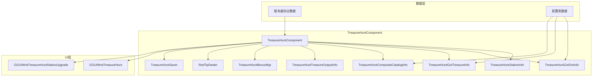
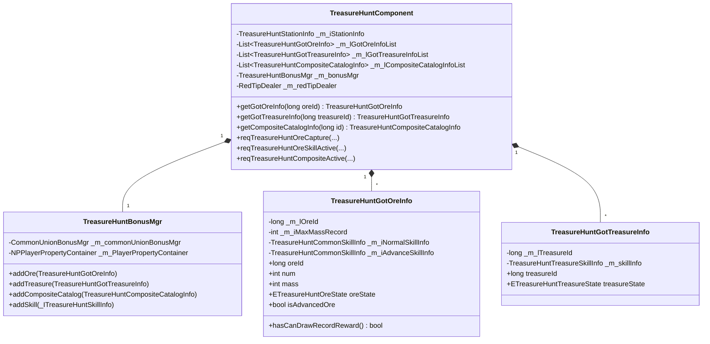

# 太空寻宝系统 - 客户端开发

## 组件架构图



---

## 文件结构

```
GameComponent/TreasureHunt/
├── TreasureHuntComponent.cs           # 太空寻宝主组件
├── TreasureHuntComponent_RedTipDealer.cs  # 红点处理
├── TreasureHuntBonusMgr.cs            # 属性加成管理器
├── TreasureHuntSaver.cs               # 本地存储
├── TreasureHuntUtil.cs                # 工具类
├── Ore/                               # 矿石相关
│   ├── _ITreasureHuntOreInfo.cs       # 矿石信息接口
│   ├── TreasureHuntGotOreInfo.cs      # 已获取矿石信息
│   ├── TreasureHuntCommonOreInfo.cs   # 通用矿石信息
│   └── TreasureHuntNotGetOreInfo.cs   # 未获取矿石信息
├── Treasure/                          # 奇物相关
│   ├── _ITreasureHuntTreasureInfo.cs  # 奇物信息接口
│   ├── TreasureHuntGotTreasureInfo.cs # 已获取奇物信息
│   ├── TreasureHuntNotGetTreasureInfo.cs # 未获取奇物信息
│   └── TreasureHuntTreasureOutputInfo.cs  # 奇物产出信息
├── Skill/                             # 技能相关
│   ├── _ITreasureHuntSkillInfo.cs     # 技能信息接口
│   ├── TreasureHuntCommonSkillInfo.cs # 通用技能信息
│   └── TreasureHuntTreasureSkillInfo.cs # 奇物技能信息
├── CompositeCatalog/                  # 组合图鉴相关
│   └── TreasureHuntCompositeCatalogInfo.cs
├── TreasureHuntStationInfo/           # 太空舱信息
│   └── TreasureHuntStationInfo.cs
└── CaptureResult/                     # 捕获结果
    ├── TreasureHuntCaptureResultBase.cs
    ├── TreasureHuntCaptureResultOre.cs
    ├── TreasureHuntCaptureResultTreasure.cs
    └── TreasureHuntCaptureResultReward.cs
```

---

## 核心类详解

### TreasureHuntComponent - 主组件

**继承关系**: `_ANPBasicPlayerComponent`

**主要职责**:
- 管理太空寻宝所有数据
- 处理服务器协议响应
- 提供数据访问接口
- 管理属性加成

**主要属性**:

| 属性名 | 类型 | 说明 |
|-------|------|------|
| stationInfo | TreasureHuntStationInfo | 太空舱信息 |
| gotOreInfoList | List\<TreasureHuntGotOreInfo\> | 已获取矿石列表 |
| gotTreasureInfoList | List\<TreasureHuntGotTreasureInfo\> | 已获取奇物列表 |
| compositeCatalogInfoList | List\<TreasureHuntCompositeCatalogInfo\> | 组合图鉴列表 |
| treasureOutputInfoList | List\<TreasureHuntTreasureOutputInfo\> | 奇物产出列表 |
| redTipDealer | RedTipDealer | 红点处理器 |
| saver | TreasureHuntSaver | 本地存储 |

**代码示例**:
```csharp
// 获取组件
var comp = NPPlayer.instance.treasureHuntComp;

// 获取太空舱信息
var stationInfo = comp.stationInfo;
Debug.Log($"太空舱等级: {stationInfo.stationLevel}, 经验: {stationInfo.exp}");

// 获取矿石列表
var oreList = comp.getGotOreInfoList();
foreach (var ore in oreList)
{
    Debug.Log($"矿石ID: {ore.oreId}, 数量: {ore.num}, 质量: {ore.mass}");
}

// 获取奇物列表
var treasureList = comp.getGotTreasureInfoList();
foreach (var treasure in treasureList)
{
    Debug.Log($"奇物ID: {treasure.treasureId}, 状态: {treasure.treasureState}");
}
```

---

### TreasureHuntGotOreInfo - 已获取矿石信息

**主要属性**:

| 属性名 | 类型 | 说明 |
|-------|------|------|
| oreId | long | 矿石ID |
| oreRefObj | TreasureHuntOreRefObj | 矿石配置引用 |
| oreState | ETreasureHuntOreState | 矿石状态 |
| num | int | 总数量 |
| mass | int | 最大质量记录 |
| getTimeMs | long | 获取时间 |
| normalSkillInfo | _ITreasureHuntSkillInfo | 普通技能信息 |
| advanceSkillInfo | _ITreasureHuntSkillInfo | 高级技能信息 |
| normalPendingOreInfo | TreasureHuntCommonOreInfo | 普通待处理矿石 |
| advancePendingOreInfo | TreasureHuntCommonOreInfo | 高级待处理矿石 |
| isAdvancedOre | bool | 是否达到高级矿石质量 |

**使用示例**:
```csharp
// 获取矿石信息
TreasureHuntGotOreInfo oreInfo = comp.getGotOreInfo(oreId);
if (oreInfo != null)
{
    // 检查矿石状态
    if (oreInfo.oreState == ETreasureHuntOreState.ACTIVATED_ADVANCED)
    {
        Debug.Log("高级矿石已激活");
    }

    // 检查是否有可领取的记录奖励
    if (oreInfo.hasCanDrawRecordReward())
    {
        Debug.Log("有可领取的记录奖励");
    }

    // 获取待处理矿石数量
    int pendingCount = oreInfo.normalPendingOreInfo?.num ?? 0;
    pendingCount += oreInfo.advancePendingOreInfo?.num ?? 0;
    Debug.Log($"待处理矿石数量: {pendingCount}");
}
```

---

### TreasureHuntGotTreasureInfo - 已获取奇物信息

**主要属性**:

| 属性名 | 类型 | 说明 |
|-------|------|------|
| treasureId | long | 奇物ID |
| treasureRefObj | TreasureHuntTreasureRefObj | 奇物配置引用 |
| treasureOutputRefObj | TreasureHuntTreasureOutputRefObj | 产出配置引用 |
| treasureState | ETreasureHuntTreasureState | 奇物状态 |
| gainTimeMs | long | 获得时间 |
| skillInfo | _ITreasureHuntSkillInfo | 技能信息 |

---

### TreasureHuntCompositeCatalogInfo - 组合图鉴信息

**主要属性**:

| 属性名 | 类型 | 说明 |
|-------|------|------|
| compositeCatalogId | long | 组合图鉴ID |
| state | ETreasureHuntCompositeCatalogState | 组合状态 |
| oreIdList | List\<long\> | 包含矿石ID列表 |
| normalSkillInfo | _ITreasureHuntSkillInfo | 普通技能信息 |
| advancedSkillInfo | _ITreasureHuntSkillInfo | 高级技能信息 |
| isCollected | bool | 是否已集齐 |

---

## 请求方法

### 捕获矿石

```csharp
/// <summary>
/// 请求捕获矿石
/// </summary>
/// <param name="_type">捕获类型</param>
/// <param name="_isAdvance">是否高级</param>
/// <param name="_areaId">区域ID</param>
/// <param name="_distance">距离</param>
/// <param name="_callBack">回调</param>
public void reqTreasureHuntOreCapture(
    ETreasureHuntCaptureType _type,
    bool _isAdvance,
    long _areaId,
    long _distance,
    Action<bool, GS2GC_036_001_RetTreasureHuntOreCapture> _callBack)
```

**使用示例**:
```csharp
// 普通捕获
NPPlayer.instance.treasureHuntComp.reqTreasureHuntOreCapture(
    ETreasureHuntCaptureType.NORMAL,
    false,
    areaId,
    distance,
    (isSucc, msg) =>
    {
        if (isSucc)
        {
            Debug.Log($"捕获成功，获得经验: {msg.getAddExp()}");
            // 处理捕获结果
            foreach (var result in msg.getResultList())
            {
                foreach (var reward in result.getCaptureRewardList())
                {
                    Debug.Log($"获得: {reward.getGainType()}, 数据: {reward.getData()}");
                }
            }
        }
        else
        {
            Debug.Log("捕获失败");
        }
    }
);
```

---

### 激活/升级矿石技能

```csharp
/// <summary>
/// 请求激活矿石技能
/// </summary>
public void reqTreasureHuntOreSkillActive(
    long _oreId,
    bool _isNormal,
    Action<bool, GS2GC_036_002_RetTreasureHuntOreSkillActive> _callBack)

/// <summary>
/// 请求升级矿石技能
/// </summary>
public void reqTreasureHuntOreSkillUpgrade(
    long _oreId,
    bool _isNormal,
    Action<bool, GS2GC_036_003_RetTreasureHuntOreSkillUpgrade> _callBack)
```

**使用示例**:
```csharp
// 激活普通技能
NPPlayer.instance.treasureHuntComp.reqTreasureHuntOreSkillActive(
    oreId,
    true,  // 普通技能
    (isSucc, msg) =>
    {
        if (isSucc)
        {
            Debug.Log("技能激活成功");
        }
    }
);

// 升级高级技能
NPPlayer.instance.treasureHuntComp.reqTreasureHuntOreSkillUpgrade(
    oreId,
    false,  // 高级技能
    (isSucc, msg) =>
    {
        if (isSucc)
        {
            Debug.Log("技能升级成功");
        }
    }
);
```

---

### 激活组合图鉴

```csharp
/// <summary>
/// 请求激活组合图鉴技能
/// </summary>
public void reqTreasureHuntCompositeActive(
    long _compositeCatalogId,
    bool _isNormal,
    Action<bool, GS2GC_036_006_RetTreasureHuntCompositeActive> _callBack)
```

---

### 领取矿石记录奖励

```csharp
/// <summary>
/// 请求领取矿石记录奖励
/// </summary>
public void reqTreasureHuntDrawOreRecordReward(
    long _oreId,
    int _recordIndex,
    Action<bool, GS2GC_036_007_RetTreasureHuntDrawOreRecordReward> _callBack)
```

**使用示例**:
```csharp
NPPlayer.instance.treasureHuntComp.reqTreasureHuntDrawOreRecordReward(
    oreId,
    0,  // 第一个档位
    (isSucc, msg) =>
    {
        if (isSucc)
        {
            Debug.Log("领取记录奖励成功");
        }
    }
);
```

---

### 领取奇物产出

```csharp
/// <summary>
/// 请求领取奇物产出
/// </summary>
public void reqTreasureHuntDrawTreasureOutput(
    long _treasureId,
    Action<bool, GS2GC_036_011_RetTreasureHuntDrawTreasureOutput> _callBack)
```

---

### 转换矿石

```csharp
/// <summary>
/// 请求转换矿石
/// </summary>
public void reqTreasureHuntTransOre(
    Action<bool, GS2GC_036_009_RetTreasureHuntTransOre> _callBack)
```

---

## 消息监听

### WinMsg 消息类型

| 消息类型 | 说明 | 参数 |
|---------|------|------|
| ON_TREASURE_HUNT_UNLOCK_NORMAL_ORE | 解锁普通矿石 | TreasureHuntGotOreInfo |
| ON_TREASURE_HUNT_UNLOCK_ADVANCED_ORE | 解锁高级矿石 | TreasureHuntGotOreInfo |
| ON_TREASURE_HUNT_UNLOCK_TREASURE | 解锁奇物 | TreasureHuntGotTreasureInfo |
| ON_TREASURE_HUNT_UNLOCK_NORMAL_COMPOSITE_CATALOG | 解锁普通组合图鉴 | TreasureHuntCompositeCatalogInfo |
| ON_TREASURE_HUNT_UNLOCK_ADVANCED_COMPOSITE_CATALOG | 解锁高级组合图鉴 | TreasureHuntCompositeCatalogInfo |
| ON_TREASURE_HUNT_TREASURE_LEVEL_CHG | 奇物等级变化 | TreasureHuntGotTreasureInfo |
| ON_TREASURE_HUNT_ORE_SKILL_CHG | 矿石技能变化 | oreInfo, isNormal |
| ON_TREASURE_HUNT_COMPOSITE_CATALOG_CHG | 组合图鉴变化 | TreasureHuntCompositeCatalogInfo |
| ON_TREASURE_HUNT_STATION_CHG | 太空舱变化 | - |
| ON_TREASURE_HUNT_STATION_LVL_CHG | 太空舱等级变化 | - |
| ON_TREASURE_HUNT_ORE_MAX_RECORD_CHG | 矿石最大记录变化 | TreasureHuntGotOreInfo |
| ON_TREASURE_HUNT_ORE_HAD_DRAW_RECORD_REWARD_CHG | 记录奖励领取变化 | TreasureHuntGotOreInfo |
| ON_TREASURE_HUNT_TREASURE_OUTPUT_CHG | 奇物产出变化 | TreasureHuntTreasureOutputInfo |

**使用示例**:
```csharp
// 监听矿石解锁
WinMsg.RegMsg(WinMsgType.ON_TREASURE_HUNT_UNLOCK_NORMAL_ORE, (TreasureHuntGotOreInfo oreInfo) =>
{
    Debug.Log($"解锁新矿石: {oreInfo.oreId}");
    // 显示解锁动画
});

// 监听太空舱等级变化
WinMsg.RegMsg(WinMsgType.ON_TREASURE_HUNT_STATION_LVL_CHG, () =>
{
    Debug.Log("太空舱升级了！");
    // 刷新UI
});
```

---

## 红点系统

### RedTipDealer 红点处理器

```csharp
// 获取红点处理器
var redTipDealer = NPPlayer.instance.treasureHuntComp.redTipDealer;

// 刷新红点
redTipDealer.refreshPendingOreRedTip();
redTipDealer.refreshUnlockNewAreaRedTip();
```

---

## 属性加成

### 获取玩家属性容器

```csharp
// 获取属性加成容器
var propertyContainer = NPPlayer.instance.treasureHuntComp.getPlayerPropertyContainer();

// 获取属性值
var attackBonus = propertyContainer.getPropertyValue(EPlayerProperty.ATTACK);
```

---

## 枚举定义

### ETreasureHuntOreState - 矿石状态

| 值 | 名称 | 说明 |
|---|------|------|
| 0 | NONE | 无 |
| 1 | NOT_ACTIVATE_NORMAL | 未激活普通矿石 |
| 2 | ACTIVATED_NORMAL | 已激活普通矿石 |
| 3 | NOT_ACTIVATE_ADVANCED | 未激活高级矿石 |
| 4 | ACTIVATED_ADVANCED | 已激活高级矿石 |

### ETreasureHuntTreasureState - 奇物状态

| 值 | 名称 | 说明 |
|---|------|------|
| 0 | NONE | 无 |
| 1 | GOT_NOT_ACTIVATE | 已获取未激活 |
| 2 | GOT_ACTIVATED | 已获取已激活 |

### ETreasureHuntSkillState - 技能状态

| 值 | 名称 | 说明 |
|---|------|------|
| 0 | LOCK | 锁定 |
| 1 | UNLOCK_NOT_ACTIVATE | 解锁未激活 |
| 2 | ACTIVATED | 已激活 |

### ETreasureHuntCompositeCatalogState - 组合图鉴状态

| 值 | 名称 | 说明 |
|---|------|------|
| 0 | NONE | 无 |
| 1 | NOT_GET | 未获取 |
| 2 | GOT_NORMAL | 已获取普通 |
| 3 | GOT_ADVANCED | 已获取高级 |

---

## 类图



---

*文档生成时间: 2026-04-12*
