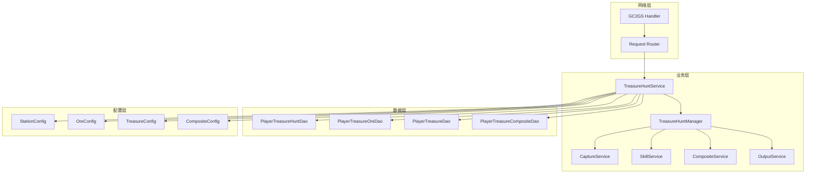

# 太空寻宝系统 - 服务端开发

## 服务端架构图



---

## 数据存储

### 1. 太空舱数据表 (player_treasure_hunt)

| 字段名 | 类型 | 说明 | 索引 |
|-------|------|------|------|
| id | bigint | 主键 | PK |
| player_id | bigint | 玩家ID | IDX |
| station_level | int | 太空舱等级 | - |
| exp | bigint | 经验值 | - |
| update_time | datetime | 更新时间 | - |
| create_time | datetime | 创建时间 | - |

**SQL示例**:
```sql
CREATE TABLE `player_treasure_hunt` (
  `id` bigint(20) NOT NULL AUTO_INCREMENT,
  `player_id` bigint(20) NOT NULL COMMENT '玩家ID',
  `station_level` int(11) NOT NULL DEFAULT '1' COMMENT '太空舱等级',
  `exp` bigint(20) NOT NULL DEFAULT '0' COMMENT '经验值',
  `update_time` datetime NOT NULL COMMENT '更新时间',
  `create_time` datetime NOT NULL COMMENT '创建时间',
  PRIMARY KEY (`id`),
  UNIQUE KEY `idx_player_id` (`player_id`)
) ENGINE=InnoDB DEFAULT CHARSET=utf8mb4 COMMENT='太空寻宝-太空舱数据';
```

---

### 2. 矿石数据表 (player_treasure_ore)

| 字段名 | 类型 | 说明 | 索引 |
|-------|------|------|------|
| id | bigint | 主键 | PK |
| player_id | bigint | 玩家ID | IDX |
| ore_id | bigint | 矿石ID | IDX |
| first_gain_time | datetime | 首次获得时间 | - |
| total_gain_num | int | 总获取数量 | - |
| normal_pending_num | int | 普通待处理数量 | - |
| advanced_pending_num | int | 高级待处理数量 | - |
| max_record | int | 最大质量记录 | - |
| normal_skill_level | int | 普通技能等级 | - |
| normal_skill_point | int | 普通技能点数 | - |
| advanced_skill_level | int | 高级技能等级 | - |
| advanced_skill_point | int | 高级技能点数 | - |
| had_draw_record_reward | varchar(255) | 已领取奖励档位 | - |
| update_time | datetime | 更新时间 | - |

**SQL示例**:
```sql
CREATE TABLE `player_treasure_ore` (
  `id` bigint(20) NOT NULL AUTO_INCREMENT,
  `player_id` bigint(20) NOT NULL COMMENT '玩家ID',
  `ore_id` bigint(20) NOT NULL COMMENT '矿石ID',
  `first_gain_time` datetime DEFAULT NULL COMMENT '首次获得时间',
  `total_gain_num` int(11) NOT NULL DEFAULT '0' COMMENT '总获取数量',
  `normal_pending_num` int(11) NOT NULL DEFAULT '0' COMMENT '普通待处理数量',
  `advanced_pending_num` int(11) NOT NULL DEFAULT '0' COMMENT '高级待处理数量',
  `max_record` int(11) NOT NULL DEFAULT '0' COMMENT '最大质量记录',
  `normal_skill_level` int(11) NOT NULL DEFAULT '0' COMMENT '普通技能等级',
  `normal_skill_point` int(11) NOT NULL DEFAULT '0' COMMENT '普通技能点数',
  `advanced_skill_level` int(11) NOT NULL DEFAULT '0' COMMENT '高级技能等级',
  `advanced_skill_point` int(11) NOT NULL DEFAULT '0' COMMENT '高级技能点数',
  `had_draw_record_reward` varchar(255) DEFAULT '' COMMENT '已领取奖励档位JSON',
  `update_time` datetime NOT NULL COMMENT '更新时间',
  `create_time` datetime NOT NULL COMMENT '创建时间',
  PRIMARY KEY (`id`),
  UNIQUE KEY `idx_player_ore` (`player_id`, `ore_id`),
  KEY `idx_player_id` (`player_id`)
) ENGINE=InnoDB DEFAULT CHARSET=utf8mb4 COMMENT='太空寻宝-矿石数据';
```

---

### 3. 奇物数据表 (player_treasure)

| 字段名 | 类型 | 说明 | 索引 |
|-------|------|------|------|
| id | bigint | 主键 | PK |
| player_id | bigint | 玩家ID | IDX |
| treasure_id | bigint | 奇物ID | IDX |
| skill_level | int | 技能等级 | - |
| gain_time | datetime | 获得时间 | - |
| last_output_time | datetime | 上次产出时间 | - |
| update_time | datetime | 更新时间 | - |

**SQL示例**:
```sql
CREATE TABLE `player_treasure` (
  `id` bigint(20) NOT NULL AUTO_INCREMENT,
  `player_id` bigint(20) NOT NULL COMMENT '玩家ID',
  `treasure_id` bigint(20) NOT NULL COMMENT '奇物ID',
  `skill_level` int(11) NOT NULL DEFAULT '0' COMMENT '技能等级',
  `gain_time` datetime DEFAULT NULL COMMENT '获得时间',
  `last_output_time` datetime DEFAULT NULL COMMENT '上次产出时间',
  `update_time` datetime NOT NULL COMMENT '更新时间',
  `create_time` datetime NOT NULL COMMENT '创建时间',
  PRIMARY KEY (`id`),
  UNIQUE KEY `idx_player_treasure` (`player_id`, `treasure_id`),
  KEY `idx_player_id` (`player_id`)
) ENGINE=InnoDB DEFAULT CHARSET=utf8mb4 COMMENT='太空寻宝-奇物数据';
```

---

### 4. 组合图鉴数据表 (player_treasure_composite)

| 字段名 | 类型 | 说明 | 索引 |
|-------|------|------|------|
| id | bigint | 主键 | PK |
| player_id | bigint | 玩家ID | IDX |
| composite_id | bigint | 组合ID | IDX |
| collect_time | datetime | 收集时间 | - |
| is_normal_active | tinyint | 普通是否激活 | - |
| is_advanced_active | tinyint | 高级是否激活 | - |
| update_time | datetime | 更新时间 | - |

---

## 核心服务实现

### TreasureHuntService - 主服务类

```java
@Service
public class TreasureHuntService {

    @Autowired
    private TreasureHuntManager treasureHuntManager;

    @Autowired
    private PlayerTreasureHuntDao treasureHuntDao;

    @Autowired
    private PlayerTreasureOreDao oreDao;

    /**
     * 初始化玩家太空寻宝数据
     */
    public TreasureHuntInfo initTreasureHunt(long playerId) {
        // 1. 获取或创建太空舱数据
        PlayerTreasureHunt station = treasureHuntDao.selectByPlayerId(playerId);
        if (station == null) {
            station = createDefaultStation(playerId);
            treasureHuntDao.insert(station);
        }

        // 2. 获取矿石列表
        List<PlayerTreasureOre> oreList = oreDao.selectByPlayerId(playerId);

        // 3. 获取奇物列表
        List<PlayerTreasure> treasureList = treasureDao.selectByPlayerId(playerId);

        // 4. 获取组合图鉴列表
        List<PlayerTreasureComposite> compositeList = compositeDao.selectByPlayerId(playerId);

        // 5. 获取奇物产出列表
        List<TreasureOutputInfo> outputList = calculateTreasureOutput(treasureList);

        // 6. 构建返回数据
        return buildTreasureHuntInfo(station, oreList, treasureList, compositeList, outputList);
    }
}
```

---

### 捕获矿石逻辑

```java
@Service
public class CaptureService {

    /**
     * 捕获矿石
     * @param playerId 玩家ID
     * @param type 捕获类型
     * @param isAdvance 是否高级
     * @param areaId 区域ID
     * @param distance 距离
     */
    public CaptureResult captureOre(long playerId, ETreasureHuntCaptureType type,
                                    boolean isAdvance, long areaId, long distance) {
        CaptureResult result = new CaptureResult();

        // 1. 获取区域配置
        TreasureAreaConfig areaConfig = configService.getAreaConfig(areaId);
        if (areaConfig == null) {
            throw new BusinessException(ErrorCode.AREA_NOT_FOUND, "区域不存在");
        }

        // 2. 检查区域是否解锁
        if (!checkAreaUnlocked(playerId, areaConfig)) {
            throw new BusinessException(ErrorCode.AREA_LOCKED, "区域未解锁");
        }

        // 3. 根据捕获类型执行捕获
        switch (type) {
            case NORMAL:
                result = captureSingle(playerId, areaConfig, isAdvance);
                break;
            case SINGLE_AKEY:
                result = captureOneKey(playerId, areaConfig, isAdvance, 1);
                break;
            case MULTIPLE_AKEY:
                int captureCount = calculateMaxCaptureCount(playerId);
                result = captureOneKey(playerId, areaConfig, isAdvance, captureCount);
                break;
            case DATA_ANALYSE:
                result = captureWithAnalysis(playerId, areaConfig, isAdvance);
                break;
        }

        // 4. 增加经验值
        long addExp = calculateExp(result);
        addStationExp(playerId, addExp);
        result.setAddExp(addExp);

        // 5. 推送捕获结果
        pushCaptureResult(playerId, result);

        return result;
    }

    /**
     * 单次捕获
     */
    private CaptureResult captureSingle(long playerId, TreasureAreaConfig areaConfig,
                                        boolean isAdvance) {
        CaptureResult result = new CaptureResult();

        // 1. 随机选择奖励类型
        ETreasureHuntGainType gainType = randomGainType(areaConfig, isAdvance);

        // 2. 根据类型获取具体奖励
        TreasureHunt_CaptureReward reward = new TreasureHunt_CaptureReward();
        reward.setGainType(gainType);

        switch (gainType) {
            case ORE:
                reward.setData(captureOreReward(playerId, areaConfig, isAdvance));
                break;
            case TREASURE:
                reward.setData(captureTreasureReward(playerId, areaConfig));
                break;
            case REWARD:
                reward.setData(captureDirectReward(playerId, areaConfig));
                break;
        }

        result.addReward(reward);
        return result;
    }

    /**
     * 随机选择奖励类型
     */
    private ETreasureHuntGainType randomGainType(TreasureAreaConfig config, boolean isAdvance) {
        int totalWeight = config.getOreWeight() + config.getTreasureWeight() + config.getRewardWeight();
        int random = ThreadLocalRandom.current().nextInt(totalWeight);

        if (random < config.getOreWeight()) {
            return ETreasureHuntGainType.ORE;
        } else if (random < config.getOreWeight() + config.getTreasureWeight()) {
            return ETreasureHuntGainType.TREASURE;
        } else {
            return ETreasureHuntGainType.REWARD;
        }
    }

    /**
     * 捕获矿石奖励
     */
    private byte[] captureOreReward(long playerId, TreasureAreaConfig config, boolean isAdvance) {
        // 1. 从矿石池随机选择矿石
        OrePoolItem oreItem = weightedSelect(config.getOrePool());
        TreasureOreConfig oreConfig = configService.getOreConfig(oreItem.getOreId());

        // 2. 计算捕获数量
        int count = ThreadLocalRandom.current().nextInt(oreItem.getMinCount(), oreItem.getMaxCount() + 1);

        // 3. 计算质量(用于记录)
        int mass = calculateMass(oreConfig, count);

        // 4. 更新玩家矿石数据
        PlayerTreasureOre ore = oreDao.selectByPlayerAndOre(playerId, oreItem.getOreId());
        boolean isNewOre = (ore == null);
        if (isNewOre) {
            ore = createNewOre(playerId, oreItem.getOreId());
        }

        ore.setTotalGainNum(ore.getTotalGainNum() + count);
        if (isAdvance) {
            ore.setAdvancedPendingNum(ore.getAdvancedPendingNum() + count);
        } else {
            ore.setNormalPendingNum(ore.getNormalPendingNum() + count);
        }

        // 更新最大记录
        if (mass > ore.getMaxRecord()) {
            ore.setMaxRecord(mass);
            // 推送最大记录变化
            pushMaxRecordChange(playerId, oreItem.getOreId(), mass);
        }

        oreDao.saveOrUpdate(ore);

        // 5. 构建返回数据
        TreasureHunt_CaptureResult_Ore oreResult = new TreasureHunt_CaptureResult_Ore();
        oreResult.setOreId(oreItem.getOreId());
        oreResult.setCount(count);
        oreResult.setMass(mass);
        oreResult.setIsNew(isNewOre);

        return oreResult.makePackage();
    }
}
```

---

### 技能服务

```java
@Service
public class SkillService {

    /**
     * 激活矿石技能
     */
    public void activateOreSkill(long playerId, long oreId, boolean isNormal) {
        // 1. 获取矿石数据
        PlayerTreasureOre ore = oreDao.selectByPlayerAndOre(playerId, oreId);
        if (ore == null) {
            throw new BusinessException(ErrorCode.ORE_NOT_FOUND, "矿石不存在");
        }

        // 2. 获取技能配置
        TreasureOreConfig oreConfig = configService.getOreConfig(oreId);
        int skillId = isNormal ? oreConfig.getNormalSkillId() : oreConfig.getAdvancedSkillId();
        TreasureSkillConfig skillConfig = configService.getSkillConfig(skillId);

        // 3. 检查是否可激活
        if (isNormal) {
            if (ore.getNormalSkillLevel() > 0) {
                throw new BusinessException(ErrorCode.SKILL_ALREADY_ACTIVATED, "技能已激活");
            }
        } else {
            // 高级技能需要达到高级矿石质量
            if (!oreConfig.isReachAdvanceOreMass(ore.getMaxRecord())) {
                throw new BusinessException(ErrorCode.ADVANCED_SKILL_LOCKED, "高级技能未解锁");
            }
            if (ore.getAdvancedSkillLevel() > 0) {
                throw new BusinessException(ErrorCode.SKILL_ALREADY_ACTIVATED, "技能已激活");
            }
        }

        // 4. 检查激活消耗
        List<CostItem> costItems = skillConfig.getUnlockCost();
        if (!costService.checkCost(playerId, costItems)) {
            throw new BusinessException(ErrorCode.COST_NOT_ENOUGH, "消耗不足");
        }

        // 5. 扣除消耗
        costService.costItems(playerId, costItems);

        // 6. 更新技能等级
        if (isNormal) {
            ore.setNormalSkillLevel(1);
        } else {
            ore.setAdvancedSkillLevel(1);
        }
        oreDao.update(ore);

        // 7. 推送技能变化
        pushSkillChange(playerId, oreId, isNormal, 1);

        // 8. 触发属性加成更新
        eventBus.publish(new TreasureHuntSkillActivateEvent(playerId, oreId, isNormal));
    }

    /**
     * 升级矿石技能
     */
    public void upgradeOreSkill(long playerId, long oreId, boolean isNormal) {
        // 1. 获取矿石数据
        PlayerTreasureOre ore = oreDao.selectByPlayerAndOre(playerId, oreId);
        if (ore == null) {
            throw new BusinessException(ErrorCode.ORE_NOT_FOUND, "矿石不存在");
        }

        // 2. 获取当前技能等级
        int currentLevel = isNormal ? ore.getNormalSkillLevel() : ore.getAdvancedSkillLevel();
        if (currentLevel <= 0) {
            throw new BusinessException(ErrorCode.SKILL_NOT_ACTIVATED, "技能未激活");
        }

        // 3. 获取技能配置
        TreasureOreConfig oreConfig = configService.getOreConfig(oreId);
        int skillId = isNormal ? oreConfig.getNormalSkillId() : oreConfig.getAdvancedSkillId();
        TreasureSkillConfig skillConfig = configService.getSkillConfig(skillId);

        // 4. 检查是否满级
        if (currentLevel >= skillConfig.getMaxLevel()) {
            throw new BusinessException(ErrorCode.SKILL_MAX_LEVEL, "技能已满级");
        }

        // 5. 检查技能点
        int skillPoint = isNormal ? ore.getNormalSkillPoint() : ore.getAdvancedSkillPoint();
        if (skillPoint <= 0) {
            throw new BusinessException(ErrorCode.SKILL_POINT_NOT_ENOUGH, "技能点不足");
        }

        // 6. 扣除技能点
        if (isNormal) {
            ore.setNormalSkillPoint(ore.getNormalSkillPoint() - 1);
            ore.setNormalSkillLevel(ore.getNormalSkillLevel() + 1);
        } else {
            ore.setAdvancedSkillPoint(ore.getAdvancedSkillPoint() - 1);
            ore.setAdvancedSkillLevel(ore.getAdvancedSkillLevel() + 1);
        }
        oreDao.update(ore);

        // 7. 推送技能变化
        pushSkillChange(playerId, oreId, isNormal, currentLevel + 1);

        // 8. 触发属性加成更新
        eventBus.publish(new TreasureHuntSkillUpgradeEvent(playerId, oreId, isNormal));
    }
}
```

---

### 奇物产出服务

```java
@Service
public class OutputService {

    /**
     * 计算奇物产出
     */
    @Scheduled(fixedRate = 60000) // 每分钟执行一次
    public void calculateTreasureOutput() {
        // 获取所有需要计算的玩家
        List<Long> playerIds = treasureDao.selectPlayerIdsWithOutput();

        for (Long playerId : playerIds) {
            try {
                calculatePlayerTreasureOutput(playerId);
            } catch (Exception e) {
                log.error("计算玩家奇物产出失败: playerId={}", playerId, e);
            }
        }
    }

    /**
     * 计算玩家奇物产出
     */
    private void calculatePlayerTreasureOutput(long playerId) {
        List<PlayerTreasure> treasures = treasureDao.selectByPlayerId(playerId);

        for (PlayerTreasure treasure : treasures) {
            TreasureConfig config = configService.getTreasureConfig(treasure.getTreasureId());
            if (config == null || config.getOutputCycle() <= 0) {
                continue;
            }

            // 计算产出周期数
            long elapsed = System.currentTimeMillis() - treasure.getLastOutputTime().getTime();
            int cycles = (int) (elapsed / (config.getOutputCycle() * 1000));

            if (cycles <= 0) {
                continue;
            }

            // 限制最大累积
            cycles = Math.min(cycles, config.getMaxAccumulate());

            // 更新产出时间
            treasure.setLastOutputTime(new Date(treasure.getLastOutputTime().getTime() + cycles * config.getOutputCycle() * 1000));
            treasureDao.update(treasure);

            // 计算产出数量
            int outputGem = (int) (config.getOutputGem() * (1 + config.getOutputGemLevelBonus() * treasure.getSkillLevel()));
            int totalGem = outputGem * cycles;

            // 推送产出变化
            pushOutputChange(playerId, treasure.getTreasureId(), totalGem);
        }
    }

    /**
     * 领取奇物产出
     */
    public void drawTreasureOutput(long playerId, long treasureId) {
        // 1. 获取产出信息
        TreasureOutputInfo outputInfo = outputDao.selectByPlayerAndTreasure(playerId, treasureId);
        if (outputInfo == null || outputInfo.getGemNum() <= 0) {
            throw new BusinessException(ErrorCode.NO_OUTPUT_TO_DRAW, "无可领取产出");
        }

        // 2. 发放钻石
        int gemNum = outputInfo.getGemNum();
        itemService.giveItem(playerId, ItemType.GEM, 0, gemNum);

        // 3. 清空产出
        outputInfo.setGemNum(0);
        outputInfo.setNextCanDrawTime(null);
        outputDao.update(outputInfo);

        // 4. 推送领取结果
        pushOutputDrawn(playerId, treasureId, gemNum);
    }
}
```

---

## 推送协议

### 推送工具类

```java
@Component
public class TreasureHuntPusher {

    /**
     * 推送矿石新增
     */
    public void pushOreAdd(long playerId, PlayerTreasureOre ore) {
        GS2GC_036_053_OnTreasureHuntOreAdd msg = new GS2GC_036_053_OnTreasureHuntOreAdd();
        msg.setOreInfo(buildOreInfo(ore));
        pushService.push(playerId, msg);
    }

    /**
     * 推送矿石数量变化
     */
    public void pushOreNumChange(long playerId, long oreId, TreasureHunt_OreNumInfo numInfo) {
        GS2GC_036_054_OnTreasureHuntOreNumChg msg = new GS2GC_036_054_OnTreasureHuntOreNumChg();
        msg.setOreId(oreId);
        msg.setNumInfo(numInfo);
        pushService.push(playerId, msg);
    }

    /**
     * 推送最大记录变化
     */
    public void pushMaxRecordChange(long playerId, long oreId, int maxRecord) {
        GS2GC_036_058_OnTreasureHuntOreMaxRecordChg msg = new GS2GC_036_058_OnTreasureHuntOreMaxRecordChg();
        msg.setOreId(oreId);
        msg.setMaxRecord(maxRecord);
        pushService.push(playerId, msg);
    }

    /**
     * 推送奇物新增
     */
    public void pushTreasureAdd(long playerId, PlayerTreasure treasure) {
        GS2GC_036_051_OnTreasureHuntTreasureAdd msg = new GS2GC_036_051_OnTreasureHuntTreasureAdd();
        msg.setTreasureInfo(buildTreasureInfo(treasure));
        pushService.push(playerId, msg);
    }
}
```

---

## 定时任务

| 任务名 | 执行频率 | 说明 |
|-------|---------|------|
| CapturePowerRecoverTask | 每5分钟 | 捕获力自动恢复 |
| TreasureOutputTask | 每1分钟 | 奇物产出计算 |
| StationUpgradeCheckTask | 每1小时 | 太空舱升级检查 |

---

## 注意事项

1. **捕获力恢复**: 需要考虑玩家离线时间的恢复
2. **矿石质量**: 每次捕获都可能刷新最大记录
3. **技能解锁**: 高级技能需要达到对应矿石质量
4. **产出累积**: 奇物产出有累积上限
5. **数据一致性**: 多表操作需要使用事务

---

*文档生成时间: 2026-04-12*
