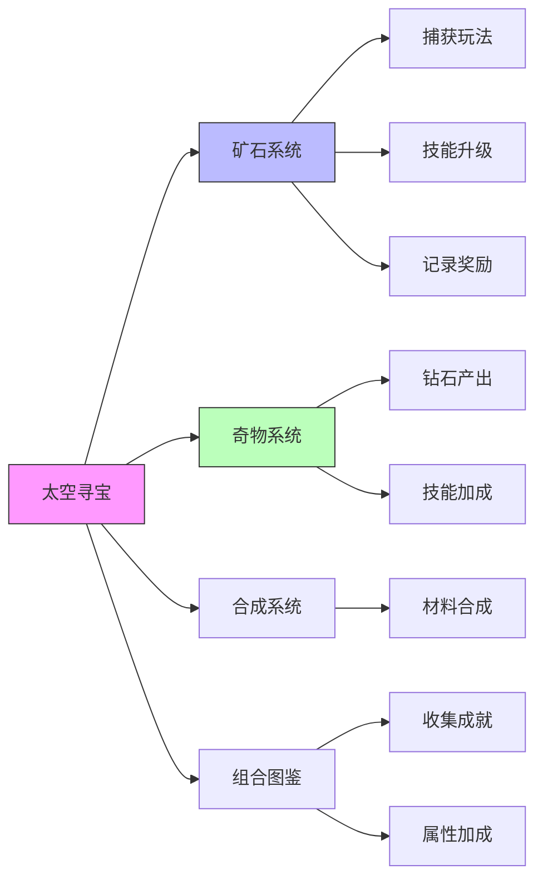
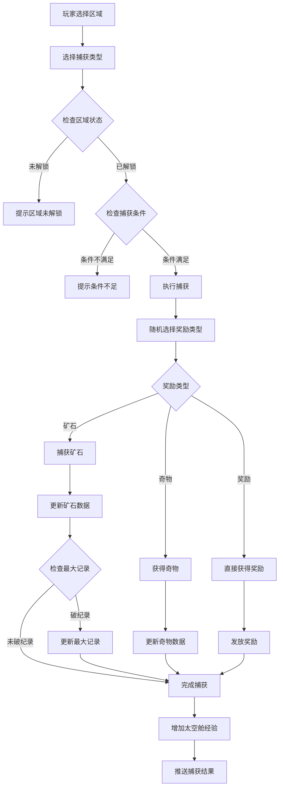
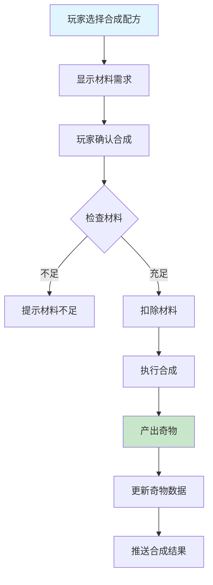
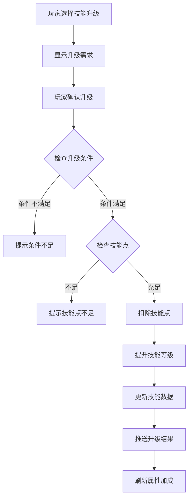
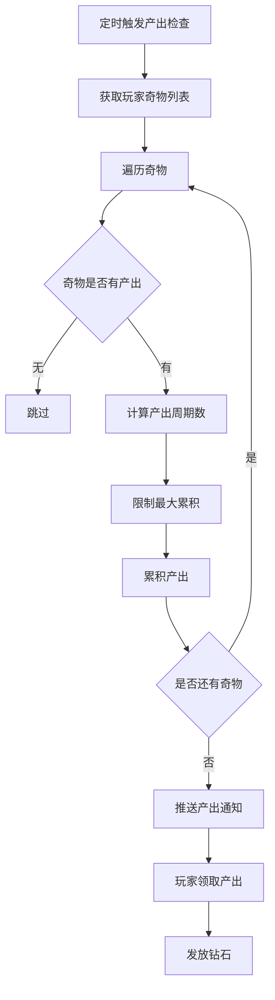
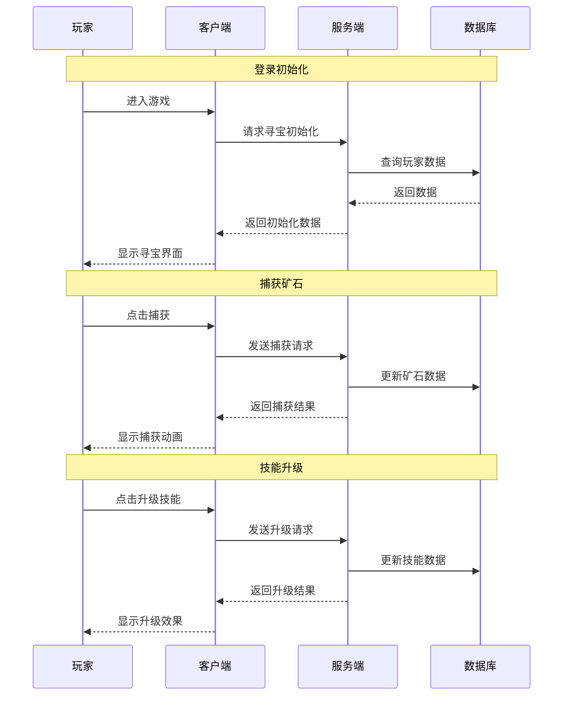

# 寻宝模块完整说明

## 一、模块概述

### 1.1 业务背景

寻宝模块是 K2C 游戏的特色探索玩法，玩家在太空中探索各类区域，捕获珍贵的矿石资源，通过合成系统将矿石转化为奇物，获得丰厚的奖励。模块融合了探索、收集、养成等多种玩法元素，为玩家提供长期目标感和成就感。

### 1.2 目标用户

- **收集玩家**：追求收集各类矿石和奇物
- **养成玩家**：提升矿石技能和奇物等级
- **策略玩家**：规划资源合成路线

### 1.3 核心价值

1. **探索乐趣**：随机捕获矿石带来惊喜感
2. **收集成就**：丰富的矿石和奇物种类
3. **养成深度**：技能升级和合成系统
4. **资源产出**：稳定的资源获取渠道

### 1.4 模块关系图



---

## 二、功能清单

### 2.1 站点探索功能

| 功能名称 | 功能描述 | 用户价值 |
|---------|---------|---------|
| 站点列表 | 显示可探索的太空站点 | 了解探索目标 |
| 站点解锁 | 达成条件解锁新站点 | 开拓探索范围 |
| 捕获矿石 | 在站点捕获矿石资源 | 获取矿石资源 |
| 站点状态 | 显示站点产出和状态 | 了解站点信息 |

### 2.2 矿石管理功能

| 功能名称 | 功能描述 | 用户价值 |
|---------|---------|---------|
| 矿石列表 | 显示拥有的矿石及数量 | 管理矿石资源 |
| 矿石技能 | 提升矿石相关技能 | 增强捕获能力 |
| 矿石传输 | 传输矿石到其他系统 | 资源流转 |
| 矿石记录 | 记录矿石捕获历史 | 追踪收集进度 |

### 2.3 奇物系统功能

| 功能名称 | 功能描述 | 用户价值 |
|---------|---------|---------|
| 奇物列表 | 显示拥有的奇物 | 管理奇物资产 |
| 奇物等级 | 提升奇物等级 | 增加产出收益 |
| 奇物产出 | 定期获得奇物收益 | 稳定资源来源 |
| 奇物技能 | 激活和升级奇物技能 | 增强能力加成 |

### 2.4 合成系统功能

| 功能名称 | 功能描述 | 用户价值 |
|---------|---------|---------|
| 合成配方 | 显示可用的合成配方 | 了解合成选项 |
| 矿石合成 | 消耗矿石合成奇物 | 获得奇物 |
| 合成等级 | 提升合成成功率 | 提高合成效率 |

---

## 三、业务流程详解

### 3.1 捕获矿石流程



**详细步骤说明**：

1. **条件验证**
   - 检查区域是否解锁
   - 检查捕获条件是否满足
   - 检查功能是否解锁

2. **捕获执行**
   - 根据权重随机选择奖励类型
   - 根据类型执行具体捕获逻辑
   - 计算捕获结果

3. **结果处理**
   - 更新玩家数据
   - 检查是否破纪录
   - 推送捕获结果

### 3.2 矿石合成流程



**详细步骤说明**：

1. **材料验证**
   - 检查矿石材料是否足够
   - 检查合成配方是否解锁

2. **合成执行**
   - 扣除材料矿石
   - 产出对应奇物

3. **结果处理**
   - 成功则产出奇物
   - 更新玩家奇物数据
   - 推送合成结果

### 3.3 技能升级流程



### 3.4 奇物产出流程



---

## 四、关键规则

### 4.1 站点规则

1. **站点解锁**
   - 达到指定太空舱等级解锁
   - 完成前置任务解锁
   - 使用道具解锁

2. **站点产出**
   - 不同站点产出不同矿石
   - 站点有矿石上限
   - 站点定时刷新矿石

### 4.2 矿石规则

1. **矿石类型**
   - 普通矿石：常见，价值较低
   - 稀有矿石：较少见，价值较高
   - 史诗矿石：罕见，价值很高
   - 传说矿石：极罕见，价值极高

2. **矿石获取**
   - 区域捕获为主要来源
   - 活动奖励可获得
   - 交易系统可获取

3. **矿石用途**
   - 合成奇物材料
   - 技能升级材料
   - 兑换其他资源

### 4.3 奇物规则

1. **奇物类型**
   - 基础奇物：产出基础资源
   - 高级奇物：产出稀有资源
   - 专属奇物：产出专属道具

2. **奇物等级**
   - 奇物可升级
   - 等级越高产出越多
   - 升级需要消耗材料

3. **奇物产出**
   - 定时产出钻石
   - 产出累积有上限
   - 需手动领取产出

### 4.4 合成规则

1. **合成配方**
   - 不同配方产出不同奇物
   - 配方需要解锁
   - 配方有等级要求

2. **合成限制**
   - 部分配方有每日次数限制
   - 材料不足无法合成

---

## 五、用户故事

### 5.1 收集玩家故事

> 作为一名收集玩家，我每天都去各个区域捕获矿石。今天在星云区域捕获到了一颗传说级矿石，这是我的第一颗传说矿石！我已经收集了普通矿石50颗、稀有矿石20颗、史诗矿石5颗，现在只差传说矿石就可以解锁图鉴成就了。

### 5.2 养成玩家故事

> 作为一名养成玩家，我专注于提升矿石技能和奇物等级。今天我把捕获技能升到了5级，捕获效率大幅提升。我的高级奇物也升到了10级，每小时能产出更多钻石了。看着自己的养成成果逐步提升，我感到很有成就感。

### 5.3 策略玩家故事

> 作为一名策略玩家，我会仔细规划矿石合成路线。根据奇物产出计算，合成"星空宝箱"的性价比最高，需要的材料也相对容易获取。我每天都会把捕获的矿石合成成奇物，然后定时领取产出，形成稳定的资源循环。

---

## 六、示例

### 6.1 捕获矿石示例

**区域配置**：
```
区域ID：1001
区域名称：星云区域
矿石池：
  - 普通矿石A（权重50，数量1-3）
  - 稀有矿石B（权重30，数量1-2）
  - 史诗矿石C（权重15，数量1）
  - 传说矿石D（权重5，数量1）
```

**捕获操作**：
- 捕获类型：普通捕获
- 是否高级：否
- 区域ID：1001

**捕获结果**：
```
获得矿石：稀有矿石B × 2
获得质量：150
历史最高记录更新：是（原记录100）
获得经验：50
```

### 6.2 矿石合成示例

**合成配方**：
```
配方ID：3001
配方名称：星空宝箱合成
材料需求：
  - 普通矿石A × 10
  - 稀有矿石B × 5
  - 史诗矿石C × 1
产出：星空宝箱 × 1
```

**玩家材料**：
```
普通矿石A：25
稀有矿石B：8
史诗矿石C：3
```

**合成操作**：合成1次

**合成结果**：
```
扣除材料：
  - 普通矿石A × 10（剩余15）
  - 稀有矿石B × 5（剩余3）
  - 史诗矿石C × 1（剩余2）
获得奇物：星空宝箱 × 1
```

### 6.3 奇物产出示例

**奇物配置**：
```
奇物ID：2001
奇物名称：星空宝箱
技能等级：5
产出周期：每4小时
单次产出：
  - 钻石 × 50
等级加成：10% / 级
累积上限：3次产出
```

**玩家奇物状态**：
```
产出累积时间：8小时
累积产出次数：2次
可领取产出：
  - 钻石 × 110（50 × (1 + 0.1 × 5) × 2）
```

**领取操作**：领取累积产出

**领取结果**：
```
获得资源：
  - 钻石 × 110
产出累积时间：重置为0
累积产出次数：0次
```

### 6.4 技能升级示例

**技能配置**：
```
技能ID：10001
技能名称：矿石精通
当前等级：3
效果：捕获效率 +15%
```

**玩家状态**：
```
技能点：5
```

**升级操作**：升级到4级

**升级结果**：
```
消耗技能点：1（剩余4）
技能等级：4
新效果：捕获效率 +20%
```

---

## 七、系统交互图



---

## 八、数据字典

### 8.1 矿石数据

| 字段名 | 类型 | 说明 | 取值范围 |
|-------|------|------|---------|
| oreId | long | 矿石ID | > 0 |
| firstGainTimeMs | long | 首次获得时间 | >= 0 |
| maxRecord | int | 最大质量记录 | >= 0 |
| totalGainNum | int | 总获取数量 | >= 0 |
| normalPendingNum | int | 普通待处理数量 | >= 0 |
| advancedPendingNum | int | 高级待处理数量 | >= 0 |
| normalSkillLevel | int | 普通技能等级 | >= 0 |
| advancedSkillLevel | int | 高级技能等级 | >= 0 |

### 8.2 奇物数据

| 字段名 | 类型 | 说明 | 取值范围 |
|-------|------|------|---------|
| treasureId | long | 奇物ID | > 0 |
| skillLevel | int | 技能等级 | >= 0 |
| gainTimeMs | long | 获得时间 | >= 0 |

### 8.3 太空舱数据

| 字段名 | 类型 | 说明 | 取值范围 |
|-------|------|------|---------|
| stationLevel | int | 太空舱等级 | >= 1 |
| exp | long | 经验值 | >= 0 |

---

*文档生成时间: 2026-04-12*
