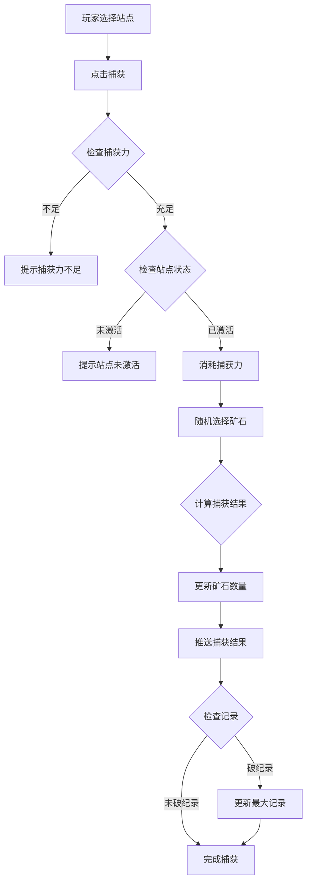
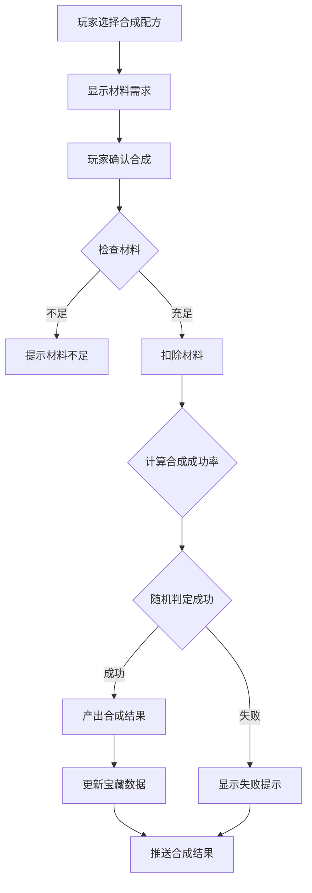
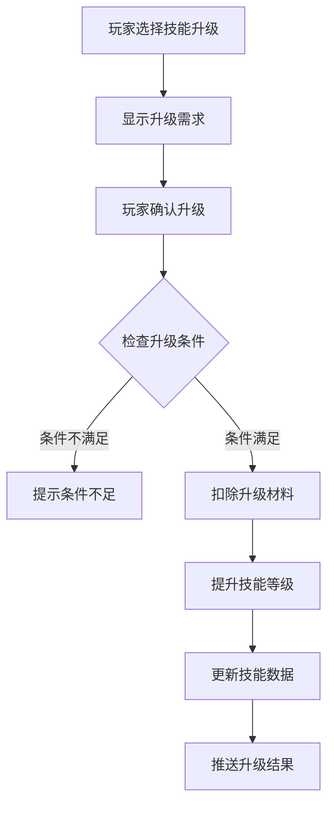
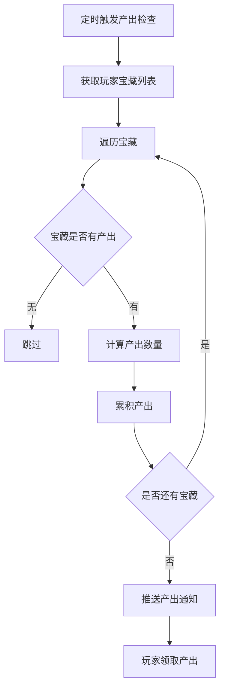

# 寻宝模块完整说明

## 一、模块概述

### 1.1 业务背景

寻宝模块是 K2C 游戏的特色探索玩法，玩家在太空中探索各类站点，捕获珍贵的矿石资源，通过合成系统将矿石转化为宝藏，获得丰厚的奖励。模块融合了探索、收集、养成等多种玩法元素，为玩家提供长期目标感和成就感。

### 1.2 目标用户

- **收集玩家**：追求收集各类矿石和宝藏
- **养成玩家**：提升矿石技能和宝藏等级
- **策略玩家**：规划资源合成路线

### 1.3 核心价值

1. **探索乐趣**：随机捕获矿石带来惊喜感
2. **收集成就**：丰富的矿石和宝藏种类
3. **养成深度**：技能升级和合成系统
4. **资源产出**：稳定的资源获取渠道

---

## 二、功能清单

### 2.1 站点探索功能

| 功能名称 | 功能描述 | 用户价值 |
|---------|---------|---------|
| 站点列表 | 显示可探索的太空站点 | 了解探索目标 |
| 站点解锁 | 达成条件解锁新站点 | 开拓探索范围 |
| 捕获矿石 | 在站点捕获矿石资源 | 获取矿石资源 |
| 站点状态 | 显示站点产出和状态 | 了解站点信息 |

### 2.2 矿石管理功能

| 功能名称 | 功能描述 | 用户价值 |
|---------|---------|---------|
| 矿石列表 | 显示拥有的矿石及数量 | 管理矿石资源 |
| 矿石技能 | 提升矿石相关技能 | 增强捕获能力 |
| 矿石传输 | 传输矿石到其他系统 | 资源流转 |
| 矿石记录 | 记录矿石捕获历史 | 追踪收集进度 |

### 2.3 宝藏系统功能

| 功能名称 | 功能描述 | 用户价值 |
|---------|---------|---------|
| 宝藏列表 | 显示拥有的宝藏 | 管理宝藏资产 |
| 宝藏等级 | 提升宝藏等级 | 增加产出收益 |
| 宝藏产出 | 定期获得宝藏收益 | 稳定资源来源 |
| 宝藏技能 | 激活和升级宝藏技能 | 增强能力加成 |

### 2.4 合成系统功能

| 功能名称 | 功能描述 | 用户价值 |
|---------|---------|---------|
| 合成配方 | 显示可用的合成配方 | 了解合成选项 |
| 矿石合成 | 消耗矿石合成宝藏 | 获得宝藏 |
| 合成等级 | 提升合成成功率 | 提高合成效率 |

---

## 三、业务流程详解

### 3.1 捕获矿石流程



**详细步骤说明**：

1. **条件验证**
   - 检查捕获力是否足够
   - 检查站点是否激活
   - 检查功能是否解锁

2. **捕获执行**
   - 消耗捕获力
   - 按权重随机选择矿石
   - 计算捕获数量

3. **结果处理**
   - 更新玩家矿石数据
   - 检查是否破纪录
   - 推送捕获结果

### 3.2 矿石合成流程



**详细步骤说明**：

1. **材料验证**
   - 检查矿石材料是否足够
   - 检查合成配方是否解锁

2. **合成执行**
   - 扣除材料矿石
   - 计算成功率
   - 执行合成判定

3. **结果处理**
   - 成功则产出宝藏
   - 更新玩家宝藏数据
   - 推送合成结果

### 3.3 技能升级流程



### 3.4 宝藏产出流程



---

## 四、关键规则

### 4.1 站点规则

1. **站点解锁**
   - 达到指定等级解锁
   - 完成前置任务解锁
   - 使用道具解锁

2. **站点产出**
   - 不同站点产出不同矿石
   - 站点有矿石上限
   - 站点定时刷新矿石

3. **捕获力**
   - 捕获力有上限
   - 定时自动恢复
   - 可使用道具补充

### 4.2 矿石规则

1. **矿石类型**
   - 普通矿石：常见，价值较低
   - 稀有矿石：较少见，价值较高
   - 史诗矿石：罕见，价值很高
   - 传说矿石：极罕见，价值极高

2. **矿石获取**
   - 站点捕获为主要来源
   - 活动奖励可获得
   - 交易系统可获取

3. **矿石用途**
   - 合成宝藏材料
   - 技能升级材料
   - 兑换其他资源

### 4.3 宝藏规则

1. **宝藏类型**
   - 基础宝藏：产出基础资源
   - 高级宝藏：产出稀有资源
   - 专属宝藏：产出专属道具

2. **宝藏等级**
   - 宝藏可升级
   - 等级越高产出越多
   - 升级需要消耗材料

3. **宝藏产出**
   - 定时产出资源
   - 产出累积有上限
   - 需手动领取产出

### 4.4 合成规则

1. **合成配方**
   - 不同配方产出不同宝藏
   - 配方需要解锁
   - 配方有等级要求

2. **合成成功率**
   - 基础成功率由配方决定
   - 技能可提升成功率
   - VIP可增加成功率

3. **合成限制**
   - 部分配方有每日次数限制
   - 材料不足无法合成

---

## 五、用户故事

### 5.1 收集玩家故事

> 作为一名收集玩家，我每天都去各个站点捕获矿石。今天在星云站点捕获到了一颗传说级矿石，这是我的第一颗传说矿石！我已经收集了普通矿石50颗、稀有矿石20颗、史诗矿石5颗，现在只差传说矿石就可以解锁图鉴成就了。

### 5.2 养成玩家故事

> 作为一名养成玩家，我专注于提升矿石技能和宝藏等级。今天我把捕获技能升到了5级，捕获力上限增加了20点。我的高级宝藏也升到了10级，每小时能产出更多钻石了。看着自己的养成成果逐步提升，我感到很有成就感。

### 5.3 策略玩家故事

> 作为一名策略玩家，我会仔细规划矿石合成路线。根据宝藏产出计算，合成"星空宝箱"的性价比最高，需要的材料也相对容易获取。我每天都会把捕获的矿石合成成宝藏，然后定时领取产出，形成稳定的资源循环。

---

## 六、示例

### 6.1 捕获矿石示例

**站点配置**：
```
站点ID：3
站点名称：星云矿站
矿石池：
  - 普通矿石A（权重50，数量1-3）
  - 稀有矿石B（权重30，数量1-2）
  - 史诗矿石C（权重15，数量1）
  - 传说矿石D（权重5，数量1）
捕获力消耗：1次/捕获
```

**捕获操作**：
- 玩家捕获力：10/20
- 选择站点：星云矿站
- 捕获次数：1

**捕获结果**：
```
获得矿石：稀有矿石B × 2
消耗捕获力：1
剩余捕获力：9/20
本次权重命中：30（稀有）
历史最高记录更新：是（原记录1颗）
```

### 6.2 矿石合成示例

**合成配方**：
```
配方ID：101
配方名称：星空宝箱
材料需求：
  - 普通矿石A × 10
  - 稀有矿石B × 5
  - 史诗矿石C × 1
产出：星空宝箱 × 1
基础成功率：80%
每日限制：3次
```

**玩家材料**：
```
普通矿石A：25
稀有矿石B：8
史诗矿石C：3
```

**合成操作**：合成1次

**合成结果**：
```
扣除材料：
  - 普通矿石A × 10（剩余15）
  - 稀有矿石B × 5（剩余3）
  - 史诗矿石C × 1（剩余2）
成功率：85%（基础80% + 技能5%）
合成结果：成功
获得宝藏：星空宝箱 × 1
今日已合成：1/3
```

### 6.3 宝藏产出示例

**宝藏配置**：
```
宝藏ID：201
宝藏名称：星空宝箱
宝藏等级：5
产出周期：每4小时
单次产出：
  - 钻石 × 50
  - 银两 × 5000
累积上限：3次产出
```

**玩家宝藏状态**：
```
产出累积时间：8小时
累积产出次数：2次
可领取产出：
  - 钻石 × 100
  - 银两 × 10000
```

**领取操作**：领取累积产出

**领取结果**：
```
获得资源：
  - 钻石 × 100
  - 银两 × 10000
产出累积时间：重置为0
累积产出次数：0次
```

### 6.4 技能升级示例

**技能配置**：
```
技能ID：1
技能名称：捕获精通
当前等级：3
效果：捕获力上限 +15
升级需求：
  - 矿石碎片 × 50
  - 金币 × 10000
```

**玩家状态**：
```
矿石碎片：80
金币：50000
```

**升级操作**：升级到4级

**升级结果**：
```
消耗材料：
  - 矿石碎片 × 50（剩余30）
  - 金币 × 10000（剩余40000）
技能等级：4
新效果：捕获力上限 +20
捕获力上限：40 → 45
```

---

*文档生成时间: 2026-04-07*
