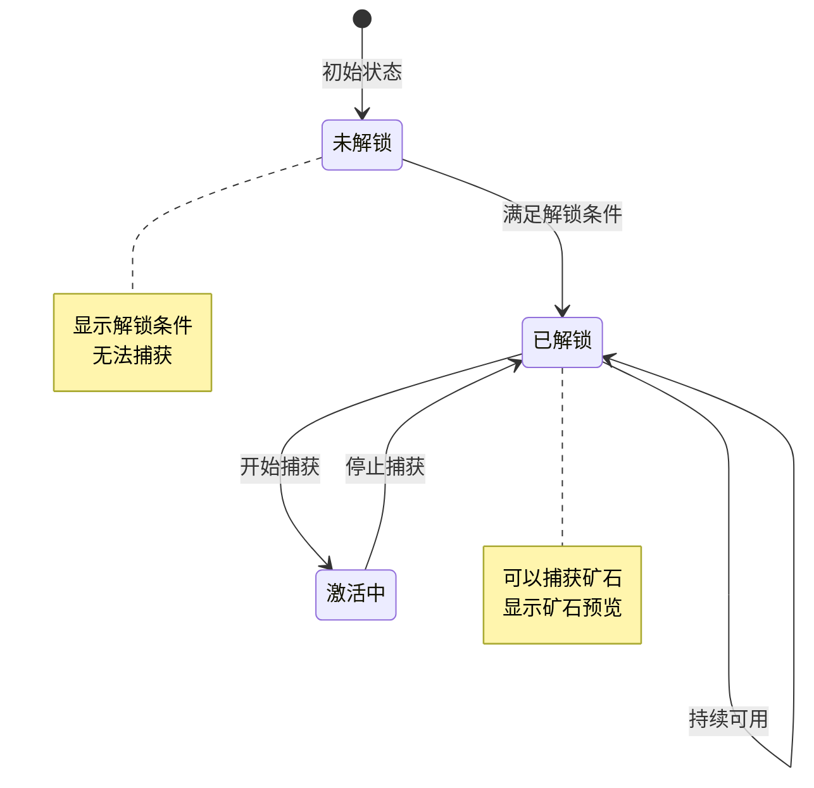
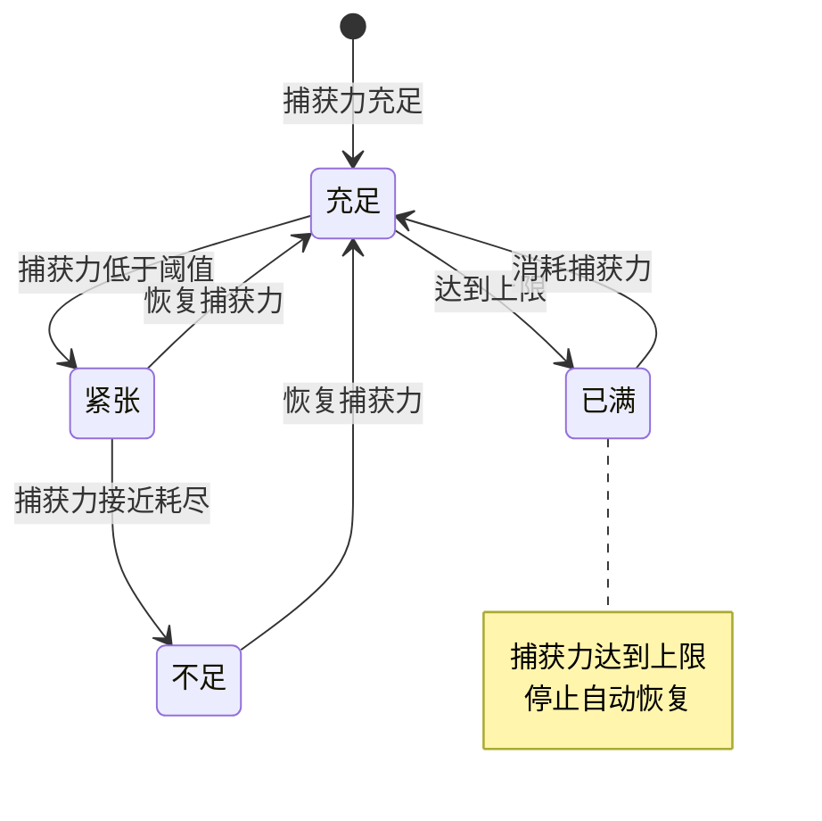
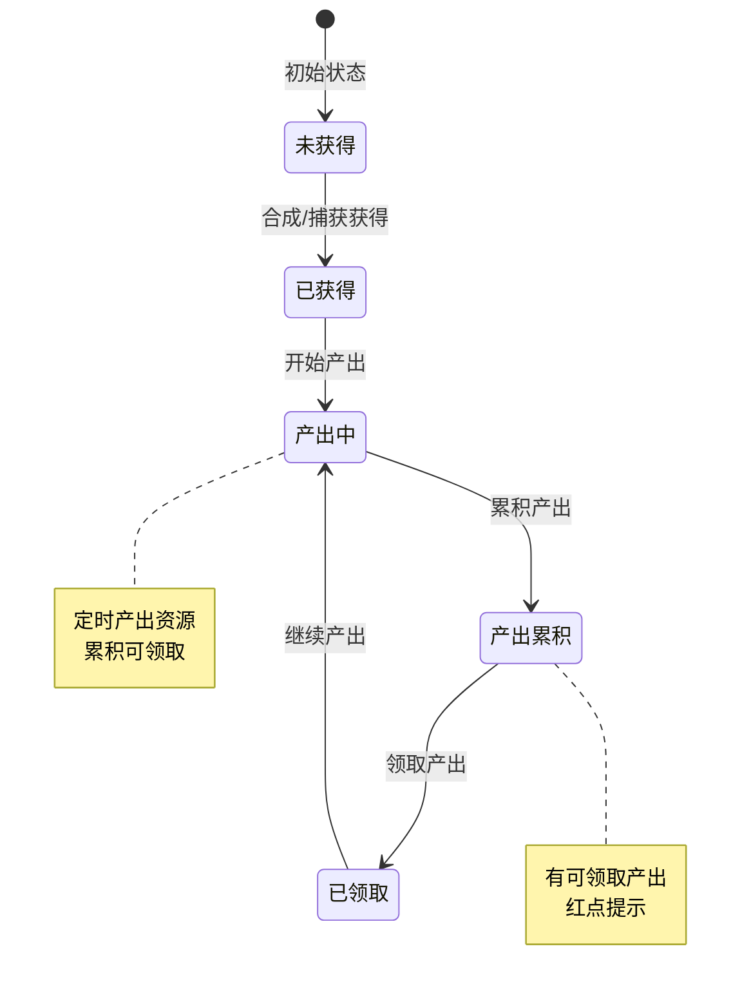
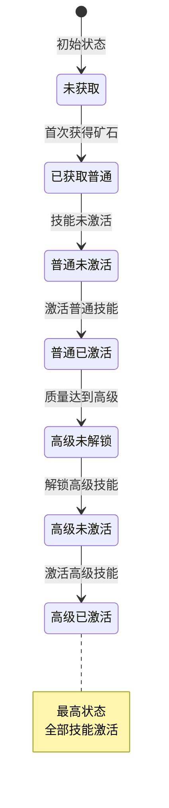
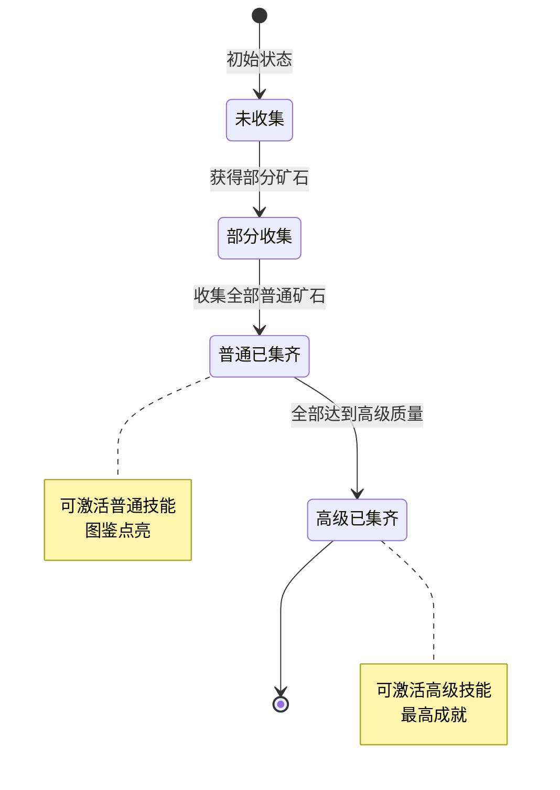
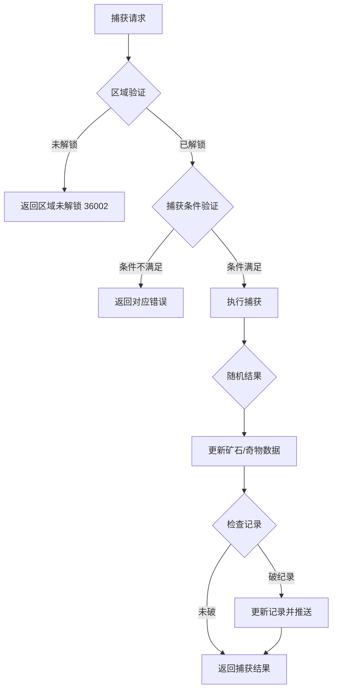
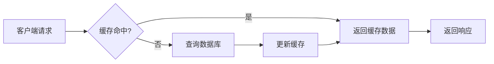

# 寻宝模块实现细节

## 一、计算公式

### 1.1 捕获力恢复公式

```
恢复量 = floor((当前时间 - 上次恢复时间) / 恢复间隔)
实际恢复 = min(恢复量, 上限 - 当前值)
```

**示例计算**：
```
恢复间隔：300秒（5分钟）
捕获力上限：20
当前捕获力：15
上次恢复时间：10:00
当前时间：10:30

经过时间：1800秒
理论恢复量：1800 / 300 = 6
实际恢复：min(6, 20 - 15) = 5
恢复后捕获力：20
```

### 1.2 矿石捕获权重计算公式

```
选中概率 = 矿石权重 / 总权重 × 100%
```

**示例计算**：
```
区域矿石池：
  - 普通矿石A：权重 50
  - 稀有矿石B：权重 30
  - 史诗矿石C：权重 15
  - 传说矿石D：权重 5
总权重：100

传说矿石D选中概率 = 5 / 100 × 100% = 5%
```

### 1.3 合成成功率计算公式

```
实际成功率 = min(基础成功率 + 技能加成 + VIP加成, 100%)
```

**示例计算**：
```
基础成功率：75%
技能加成：10%
VIP加成：5%

实际成功率 = min(75% + 10% + 5%, 100%) = 90%
```

### 1.4 宝藏产出计算公式

```
单次产出 = 基础产出 × (1 + 等级加成 × 技能等级)
```

**示例计算**：
```
基础产出：钻石 × 40
等级加成：10% / 级
技能等级：5

单次产出 = 40 × (1 + 0.1 × 5) = 40 × 1.5 = 60钻石
```

### 1.5 矿石质量计算公式

```
质量 = 基础质量 × 数量 × 稀有度系数
```

**示例计算**：
```
矿石基础质量：10
捕获数量：2
稀有度系数：1.5 (稀有)

质量 = 10 × 2 × 1.5 = 30
```

---

## 二、状态机定义

### 2.1 站点状态机



### 2.2 捕获力状态机



### 2.3 宝藏状态机



### 2.4 矿石状态机



### 2.5 组合图鉴状态机



---

## 三、数据约束

### 3.1 矿石数据约束

| 字段名 | 数据类型 | 取值范围 | 必填 | 说明 |
|--------|----------|----------|------|------|
| player_id | bigint | > 0 | 是 | 玩家ID |
| ore_id | bigint | > 0 | 是 | 矿石ID |
| first_gain_time | datetime | - | 是 | 首次获得时间 |
| total_gain_num | int | >= 0 | 是 | 总获取数量 |
| normal_pending_num | int | >= 0 | 是 | 普通待处理数量 |
| advanced_pending_num | int | >= 0 | 是 | 高级待处理数量 |
| max_record | int | >= 0 | 是 | 最大质量记录 |
| normal_skill_level | int | >= 0 | 是 | 普通技能等级 |
| advanced_skill_level | int | >= 0 | 是 | 高级技能等级 |
| update_time | datetime | - | 是 | 更新时间 |

### 3.2 宝藏数据约束

| 字段名 | 数据类型 | 取值范围 | 必填 | 说明 |
|--------|----------|----------|------|------|
| player_id | bigint | > 0 | 是 | 玩家ID |
| treasure_id | bigint | > 0 | 是 | 宝藏ID |
| skill_level | int | >= 0 | 是 | 技能等级 |
| gain_time | datetime | - | 是 | 获得时间 |
| last_output_time | datetime | - | 否 | 上次产出时间 |

### 3.3 站点数据约束

| 字段名 | 数据类型 | 取值范围 | 必填 | 说明 |
|--------|----------|----------|------|------|
| player_id | bigint | > 0 | 是 | 玩家ID |
| station_level | int | >= 1 | 是 | 太空舱等级 |
| exp | bigint | >= 0 | 是 | 经验值 |
| update_time | datetime | - | 是 | 更新时间 |

### 3.4 捕获力数据约束

| 字段名 | 数据类型 | 取值范围 | 必填 | 说明 |
|--------|----------|----------|------|------|
| player_id | bigint | > 0 | 是 | 玩家ID |
| current_power | int | >= 0 | 是 | 当前捕获力 |
| max_power | int | > 0 | 是 | 捕获力上限 |
| recover_time | datetime | - | 是 | 上次恢复时间 |

---

## 四、错误处理策略

### 4.1 寻宝模块错误码

| 错误码 | 错误信息 | 处理策略 | 用户提示 |
|--------|----------|----------|----------|
| 36001 | 功能未解锁 | 检查功能解锁 | "寻宝功能尚未解锁" |
| 36002 | 区域未解锁 | 检查区域状态 | "该区域尚未解锁" |
| 36003 | 捕获力不足 | 检查捕获力 | "捕获力不足" |
| 36004 | 材料不足 | 检查材料数量 | "合成材料不足" |
| 36005 | 合成次数已达上限 | 检查合成次数 | "今日合成次数已达上限" |
| 36006 | 技能等级已达上限 | 检查技能等级 | "技能已达最高等级" |
| 36007 | 宝藏等级已达上限 | 检查宝藏等级 | "宝藏已达最高等级" |
| 36008 | 无可领取产出 | 检查产出状态 | "暂无可领取产出" |
| 36009 | 技能未解锁 | 检查技能解锁条件 | "技能尚未解锁" |
| 36010 | 技能已激活 | 检查技能状态 | "技能已激活" |
| 36011 | 技能点不足 | 检查技能点数量 | "技能点不足" |

### 4.2 捕获错误处理流程



### 4.3 异常处理策略

| 异常场景 | 处理策略 | 数据处理 |
|----------|----------|----------|
| 捕获力恢复异常 | 以服务器时间为准 | 修正客户端时间 |
| 合成失败材料扣除 | 正常扣除材料 | 不返还材料 |
| 宝藏产出计算异常 | 使用默认产出 | 记录告警日志 |
| 区域刷新异常 | 强制刷新 | 重新生成矿石池 |
| 数据版本冲突 | 使用最新数据 | 忽略旧数据 |

---

## 五、关键代码示例

### 5.1 捕获矿石伪代码

```csharp
public Result CaptureOre(long playerId, ETreasureHuntCaptureType type,
                         bool isAdvance, long areaId, long distance)
{
    // 1. 获取区域配置
    TreasureAreaConfig areaConfig = configService.GetAreaConfig(areaId);
    if (areaConfig == null)
    {
        return Result.Error(ErrorCode.CONFIG_ERROR, "区域配置不存在");
    }

    // 2. 检查区域状态
    if (!CheckAreaUnlocked(playerId, areaConfig))
    {
        return Result.Error(36002, "区域未解锁");
    }

    // 3. 根据捕获类型执行
    CaptureResult result = new CaptureResult();
    switch (type)
    {
        case ETreasureHuntCaptureType.NORMAL:
            result = CaptureSingle(playerId, areaConfig, isAdvance);
            break;
        case ETreasureHuntCaptureType.SINGLE_AKEY:
            result = CaptureOneKey(playerId, areaConfig, isAdvance, 1);
            break;
        case ETreasureHuntCaptureType.MULTIPLE_AKEY:
            int maxCount = CalculateMaxCaptureCount(playerId);
            result = CaptureOneKey(playerId, areaConfig, isAdvance, maxCount);
            break;
    }

    // 4. 增加经验值
    long addExp = CalculateExp(result);
    AddStationExp(playerId, addExp);
    result.AddExp = addExp;

    // 5. 推送捕获结果
    PushCaptureResult(playerId, result);

    return Result.Success(result);
}

private CaptureResult CaptureSingle(long playerId, TreasureAreaConfig config, bool isAdvance)
{
    CaptureResult result = new CaptureResult();

    // 1. 随机选择奖励类型
    ETreasureHuntGainType gainType = RandomGainType(config, isAdvance);

    // 2. 根据类型获取具体奖励
    TreasureHunt_CaptureReward reward = new TreasureHunt_CaptureReward();
    reward.GainType = gainType;

    switch (gainType)
    {
        case ETreasureHuntGainType.ORE:
            reward.Data = CaptureOreReward(playerId, config, isAdvance);
            break;
        case ETreasureHuntGainType.TREASURE:
            reward.Data = CaptureTreasureReward(playerId, config);
            break;
        case ETreasureHuntGainType.REWARD:
            reward.Data = CaptureDirectReward(playerId, config);
            break;
    }

    result.AddReward(reward);
    return result;
}

private ETreasureHuntGainType RandomGainType(TreasureAreaConfig config, bool isAdvance)
{
    int totalWeight = config.OreWeight + config.TreasureWeight + config.RewardWeight;
    int random = Random.Range(0, totalWeight);

    if (random < config.OreWeight)
        return ETreasureHuntGainType.ORE;
    else if (random < config.OreWeight + config.TreasureWeight)
        return ETreasureHuntGainType.TREASURE;
    else
        return ETreasureHuntGainType.REWARD;
}
```

### 5.2 矿石合成伪代码

```csharp
public Result Composite(long playerId, int compositeId)
{
    // 1. 获取合成配置
    TreasureCompositeConfig config = configService.GetCompositeConfig(compositeId);
    if (config == null)
    {
        return Result.Error(ErrorCode.CONFIG_ERROR, "合成配置不存在");
    }

    // 2. 检查合成次数
    int todayCount = GetTodayCompositeCount(playerId, compositeId);
    if (config.DailyLimit > 0 && todayCount >= config.DailyLimit)
    {
        return Result.Error(36005, "合成次数已达上限");
    }

    // 3. 检查材料
    foreach (var material in config.MaterialList)
    {
        PlayerTreasureOre ore = oreDao.GetByPlayerAndOre(playerId, material.OreId);
        if (ore == null || ore.TotalGainNum < material.Count)
        {
            return Result.Error(36004, "材料不足");
        }
    }

    // 4. 扣除材料
    foreach (var material in config.MaterialList)
    {
        PlayerTreasureOre ore = oreDao.GetByPlayerAndOre(playerId, material.OreId);
        ore.TotalGainNum -= material.Count;
        oreDao.Update(ore);
    }

    // 5. 发放奇物
    PlayerTreasure treasure = treasureDao.GetByPlayerAndTreasure(playerId, config.OutputTreasureId);
    if (treasure == null)
    {
        treasure = new PlayerTreasure
        {
            PlayerId = playerId,
            TreasureId = config.OutputTreasureId,
            SkillLevel = 0,
            GainTime = DateTime.Now,
            LastOutputTime = DateTime.Now
        };
        treasureDao.Insert(treasure);
    }
    else
    {
        treasure.SkillLevel++;
        treasureDao.Update(treasure);
    }

    // 6. 更新合成次数
    IncrementTodayCompositeCount(playerId, compositeId);

    // 7. 推送合成成功
    PushCompositeSuccess(playerId, config.OutputTreasureId);

    return Result.Success(new { treasureId = config.OutputTreasureId });
}
```

### 5.3 技能升级伪代码

```csharp
public Result UpgradeOreSkill(long playerId, long oreId, bool isNormal)
{
    // 1. 获取矿石数据
    PlayerTreasureOre ore = oreDao.GetByPlayerAndOre(playerId, oreId);
    if (ore == null)
    {
        return Result.Error(ErrorCode.ORE_NOT_FOUND, "矿石不存在");
    }

    // 2. 获取当前技能等级和技能点
    int currentLevel = isNormal ? ore.NormalSkillLevel : ore.AdvancedSkillLevel;
    int skillPoint = isNormal ? ore.NormalSkillPoint : ore.AdvancedSkillPoint;

    // 3. 检查技能是否已激活
    if (currentLevel <= 0)
    {
        return Result.Error(36009, "技能未激活");
    }

    // 4. 获取技能配置
    TreasureOreConfig oreConfig = configService.GetOreConfig(oreId);
    int skillId = isNormal ? oreConfig.NormalSkillId : oreConfig.AdvancedSkillId;
    TreasureSkillConfig skillConfig = configService.GetSkillConfig(skillId);

    // 5. 检查是否满级
    if (currentLevel >= skillConfig.MaxLevel)
    {
        return Result.Error(36006, "技能已达最高等级");
    }

    // 6. 检查技能点
    if (skillPoint <= 0)
    {
        return Result.Error(36011, "技能点不足");
    }

    // 7. 扣除技能点并升级
    if (isNormal)
    {
        ore.NormalSkillPoint--;
        ore.NormalSkillLevel++;
    }
    else
    {
        ore.AdvancedSkillPoint--;
        ore.AdvancedSkillLevel++;
    }
    oreDao.Update(ore);

    // 8. 推送技能变化
    PushSkillChange(playerId, oreId, isNormal);

    // 9. 触发属性更新
    eventBus.Publish(new TreasureHuntSkillUpgradeEvent(playerId, oreId, isNormal));

    return Result.Success(new { level = currentLevel + 1 });
}
```

### 5.4 宝藏产出伪代码

```csharp
public void CalculateTreasureOutput(long playerId)
{
    // 1. 获取玩家所有宝藏
    List<PlayerTreasure> treasures = treasureDao.GetByPlayer(playerId);

    List<RewardItem> totalOutput = new List<RewardItem>();

    foreach (var treasure in treasures)
    {
        // 2. 获取宝藏配置
        TreasureConfig config = configService.GetTreasureConfig(treasure.TreasureId);
        if (config == null || config.OutputCycle <= 0) continue;

        // 3. 计算产出周期数
        TimeSpan elapsed = DateTime.Now - treasure.LastOutputTime;
        int cycles = (int)(elapsed.TotalSeconds / config.OutputCycle);

        if (cycles <= 0) continue;

        // 4. 限制最大累积
        cycles = Math.Min(cycles, config.MaxAccumulate);

        // 5. 计算产出
        long gemPerCycle = (long)(config.OutputGem * (1 + config.OutputGemLevelBonus * treasure.SkillLevel));
        long totalGem = gemPerCycle * cycles;

        // 6. 更新产出时间
        treasure.LastOutputTime = treasure.LastOutputTime.AddSeconds(cycles * config.OutputCycle);
        treasureDao.Update(treasure);

        // 7. 累积产出
        TreasureOutputInfo outputInfo = outputDao.GetByPlayerAndTreasure(playerId, treasure.TreasureId);
        if (outputInfo == null)
        {
            outputInfo = new TreasureOutputInfo
            {
                PlayerId = playerId,
                TreasureId = treasure.TreasureId
            };
        }
        outputInfo.GemNum += (int)totalGem;
        outputDao.SaveOrUpdate(outputInfo);
    }
}
```

---

## 六、跨模块依赖

### 6.1 模块依赖关系

| 依赖模块 | 依赖内容 | 说明 |
|----------|----------|------|
| Player模块 | 玩家基础数据、VIP等级 | VIP加成计算 |
| Bag模块 | 背包空间检查、物品发放 | 奖励发放 |
| Item模块 | 物品配置、物品创建 | 奖励物品创建 |
| Notice模块 | 红点提示、推送通知 | 状态变更通知 |

### 6.2 接口依赖

```csharp
// 玩家模块接口
interface IPlayerService
{
    int GetVipLevel(long playerId);
    float GetVipBonus(long playerId);
}

// 背包模块接口
interface IBagService
{
    bool HasSpace(long playerId, List<RewardItem> items);
    void AddItems(long playerId, List<RewardItem> items);
}

// 配置模块接口
interface IConfigService
{
    TreasureAreaConfig GetAreaConfig(int areaId);
    TreasureOreConfig GetOreConfig(long oreId);
    TreasureCompositeConfig GetCompositeConfig(int compositeId);
    TreasureConfig GetTreasureConfig(long treasureId);
    TreasureSkillConfig GetSkillConfig(int skillId);
}
```

### 6.3 事件依赖

| 事件类型 | 触发时机 | 处理逻辑 |
|----------|----------|----------|
| 定时恢复 | 定时触发 | 捕获力自动恢复 |
| 定时产出 | 定时触发 | 宝藏产出计算 |
| 玩家登录 | 登录触发 | 恢复捕获力，计算产出 |
| 区域刷新 | 定时刷新 | 重新生成区域矿石池 |

---

## 七、性能优化

### 7.1 数据缓存策略



### 7.2 批量操作优化

| 操作 | 优化策略 |
|------|----------|
| 一键捕获 | 批量计算结果，单次数据库更新 |
| 初始化加载 | 合并多次查询为单次批量查询 |
| 产出计算 | 分批处理玩家列表 |

### 7.3 索引优化

```sql
-- 矿石表索引
CREATE INDEX idx_player_ore ON player_treasure_ore(player_id, ore_id);

-- 宝藏表索引
CREATE INDEX idx_player_treasure ON player_treasure(player_id, treasure_id);

-- 组合表索引
CREATE INDEX idx_player_composite ON player_treasure_composite(player_id, composite_id);
```

---

*文档生成时间: 2026-04-12*
