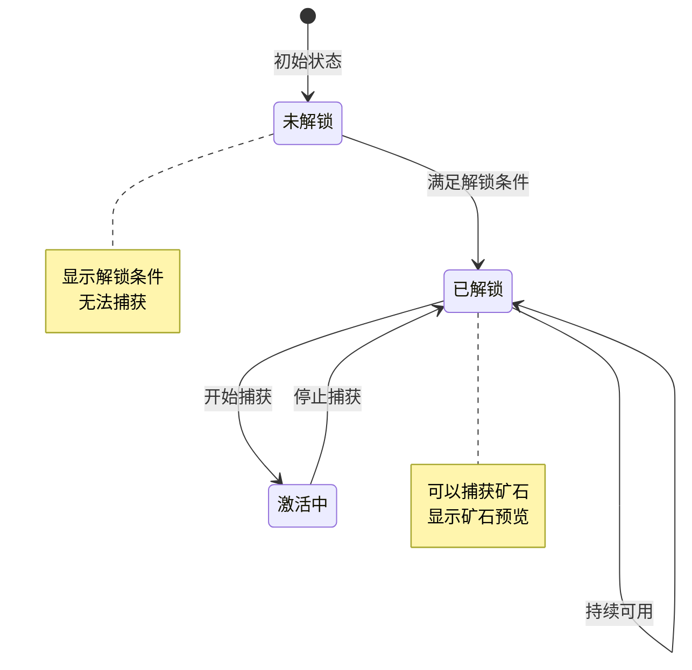
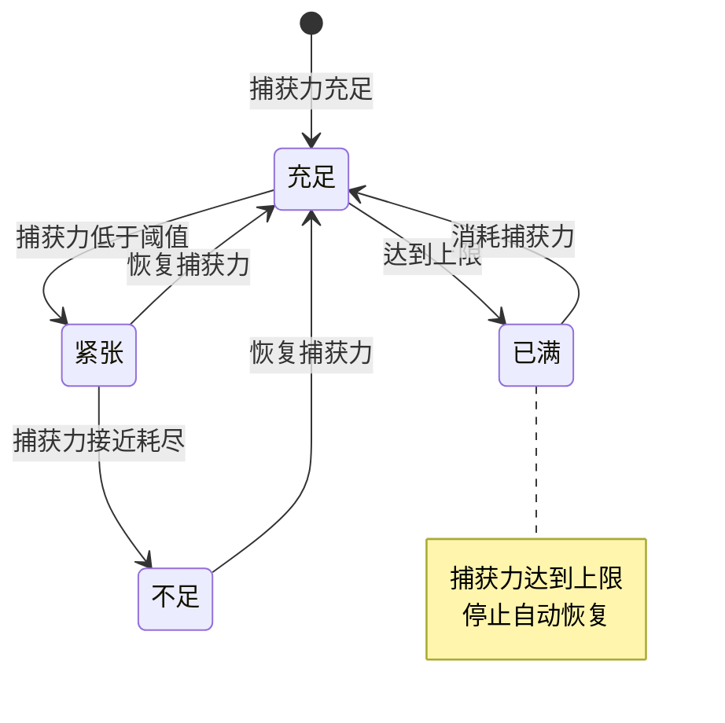
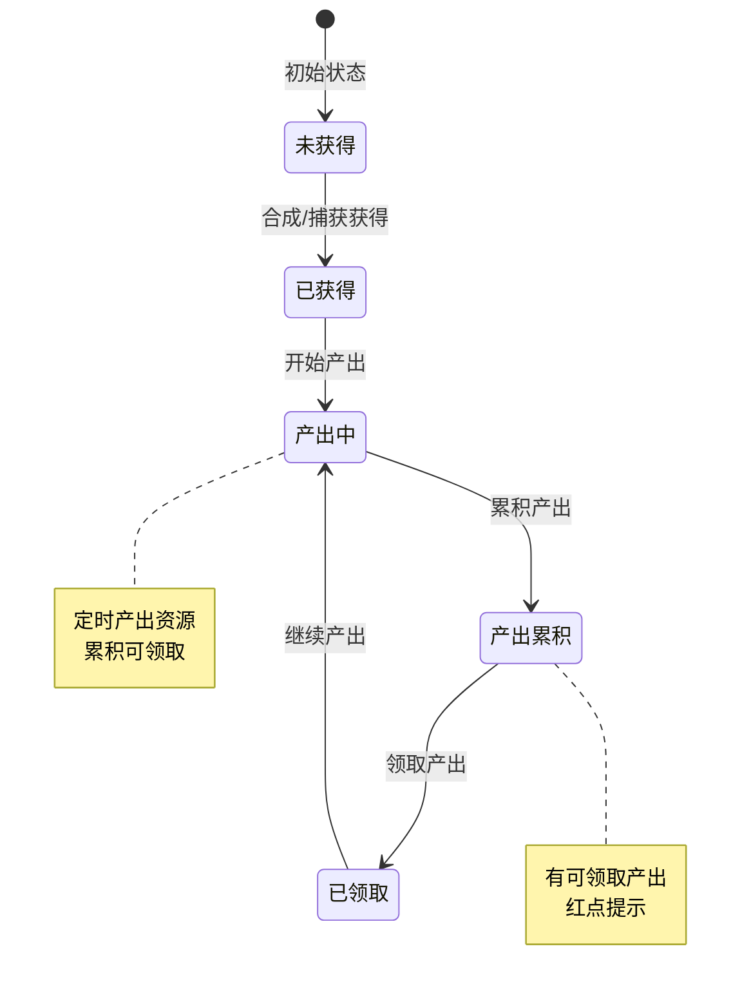
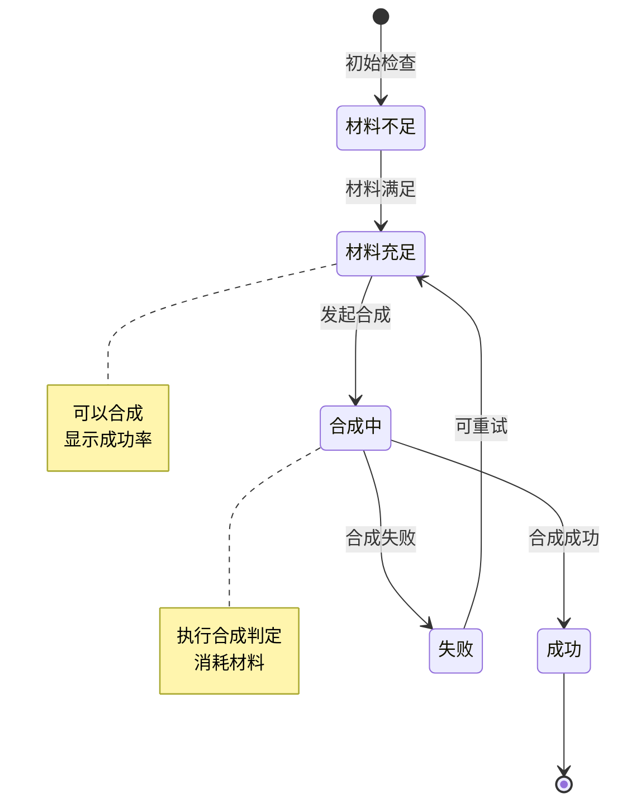
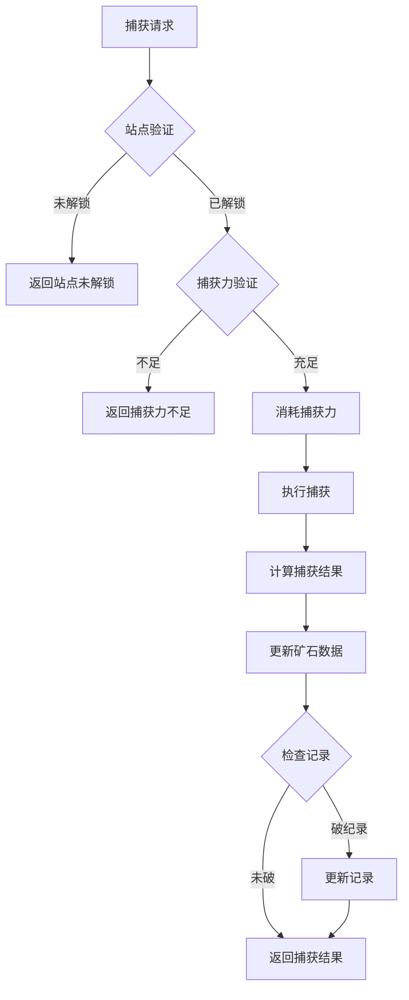

# 寻宝模块实现细节

## 一、计算公式

### 1.1 捕获力恢复公式

```
恢复量 = floor((当前时间 - 上次恢复时间) / 恢复间隔)
实际恢复 = min(恢复量, 上限 - 当前值)
```

**示例计算**：
```
恢复间隔：300秒（5分钟）
捕获力上限：20
当前捕获力：15
上次恢复时间：10:00
当前时间：10:30

经过时间：1800秒
理论恢复量：1800 / 300 = 6
实际恢复：min(6, 20 - 15) = 5
恢复后捕获力：20
```

### 1.2 矿石捕获权重计算公式

```
选中概率 = 矿石权重 / 总权重 × 100%
```

**示例计算**：
```
站点矿石池：
  - 普通矿石A：权重 50
  - 稀有矿石B：权重 30
  - 史诗矿石C：权重 15
  - 传说矿石D：权重 5
总权重：100

传说矿石D选中概率 = 5 / 100 × 100% = 5%
```

### 1.3 合成成功率计算公式

```
实际成功率 = min(基础成功率 + 技能加成 + VIP加成, 100%)
```

**示例计算**：
```
基础成功率：75%
技能加成：10%
VIP加成：5%

实际成功率 = min(75% + 10% + 5%, 100%) = 90%
```

### 1.4 宝藏产出计算公式

```
单次产出 = 基础产出 × (1 + 等级加成 × 宝藏等级)
```

**示例计算**：
```
基础产出：钻石 × 40
等级加成：10% / 级
宝藏等级：5

单次产出 = 40 × (1 + 0.1 × 5) = 40 × 1.5 = 60钻石
```

---

## 二、状态机定义

### 2.1 站点状态机



### 2.2 捕获力状态机



### 2.3 宝藏状态机



### 2.4 合成状态机



---

## 三、数据约束

### 3.1 矿石数据约束

| 字段名 | 数据类型 | 取值范围 | 必填 | 说明 |
|--------|----------|----------|------|------|
| player_id | bigint | > 0 | 是 | 玩家ID |
| ore_id | int | > 0 | 是 | 矿石ID |
| count | int | >= 0 | 是 | 数量 |
| skill_level | int | >= 0 | 是 | 技能等级 |
| update_time | datetime | - | 是 | 更新时间 |

### 3.2 宝藏数据约束

| 字段名 | 数据类型 | 取值范围 | 必填 | 说明 |
|--------|----------|----------|------|------|
| player_id | bigint | > 0 | 是 | 玩家ID |
| treasure_id | int | > 0 | 是 | 宝藏ID |
| level | int | >= 1 | 是 | 宝藏等级 |
| skill_level | int | >= 0 | 是 | 技能等级 |
| output_time | datetime | - | 否 | 上次产出时间 |

### 3.3 站点数据约束

| 字段名 | 数据类型 | 取值范围 | 必填 | 说明 |
|--------|----------|----------|------|------|
| station_id | int | > 0 | 是 | 站点ID |
| state | int | 0-2 | 是 | 状态：0未解锁，1已解锁，2激活中 |
| ore_count | int | >= 0 | 是 | 当前矿石数量 |
| refresh_time | datetime | - | 是 | 刷新时间 |

### 3.4 捕获力数据约束

| 字段名 | 数据类型 | 取值范围 | 必填 | 说明 |
|--------|----------|----------|------|------|
| player_id | bigint | > 0 | 是 | 玩家ID |
| current_power | int | >= 0 | 是 | 当前捕获力 |
| max_power | int | > 0 | 是 | 捕获力上限 |
| recover_time | datetime | - | 是 | 上次恢复时间 |

---

## 四、错误处理策略

### 4.1 寻宝模块错误码

| 错误码 | 错误信息 | 处理策略 | 用户提示 |
|--------|----------|----------|----------|
| 36001 | 功能未解锁 | 检查功能解锁 | "寻宝功能尚未解锁" |
| 36002 | 站点未解锁 | 检查站点状态 | "该站点尚未解锁" |
| 36003 | 捕获力不足 | 检查捕获力 | "捕获力不足" |
| 36004 | 材料不足 | 检查材料数量 | "合成材料不足" |
| 36005 | 合成次数已达上限 | 检查合成次数 | "今日合成次数已达上限" |
| 36006 | 技能等级已达上限 | 检查技能等级 | "技能已达最高等级" |
| 36007 | 宝藏等级已达上限 | 检查宝藏等级 | "宝藏已达最高等级" |
| 36008 | 无可领取产出 | 检查产出状态 | "暂无可领取产出" |

### 4.2 捕获错误处理流程



### 4.3 异常处理策略

| 异常场景 | 处理策略 | 数据处理 |
|----------|----------|----------|
| 捕获力恢复异常 | 以服务器时间为准 | 修正客户端时间 |
| 合成失败材料扣除 | 正常扣除材料 | 不返还材料 |
| 宝藏产出计算异常 | 使用默认产出 | 记录告警日志 |
| 站点刷新异常 | 强制刷新 | 重新生成矿石 |

---

## 五、关键代码示例

### 5.1 捕获矿石伪代码

```csharp
public Result CaptureOre(long playerId, int stationId)
{
    // 1. 获取站点配置
    TreasureStationConfig stationConfig = configService.GetStationConfig(stationId);
    if (stationConfig == null)
    {
        return Result.Error(ErrorCode.CONFIG_ERROR, "站点配置不存在");
    }

    // 2. 检查站点状态
    PlayerStation station = stationDao.GetPlayerStation(playerId, stationId);
    if (station == null || station.state == 0)
    {
        return Result.Error(36002, "站点未解锁");
    }

    // 3. 检查捕获力
    PlayerCapturePower power = capturePowerDao.GetByPlayer(playerId);
    if (power.current_power <= 0)
    {
        return Result.Error(36003, "捕获力不足");
    }

    // 4. 消耗捕获力
    power.current_power--;
    capturePowerDao.Update(power);

    // 5. 随机选择矿石
    TreasureOreConfig oreConfig = WeightedSelectOre(stationConfig.orePool);

    // 6. 计算捕获数量
    int count = Random.Range(oreConfig.minCount, oreConfig.maxCount + 1);

    // 7. 更新玩家矿石数据
    PlayerOre ore = oreDao.GetByPlayerAndOre(playerId, oreConfig.oreId);
    if (ore == null)
    {
        ore = new PlayerOre
        {
            player_id = playerId,
            ore_id = oreConfig.oreId,
            count = 0,
            skill_level = 0
        };
    }
    ore.count += count;
    oreDao.SaveOrUpdate(ore);

    // 8. 检查是否破纪录
    bool isRecord = CheckAndUpdateRecord(playerId, oreConfig.oreId, count);

    // 9. 推送捕获结果
    PushCaptureResult(playerId, oreConfig.oreId, count, isRecord);

    return Result.Success(new { oreId = oreConfig.oreId, count, isRecord });
}

private TreasureOreConfig WeightedSelectOre(List<OrePoolItem> pool)
{
    int totalWeight = pool.Sum(p => p.weight);
    int random = Random.Range(0, totalWeight);

    int accumulated = 0;
    foreach (var item in pool)
    {
        accumulated += item.weight;
        if (random < accumulated)
        {
            return configService.GetOreConfig(item.oreId);
        }
    }

    return configService.GetOreConfig(pool[0].oreId);
}
```

### 5.2 矿石合成伪代码

```csharp
public Result Composite(long playerId, int compositeId)
{
    // 1. 获取合成配置
    TreasureCompositeConfig config = configService.GetCompositeConfig(compositeId);
    if (config == null)
    {
        return Result.Error(ErrorCode.CONFIG_ERROR, "合成配置不存在");
    }

    // 2. 检查合成次数
    int todayCount = GetTodayCompositeCount(playerId, compositeId);
    if (config.dailyLimit > 0 && todayCount >= config.dailyLimit)
    {
        return Result.Error(36005, "合成次数已达上限");
    }

    // 3. 检查材料
    foreach (var material in config.materialList)
    {
        PlayerOre ore = oreDao.GetByPlayerAndOre(playerId, material.oreId);
        if (ore == null || ore.count < material.count)
        {
            return Result.Error(36004, "材料不足");
        }
    }

    // 4. 扣除材料
    foreach (var material in config.materialList)
    {
        PlayerOre ore = oreDao.GetByPlayerAndOre(playerId, material.oreId);
        ore.count -= material.count;
        oreDao.Update(ore);
    }

    // 5. 计算成功率
    float successRate = config.baseSuccessRate;
    successRate += GetSkillBonus(playerId);
    successRate += GetVipBonus(playerId);
    successRate = Math.Min(successRate, 1.0f);

    // 6. 执行合成判定
    bool isSuccess = Random.Range(0f, 1f) < successRate;

    // 7. 更新合成次数
    IncrementTodayCompositeCount(playerId, compositeId);

    // 8. 处理结果
    if (isSuccess)
    {
        // 发放宝藏
        PlayerTreasure treasure = treasureDao.GetByPlayerAndTreasure(playerId, config.outputTreasureId);
        if (treasure == null)
        {
            treasure = new PlayerTreasure
            {
                player_id = playerId,
                treasure_id = config.outputTreasureId,
                level = 1,
                skill_level = 0,
                output_time = DateTime.Now
            };
        }
        treasure.level++;
        treasureDao.SaveOrUpdate(treasure);

        // 推送合成成功
        PushCompositeSuccess(playerId, config.outputTreasureId);
    }
    else
    {
        // 推送合成失败
        PushCompositeFail(playerId, compositeId);
    }

    return Result.Success(new { isSuccess, successRate });
}
```

### 5.3 捕获力恢复伪代码

```csharp
public void RecoverCapturePower(long playerId)
{
    // 1. 获取捕获力数据
    PlayerCapturePower power = capturePowerDao.GetByPlayer(playerId);
    if (power == null)
    {
        power = new PlayerCapturePower
        {
            player_id = playerId,
            current_power = GetDefaultMaxPower(playerId),
            max_power = GetDefaultMaxPower(playerId),
            recover_time = DateTime.Now
        };
        capturePowerDao.Insert(power);
        return;
    }

    // 2. 检查是否已满
    if (power.current_power >= power.max_power)
    {
        return;
    }

    // 3. 计算恢复量
    TimeSpan elapsed = DateTime.Now - power.recover_time;
    int recoverCount = (int)(elapsed.TotalSeconds / RECOVER_INTERVAL);

    if (recoverCount <= 0) return;

    // 4. 计算实际恢复量
    int actualRecover = Math.Min(recoverCount, power.max_power - power.current_power);
    power.current_power += actualRecover;

    // 5. 更新恢复时间
    power.recover_time = power.recover_time.AddSeconds(recoverCount * RECOVER_INTERVAL);

    // 6. 如果满了，设置为当前时间
    if (power.current_power >= power.max_power)
    {
        power.recover_time = DateTime.Now;
    }

    capturePowerDao.Update(power);

    // 7. 推送捕获力变化
    PushCapturePowerChange(playerId, power.current_power);
}
```

### 5.4 宝藏产出伪代码

```csharp
public void CalculateTreasureOutput(long playerId)
{
    // 1. 获取玩家所有宝藏
    List<PlayerTreasure> treasures = treasureDao.GetByPlayer(playerId);

    List<RewardItem> totalOutput = new List<RewardItem>();

    foreach (var treasure in treasures)
    {
        // 2. 获取宝藏配置
        TreasureConfig config = configService.GetTreasureConfig(treasure.treasure_id);
        if (config == null || !config.hasOutput) continue;

        // 3. 计算产出周期数
        TimeSpan elapsed = DateTime.Now - treasure.output_time;
        int cycles = (int)(elapsed.TotalSeconds / config.outputCycle);

        if (cycles <= 0) continue;

        // 4. 限制最大累积
        cycles = Math.Min(cycles, config.maxAccumulate);

        // 5. 计算产出
        for (int i = 0; i < cycles; i++)
        {
            foreach (var output in config.outputList)
            {
                long amount = (long)(output.value * (1 + config.levelBonus * treasure.level));
                totalOutput.Add(new RewardItem
                {
                    type = output.type,
                    id = output.id,
                    count = amount
                });
            }
        }

        // 6. 更新产出时间
        treasure.output_time = treasure.output_time.AddSeconds(cycles * config.outputCycle);
        treasureDao.Update(treasure);
    }

    // 7. 累积产出（不直接发放，等待玩家领取）
    if (totalOutput.Count > 0)
    {
        AccumulateOutput(playerId, totalOutput);
        PushOutputReady(playerId);
    }
}
```

### 5.5 领取宝藏产出伪代码

```csharp
public Result DrawTreasureOutput(long playerId)
{
    // 1. 获取累积产出
    List<RewardItem> output = GetAccumulatedOutput(playerId);
    if (output == null || output.Count == 0)
    {
        return Result.Error(36008, "无可领取产出");
    }

    // 2. 发放奖励
    itemService.GiveItems(playerId, output);

    // 3. 清空累积产出
    ClearAccumulatedOutput(playerId);

    // 4. 推送领取结果
    PushOutputDrawn(playerId, output);

    return Result.Success(output);
}
```

---

## 六、跨模块依赖

### 6.1 模块依赖关系

| 依赖模块 | 依赖内容 | 说明 |
|----------|----------|------|
| Player模块 | 玩家基础数据、VIP等级 | VIP加成计算 |
| Bag模块 | 背包空间检查、物品发放 | 奖励发放 |
| Item模块 | 物品配置、物品创建 | 奖励物品创建 |
| Notice模块 | 红点提示、推送通知 | 状态变更通知 |

### 6.2 接口依赖

```csharp
// 玩家模块接口
interface IPlayerService
{
    int GetVipLevel(long playerId);
    float GetVipBonus(long playerId);
}

// 背包模块接口
interface IBagService
{
    bool HasSpace(long playerId, List<RewardItem> items);
    void AddItems(long playerId, List<RewardItem> items);
}

// 配置模块接口
interface IConfigService
{
    TreasureStationConfig GetStationConfig(int stationId);
    TreasureOreConfig GetOreConfig(int oreId);
    TreasureCompositeConfig GetCompositeConfig(int compositeId);
    TreasureConfig GetTreasureConfig(int treasureId);
}
```

### 6.3 事件依赖

| 事件类型 | 触发时机 | 处理逻辑 |
|----------|----------|----------|
| 定时恢复 | 定时触发 | 捕获力自动恢复 |
| 定时产出 | 定时触发 | 宝藏产出计算 |
| 玩家登录 | 登录触发 | 恢复捕获力，计算产出 |
| 站点刷新 | 定时刷新 | 重新生成站点矿石 |

---

*文档生成时间: 2026-04-07*
