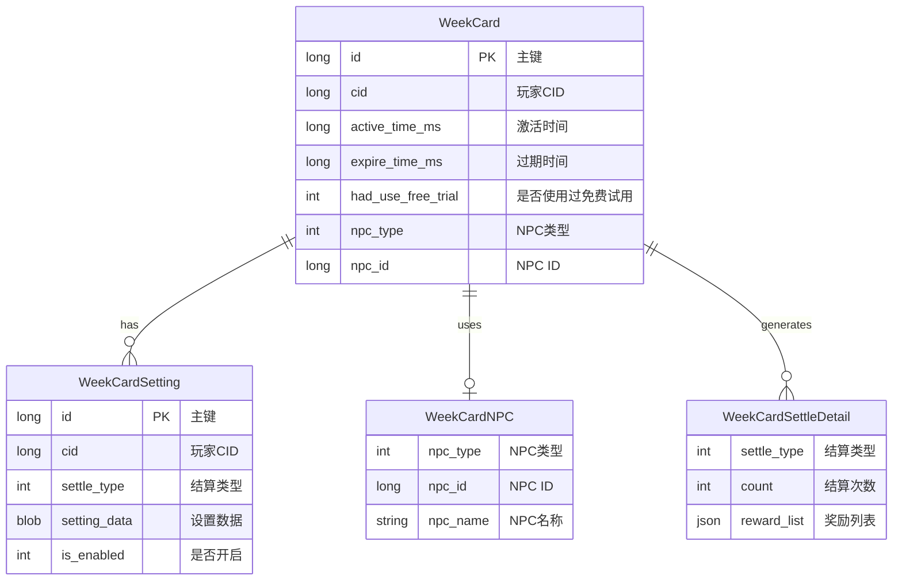
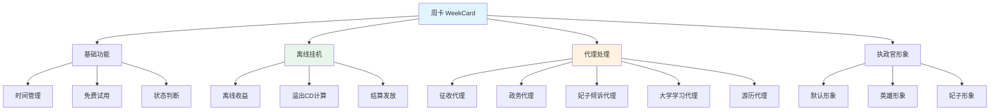
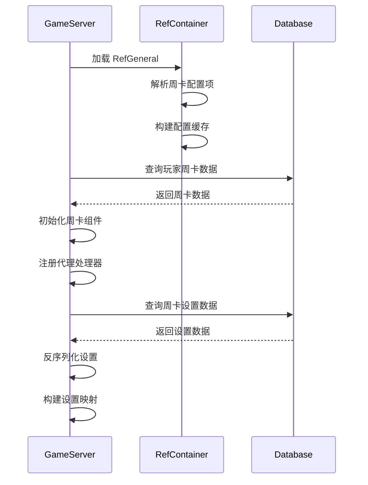
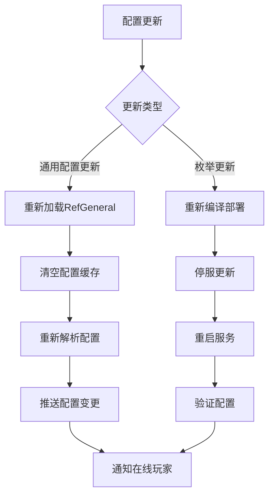

# 周卡模块 - 数据配表

**模块名称**: WeekCard（周卡系统）
**模块编号**: p004
**文档版本**: 2.0
**更新日期**: 2026-04-12

---

## 一、配表总览



---

## 二、核心概念



---

## 三、配表文件列表

| 配表名称 | 文件路径 | 说明 |
|---------|---------|------|
| RefGeneral | GameRes/Refs/General/RefGeneral.java | 通用配置（含周卡参数） |
| EWeekCardSettleType | Common/Enum/EWeekCardSettleType.java | 结算类型枚举 |
| EWeekCardNPCType | Common/Enum/EWeekCardNPCType.java | NPC类型枚举 |
| EWeekCardStat | Common/Enum/EWeekCardStat.java | 周卡状态枚举 |

---

## 四、通用配置 (RefGeneral)

### 4.1 周卡相关配置项

| 配置项 | 类型 | 默认值 | 说明 |
|--------|------|--------|------|
| week_card_func_simple_unlock_id | int | 0 | 周卡功能解锁条件ID |
| week_card_free_trial_time_sec | int | 86400 | 免费试用时长(秒)，默认24小时 |
| week_card_offline_active_min_time_sec | int | 1800 | 离线激活最小时间(秒)，默认30分钟 |
| week_card_offline_hosting_max_profit_time_sec | int | 43200 | 离线挂机最大收益时间(秒)，默认12小时 |
| week_card_assign_default_td_show | object | null | 默认执政官形象配置 |

### 4.2 配置项详解

#### week_card_func_simple_unlock_id

**类型**: int
**说明**: 周卡功能解锁的条件ID，关联功能解锁配置表

**使用场景**:
```java
// 检查周卡功能是否解锁
int unlockId = RefGeneral.Ref().week_card_func_simple_unlock_id;
boolean unlocked = userData.funcUnlockComp.isFuncUnlock(unlockId);
```

#### week_card_free_trial_time_sec

**类型**: int
**默认值**: 86400（24小时）
**说明**: 新玩家免费试用周卡的时长

**取值范围**: 0 - 604800（0表示无免费试用，最大7天）

**计算示例**:
```
免费试用过期时间 = 当前时间戳 + week_card_free_trial_time_sec * 1000
```

#### week_card_offline_active_min_time_sec

**类型**: int
**默认值**: 1800（30分钟）
**说明**: 触发离线结算的最小离线时长

**设计意图**:
- 防止频繁上下线刷收益
- 保证玩家有足够的离线时间产生收益
- 避免服务器频繁计算短时离线

#### week_card_offline_hosting_max_profit_time_sec

**类型**: int
**默认值**: 43200（12小时）
**说明**: 离线挂机收益的最大计算时长

**设计意图**:
- 限制离线收益上限
- 鼓励玩家定期上线
- 防止长时间不活跃玩家收益过高

**计算公式**:
```
有效结算时长 = min(实际离线时长, week_card_offline_hosting_max_profit_time_sec)
```

### 4.3 配置示例

```json
{
    "week_card_func_simple_unlock_id": 1001,
    "week_card_free_trial_time_sec": 86400,
    "week_card_offline_active_min_time_sec": 1800,
    "week_card_offline_hosting_max_profit_time_sec": 43200,
    "week_card_assign_default_td_show": {
        "npcType": 0,
        "npcId": 0
    }
}
```

---

## 五、枚举定义

### 5.1 EWeekCardSettleType - 结算类型

**文件路径**: `Common/Enum/EWeekCardSettleType.java`

| 枚举值 | 数值 | 说明 | 关联模块 | CD类型 |
|--------|------|------|----------|--------|
| NONE | 0 | 无 | - | - |
| LEVY | 1 | 征收 | LevyModule | 定时CD |
| ANECDOTE | 2 | 政务 | AnecdoteModule | 事件触发 |
| CONSORT_RND_CALL | 3 | 妃子倾诉 | ConsortModule | 定时CD |
| CHILD_TRAIN | 4 | 子嗣培养 | ChildModule | 定时CD |
| COLLEGE_STUDY | 5 | 大学学习 | CollegeModule | 定时CD |
| TRAVEL | 6 | 游历 | TravelModule | 定时CD |

```java
public enum EWeekCardSettleType {
    NONE(0, "无"),
    LEVY(1, "征收"),
    ANECDOTE(2, "政务"),
    CONSORT_RND_CALL(3, "妃子倾诉"),
    CHILD_TRAIN(4, "子嗣培养"),
    COLLEGE_STUDY(5, "大学学习"),
    TRAVEL(6, "游历");

    private final int value;
    private final String desc;

    EWeekCardSettleType(int value, String desc) {
        this.value = value;
        this.desc = desc;
    }

    public int getValue() { return value; }
    public String getDesc() { return desc; }

    public static EWeekCardSettleType fromInt(int value) {
        for (EWeekCardSettleType type : values()) {
            if (type.value == value) return type;
        }
        return NONE;
    }
}
```

### 5.2 EWeekCardNPCType - NPC类型

**文件路径**: `Common/Enum/EWeekCardNPCType.java`

| 枚举值 | 数值 | 说明 | 使用场景 |
|--------|------|------|----------|
| NONE | 0 | 无/默认形象 | 使用默认执政官形象 |
| HERO | 1 | 英雄 | 使用已解锁的英雄作为执政官形象 |
| CONSORT | 2 | 伴侣/妃子 | 使用已解锁的妃子作为执政官形象 |

```java
public enum EWeekCardNPCType {
    NONE(0, "默认"),
    HERO(1, "英雄"),
    CONSORT(2, "妃子");

    private final int value;
    private final String desc;

    EWeekCardNPCType(int value, String desc) {
        this.value = value;
        this.desc = desc;
    }

    public int getValue() { return value; }
    public String getDesc() { return desc; }

    public static EWeekCardNPCType fromInt(int value) {
        for (EWeekCardNPCType type : values()) {
            if (type.value == value) return type;
        }
        return NONE;
    }
}
```

### 5.3 EWeekCardStat - 周卡状态

**文件路径**: `Common/Enum/EWeekCardStat.java`

| 枚举值 | 数值 | 说明 | UI显示 | 可操作 |
|--------|------|------|--------|--------|
| NONE | 0 | 未使用过免费试用 | 显示免费试用按钮 | 可激活免费试用 |
| IN_WEEK_CARD | 1 | 周卡生效中 | 显示剩余时间 | 可续费、可修改设置 |
| EXPIREED | 2 | 已过期 | 显示续费按钮 | 可续费 |

```java
public enum EWeekCardStat {
    NONE(0, "未使用过免费试用"),
    IN_WEEK_CARD(1, "周卡生效中"),
    EXPIREED(2, "已过期");

    private final int value;
    private final String desc;

    EWeekCardStat(int value, String desc) {
        this.value = value;
        this.desc = desc;
    }

    public int getValue() { return value; }
    public String getDesc() { return desc; }
}
```

---

## 六、数据结构

### 6.1 WeekCard_Info - 周卡信息

**路径**: `ClientProtocol/Common/WeekCardObj/WeekCard_Info.cs`

| 字段名 | 类型 | 必填 | 默认值 | 说明 | 示例值 |
|--------|------|------|--------|------|--------|
| expireTimeTagS | int | 是 | 0 | 过期时间戳(秒) | 1713081600 |
| hadUseFreeTrial | bool | 是 | false | 是否使用过免费试用 | true |
| npcType | EWeekCardNPCType | 是 | NONE | NPC类型 | HERO |
| npcId | long | 是 | 0 | NPC ID | 10001 |

```csharp
public class WeekCard_Info : _IALProtocolStructure
{
    private int expireTimeTagS;           // 过期时间戳(秒)
    private bool hadUseFreeTrial;         // 是否使用过免费试用
    private EWeekCardNPCType npcType;     // NPC类型
    private long npcId;                   // NPC ID

    public byte getMainOrder() { return (byte)4; }
    public byte getSubOrder() { return (byte)0; }

    // 计算剩余时间(秒)
    public int getRemainTimeSec(int currentServerTime)
    {
        return Math.Max(0, expireTimeTagS - currentServerTime);
    }

    // 判断周卡是否生效
    public bool isEffective(int currentServerTime)
    {
        return expireTimeTagS > currentServerTime;
    }
}
```

### 6.2 WeekCard_SettleInfo - 结算信息

**路径**: `ClientProtocol/Common/WeekCardObj/WeekCard_SettleInfo.cs`

| 字段名 | 类型 | 必填 | 说明 |
|--------|------|------|------|
| detailList | List&lt;WeekCard_SettleDetailInfo&gt; | 否 | 结算详情列表 |
| itemList | List&lt;RewardItem&gt; | 否 | 奖励物品列表 |

```csharp
public class WeekCard_SettleInfo : _IALProtocolStructure
{
    private List<WeekCard_SettleDetailInfo> detailList;  // 结算详情列表
    private List<RewardItem> itemList;                   // 奖励物品列表

    public byte getMainOrder() { return (byte)4; }
    public byte getSubOrder() { return (byte)1; }

    // 是否有结算收益
    public bool hasSettleReward()
    {
        return itemList != null && itemList.Count > 0;
    }

    // 获取指定类型的结算详情
    public WeekCard_SettleDetailInfo getDetail(EWeekCardSettleType type)
    {
        if (detailList == null) return null;
        return detailList.Find(d => d.type == type);
    }
}
```

### 6.3 WeekCard_SettleDetailInfo - 结算详情

**路径**: `ClientProtocol/Common/WeekCardObj/WeekCard_SettleDetailInfo.cs`

| 字段名 | 类型 | 必填 | 说明 |
|--------|------|------|------|
| type | EWeekCardSettleType | 是 | 结算类型 |
| count | int | 是 | 结算次数 |
| rewardList | List&lt;RewardItem&gt; | 否 | 奖励列表 |

```csharp
public class WeekCard_SettleDetailInfo : _IALProtocolStructure
{
    private EWeekCardSettleType type;       // 结算类型
    private int count;                      // 结算次数
    private List<RewardItem> rewardList;    // 奖励列表

    public byte getMainOrder() { return (byte)4; }
    public byte getSubOrder() { return (byte)2; }
}
```

### 6.4 WeekCard_SingleSettingInfo - 单项设置信息

**路径**: `ClientProtocol/Common/WeekCardObj/WeekCard_SingleSettingInfo.cs`

| 字段名 | 类型 | 必填 | 说明 |
|--------|------|------|------|
| type | EWeekCardSettleType | 是 | 结算类型 |
| settingData | byte[] | 是 | 设置数据(序列化) |

```csharp
public class WeekCard_SingleSettingInfo : _IALProtocolStructure
{
    private EWeekCardSettleType type;       // 结算类型
    private byte[] settingData;             // 设置数据(序列化)

    public byte getMainOrder() { return (byte)4; }
    public byte getSubOrder() { return (byte)3; }

    // 反序列化设置数据
    public T getSetting<T>() where T : class
    {
        return ProtocolHelper.Deserialize<T>(settingData);
    }
}
```

---

## 七、代理设置数据结构

### 7.1 GWeekCardSettingInfo_DealPolicy - 处理策略设置

**适用类型**: LEVY, ANECDOTE, CONSORT_RND_CALL, TRAVEL

| 字段名 | 类型 | 说明 |
|--------|------|------|
| isEnabled | bool | 是否开启代理 |
| dealPolicy | int | 处理策略（0随机，1优先银两，2优先经验等） |
| targetId | long | 目标ID（如妃子ID、政务类型等） |

### 7.2 GWeekCardSettingInfo_CollegeStudy - 大学学习设置

**适用类型**: COLLEGE_STUDY

| 字段名 | 类型 | 说明 |
|--------|------|------|
| isEnabled | bool | 是否开启代理 |
| studyType | int | 学习类型（0自动选择最短，1指定课程） |
| courseId | long | 课程ID |

---

## 八、数据库设计

### 8.1 周卡主数据表 (player_week_card)

```sql
CREATE TABLE IF NOT EXISTS `player_week_card` (
    `id` bigint(20) NOT NULL AUTO_INCREMENT COMMENT '自增主键',
    `cid` bigint(20) NOT NULL DEFAULT '0' COMMENT '玩家CID',
    `active_time_ms` bigint(20) NOT NULL DEFAULT '0' COMMENT '激活时间戳(毫秒)',
    `expire_time_ms` bigint(20) NOT NULL DEFAULT '0' COMMENT '过期时间戳(毫秒)',
    `had_use_free_trial` tinyint(1) NOT NULL DEFAULT '0' COMMENT '是否使用过免费试用(0否1是)',
    `npc_type` int(11) NOT NULL DEFAULT '0' COMMENT 'NPC类型(0默认,1英雄,2妃子)',
    `npc_id` bigint(20) NOT NULL DEFAULT '0' COMMENT 'NPC ID',
    `create_time` datetime DEFAULT CURRENT_TIMESTAMP COMMENT '创建时间',
    `update_time` datetime DEFAULT CURRENT_TIMESTAMP ON UPDATE CURRENT_TIMESTAMP COMMENT '更新时间',
    PRIMARY KEY (`id`),
    UNIQUE KEY `uk_cid` (`cid`),
    KEY `idx_expire_time` (`expire_time_ms`)
) COMMENT='玩家周卡数据' engine=InnoDB DEFAULT CHARSET=utf8mb4;
```

### 8.2 周卡设置数据表 (player_week_card_setting)

```sql
CREATE TABLE IF NOT EXISTS `player_week_card_setting` (
    `id` bigint(20) NOT NULL AUTO_INCREMENT COMMENT '自增主键',
    `cid` bigint(20) NOT NULL DEFAULT '0' COMMENT '玩家CID',
    `settle_type` int(11) NOT NULL DEFAULT '0' COMMENT '结算类型(1征收,2政务,3妃子倾诉,4子嗣培养,5大学学习,6游历)',
    `setting_data` blob COMMENT '设置数据(序列化)',
    `is_enabled` tinyint(1) NOT NULL DEFAULT '1' COMMENT '是否开启(0否1是)',
    `update_time` datetime DEFAULT CURRENT_TIMESTAMP ON UPDATE CURRENT_TIMESTAMP COMMENT '更新时间',
    PRIMARY KEY (`id`),
    UNIQUE KEY `uk_cid_settle_type` (`cid`, `settle_type`),
    KEY `idx_cid` (`cid`)
) COMMENT='玩家周卡设置数据' engine=InnoDB DEFAULT CHARSET=utf8mb4;
```

---

## 九、数据关系图

```mermaid
flowchart LR
    subgraph 配置数据
        A[RefGeneral<br/>通用配置]
        B[EWeekCardSettleType<br/>结算类型枚举]
        C[EWeekCardNPCType<br/>NPC类型枚举]
    end

    subgraph 运行时数据
        D[PlayerWeekCard<br/>玩家周卡数据]
        E[PlayerWeekCardSetting<br/>玩家周卡设置]
        F[WeekCard_SettleInfo<br/>结算信息(内存)]
    end

    subgraph 关联模块
        G[LevyModule<br/>征收模块]
        H[AnecdoteModule<br/>政务模块]
        I[ConsortModule<br/>妃子模块]
        J[CollegeModule<br/>大学模块]
        K[TravelModule<br/>游历模块]
    end

    A --> D
    B --> E
    C --> D

    E --> G
    E --> H
    E --> I
    E --> J
    E --> K

    D --> F
```

---

## 十、配表加载流程



---

## 十一、配置热更新



---

## 十二、配置校验规则

| 配置项 | 校验规则 | 错误级别 |
|--------|----------|----------|
| week_card_free_trial_time_sec | 范围 0-604800 | WARN |
| week_card_offline_active_min_time_sec | 范围 0-86400 | ERROR |
| week_card_offline_hosting_max_profit_time_sec | 范围 0-604800 | ERROR |
| week_card_func_simple_unlock_id | 必须关联有效的解锁条件 | ERROR |

---

## 十三、代码示例

### 13.1 Java服务端 - 获取配置

```java
// 获取周卡配置
int freeTrialTime = RefGeneral.Ref().week_card_free_trial_time_sec;
int minOfflineTime = RefGeneral.Ref().week_card_offline_active_min_time_sec;
int maxProfitTime = RefGeneral.Ref().week_card_offline_hosting_max_profit_time_sec;

// 获取功能解锁ID
int unlockId = RefGeneral.Ref().week_card_func_simple_unlock_id;

// 检查功能是否解锁
boolean unlocked = userData.funcUnlockComp.isFuncUnlock(unlockId);
if (!unlocked) {
    return PlayerErr.FUNC_NOT_UNLOCK;
}
```

### 13.2 C#客户端 - 获取配置

```csharp
// 获取周卡配置
int freeTrialTime = GRefdataCoreMgr.instance.generalRef.week_card_free_trial_time_sec;
int minOfflineTime = GRefdataCoreMgr.instance.generalRef.week_card_offline_active_min_time_sec;
int maxProfitTime = GRefdataCoreMgr.instance.generalRef.week_card_offline_hosting_max_profit_time_sec;

// 计算免费试用过期时间
long freeTrialExpireTime = DateTimeOffset.UtcNow.ToUnixTimeSeconds() + freeTrialTime;

// 格式化显示时间
string timeDisplay = FormatTimeHelper.FormatTime(freeTrialTime);
Debug.Log($"免费试用时长: {timeDisplay}");
```

---

## 十四、配表路径汇总

| 文件名 | 路径 | 说明 |
|--------|------|------|
| RefGeneral.java | GameRes/Refs/General/ | 通用配置 |
| EWeekCardSettleType.java | Common/Enum/ | 结算类型枚举 |
| EWeekCardNPCType.java | Common/Enum/ | NPC类型枚举 |
| EWeekCardStat.java | Common/Enum/ | 周卡状态枚举 |
| WeekCard_Info.cs | ClientProtocol/Common/WeekCardObj/ | 周卡信息协议 |
| WeekCard_SettleInfo.cs | ClientProtocol/Common/WeekCardObj/ | 结算信息协议 |
| WeekCard_SingleSettingInfo.cs | ClientProtocol/Common/WeekCardObj/ | 设置信息协议 |

---

*文档生成时间: 2026-04-12*
*文档版本: v2.0*
