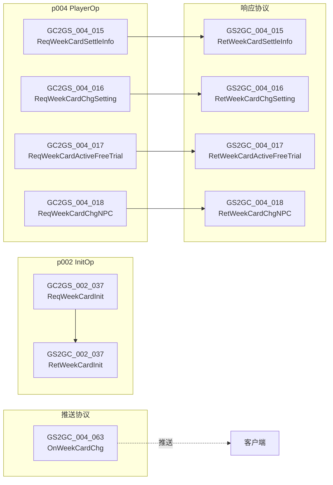
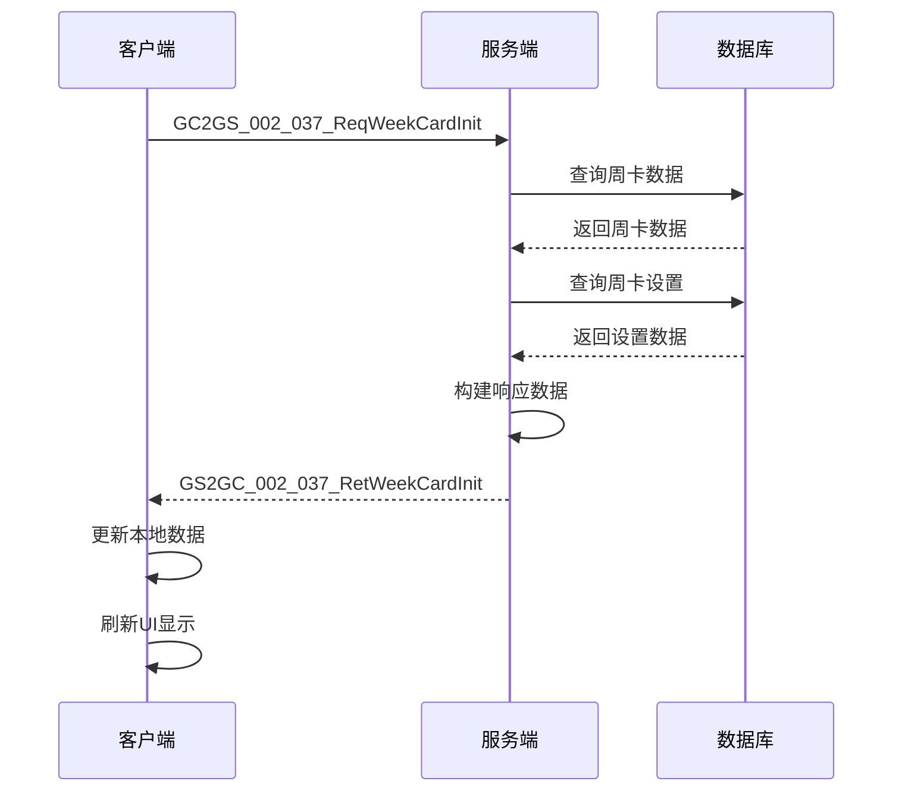
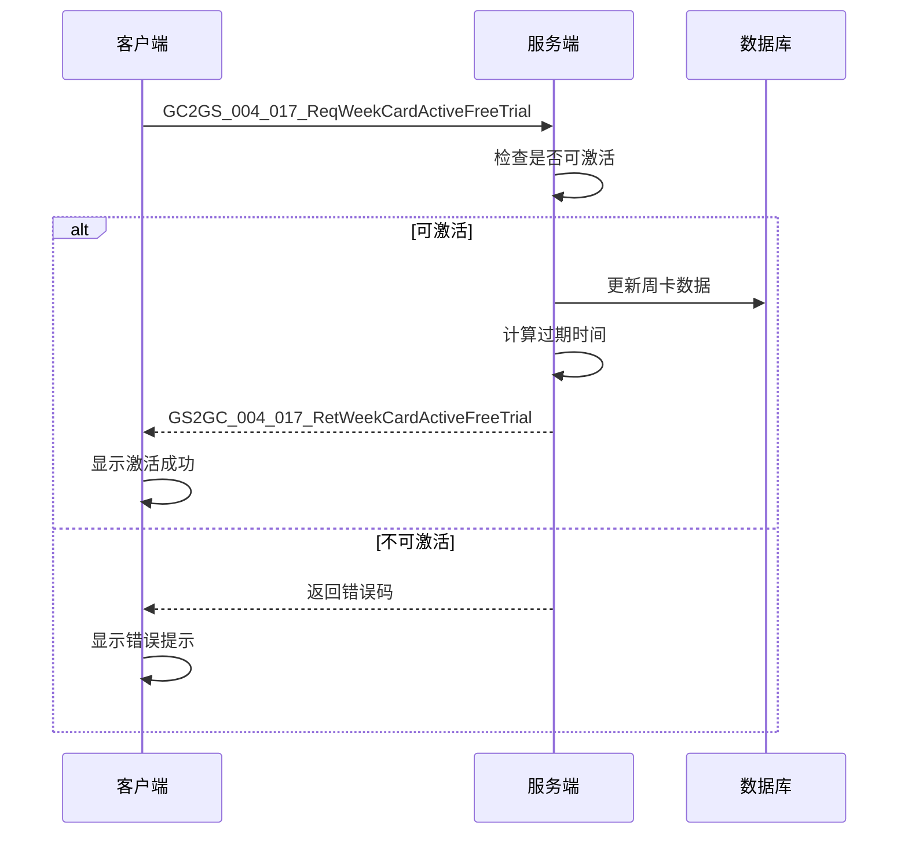
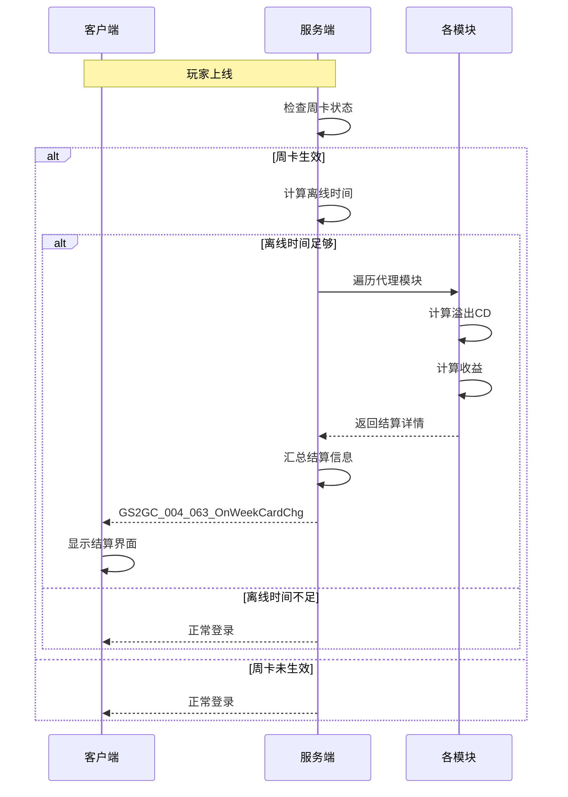
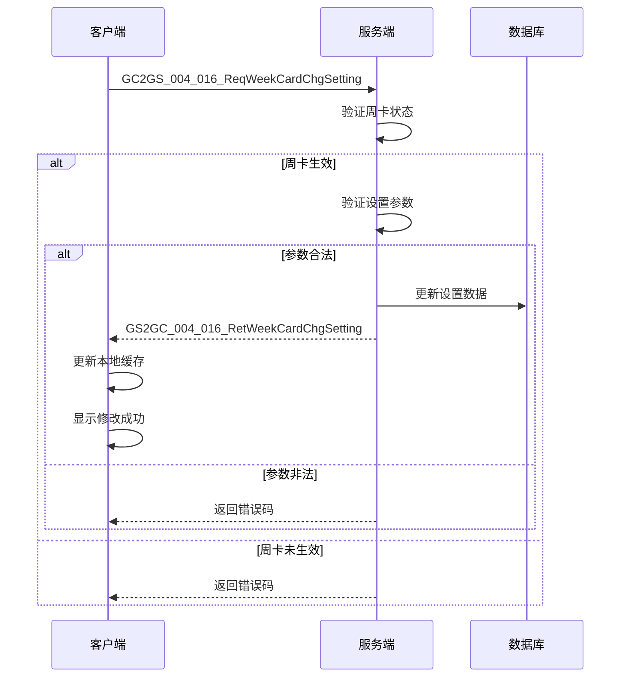
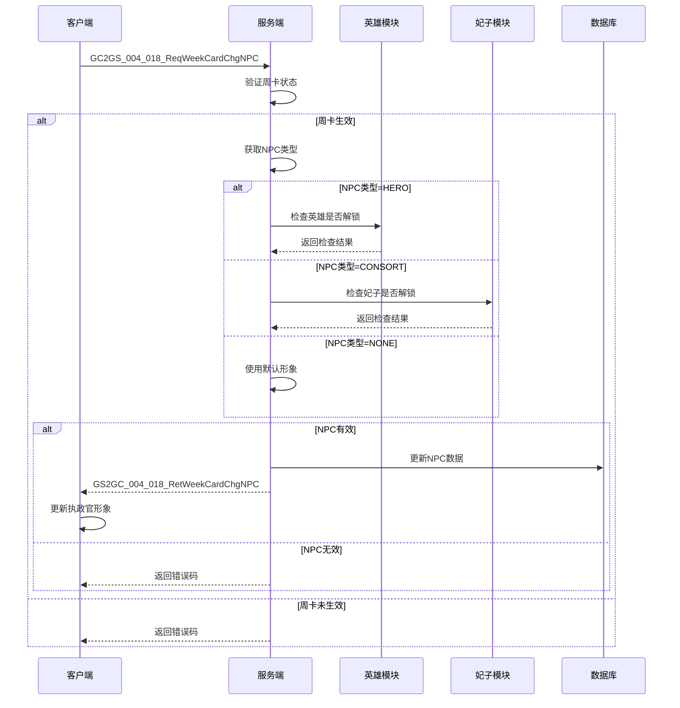
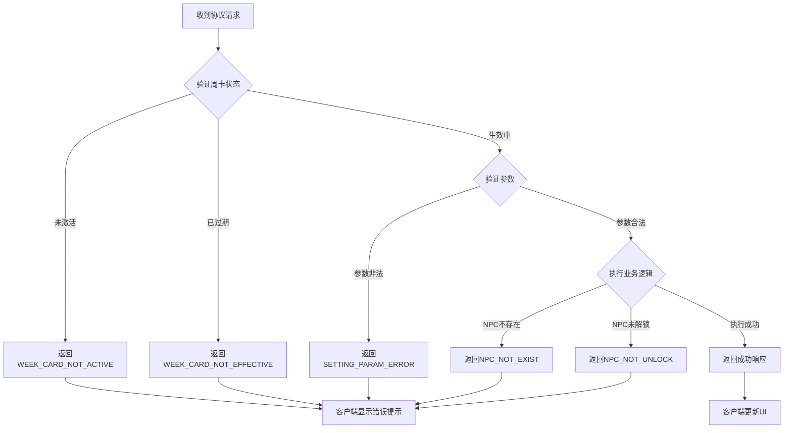

# 周卡模块 - 协议文档

**模块名称**: WeekCard（周卡系统）
**协议模块编号**: p002 (InitOp) / p004 (PlayerOp)
**文档版本**: 2.0
**更新日期**: 2026-04-12

---

## 一、协议总览



---

## 二、客户端请求协议 (GC2GS)

### 2.1 初始化相关

#### GC2GS_002_037_ReqWeekCardInit - 请求周卡初始化

**协议编号**: `002_037`
**功能说明**: 请求获取玩家周卡数据，在玩家登录后调用

**请求参数**: 无

```csharp
// 客户端调用示例
NPPlayer.instance.weekCardComp.presendInitProtocol();
```

```java
// 服务端处理签名
public void handleReqWeekCardInit(long cid, GC2GS_002_037_ReqWeekCardInit msg)
```

---

### 2.2 周卡操作

#### GC2GS_004_015_ReqWeekCardSettleInfo - 请求结算信息

**协议编号**: `004_015`
**功能说明**: 请求周卡的离线结算信息

**请求参数**: 无

```csharp
// 客户端调用示例
NPPlayer.instance.weekCardComp.reqWeekCardSettleInfo((msg) =>
{
    if (msg != null && msg.settleInfo != null)
    {
        // 处理结算信息
        ShowSettleUI(msg.settleInfo);
    }
});
```

---

#### GC2GS_004_016_ReqWeekCardChgSetting - 修改设置

**协议编号**: `004_016`
**功能说明**: 请求修改周卡的代理设置

**请求参数**:

| 字段名 | 类型 | 必填 | 说明 |
|--------|------|------|------|
| settingInfo | WeekCard_SingleSettingInfo | 是 | 设置信息 |

**参数结构**:

```csharp
public class GC2GS_004_016_ReqWeekCardChgSetting
{
    public WeekCard_SingleSettingInfo settingInfo;  // 设置信息
}
```

```csharp
// 客户端调用示例
WeekCard_SingleSettingInfo settingInfo = new WeekCard_SingleSettingInfo();
settingInfo.type = EWeekCardSettleType.LEVY;
settingInfo.settingData = SerializeLevySetting(new LevySetting
{
    isEnabled = true,
    dealPolicy = 1
});

NPPlayer.instance.weekCardComp.reqWeekCardChgSetting(settingInfo, (msg) =>
{
    if (msg != null)
    {
        Debug.Log("设置修改成功");
    }
});
```

---

#### GC2GS_004_017_ReqWeekCardActiveFreeTrial - 激活免费试用

**协议编号**: `004_017`
**功能说明**: 请求激活周卡免费试用

**请求参数**: 无

**前置条件**:
- 玩家未使用过免费试用
- 周卡功能已解锁

```csharp
// 客户端调用示例
NPPlayer.instance.weekCardComp.reqWeekCardActiveFreeTrial((msg) =>
{
    if (msg != null)
    {
        Debug.Log($"免费试用激活成功，过期时间: {msg.info.expireTimeTagS}");
    }
});
```

---

#### GC2GS_004_018_ReqWeekCardChgNPC - 修改NPC形象

**协议编号**: `004_018`
**功能说明**: 请求修改周卡执政官的NPC形象

**请求参数**:

| 字段名 | 类型 | 必填 | 说明 |
|--------|------|------|------|
| npcType | EWeekCardNPCType | 是 | NPC类型 |
| npcId | long | 是 | NPC ID（英雄ID或妃子ID） |

**参数结构**:

```csharp
public class GC2GS_004_018_ReqWeekCardChgNPC
{
    public EWeekCardNPCType npcType;  // NPC类型
    public long npcId;                // NPC ID
}
```

```csharp
// 客户端调用示例
// 使用英雄作为执政官形象
NPPlayer.instance.weekCardComp.reqWeekCardChgNPC(
    EWeekCardNPCType.HERO,
    selectedHeroId,
    (msg) =>
    {
        if (msg != null)
        {
            Debug.Log($"NPC形象修改成功: 类型={msg.info.npcType}, ID={msg.info.npcId}");
        }
    }
);

// 使用妃子作为执政官形象
NPPlayer.instance.weekCardComp.reqWeekCardChgNPC(
    EWeekCardNPCType.CONSORT,
    selectedConsortId,
    (msg) =>
    {
        if (msg != null)
        {
            Debug.Log($"NPC形象修改成功");
        }
    }
);

// 恢复默认形象
NPPlayer.instance.weekCardComp.reqWeekCardChgNPC(
    EWeekCardNPCType.NONE,
    0,
    (msg) =>
    {
        Debug.Log("已恢复默认执政官形象");
    }
);
```

---

## 三、服务端响应协议 (GS2GC)

### 3.1 初始化响应

#### GS2GC_002_037_RetWeekCardInit - 返回周卡初始化数据

**协议编号**: `002_037`
**功能说明**: 返回玩家周卡初始化数据

**响应参数**:

| 字段名 | 类型 | 说明 |
|--------|------|------|
| info | WeekCard_Info | 周卡信息 |
| settingList | List&lt;WeekCard_SingleSettingInfo&gt; | 设置列表 |

**参数结构**:

```csharp
public class GS2GC_002_037_RetWeekCardInit
{
    public WeekCard_Info info;                                    // 周卡信息
    public List<WeekCard_SingleSettingInfo> settingList;          // 设置列表
}
```

---

### 3.2 操作响应

#### GS2GC_004_015_RetWeekCardSettleInfo - 返回结算信息

**协议编号**: `004_015`
**功能说明**: 返回周卡离线结算信息

**响应参数**:

| 字段名 | 类型 | 说明 |
|--------|------|------|
| settleInfo | WeekCard_SettleInfo | 结算信息 |

**参数结构**:

```csharp
public class GS2GC_004_015_RetWeekCardSettleInfo
{
    public WeekCard_SettleInfo settleInfo;  // 结算信息
}
```

---

#### GS2GC_004_016_RetWeekCardChgSetting - 修改设置结果

**协议编号**: `004_016`
**功能说明**: 返回修改设置的结果

**响应参数**:

| 字段名 | 类型 | 说明 |
|--------|------|------|
| settingInfo | WeekCard_SingleSettingInfo | 修改后的设置信息 |

**参数结构**:

```csharp
public class GS2GC_004_016_RetWeekCardChgSetting
{
    public WeekCard_SingleSettingInfo settingInfo;  // 设置信息
}
```

---

#### GS2GC_004_017_RetWeekCardActiveFreeTrial - 激活免费试用结果

**协议编号**: `004_017`
**功能说明**: 返回激活免费试用的结果

**响应参数**:

| 字段名 | 类型 | 说明 |
|--------|------|------|
| info | WeekCard_Info | 周卡信息（含新的过期时间） |

**参数结构**:

```csharp
public class GS2GC_004_017_RetWeekCardActiveFreeTrial
{
    public WeekCard_Info info;  // 周卡信息
}
```

---

#### GS2GC_004_018_RetWeekCardChgNPC - 修改NPC结果

**协议编号**: `004_018`
**功能说明**: 返回修改NPC形象的结果

**响应参数**:

| 字段名 | 类型 | 说明 |
|--------|------|------|
| info | WeekCard_Info | 周卡信息（含新的NPC信息） |

**参数结构**:

```csharp
public class GS2GC_004_018_RetWeekCardChgNPC
{
    public WeekCard_Info info;  // 周卡信息
}
```

---

### 3.3 推送通知协议

#### GS2GC_004_063_OnWeekCardChg - 周卡变化推送

**协议编号**: `004_063`
**功能说明**: 推送周卡数据变化，在以下场景触发：
- 购买/续费周卡成功
- 周卡到期
- 执政官形象变化

**推送参数**:

| 字段名 | 类型 | 说明 |
|--------|------|------|
| info | WeekCard_Info | 周卡信息 |

**参数结构**:

```csharp
public class GS2GC_004_063_OnWeekCardChg
{
    public WeekCard_Info info;  // 周卡信息
}
```

---

## 四、协议调用流程

### 4.1 周卡初始化流程



### 4.2 激活免费试用流程



### 4.3 离线结算流程



### 4.4 修改设置流程



### 4.5 修改NPC形象流程



---

## 五、错误码定义

### 5.1 PlayerErr - 玩家相关错误

| 错误码 | 错误名 | 说明 | 客户端提示 |
|--------|--------|------|-----------|
| 00237 | WEEK_CARD_NOT_ACTIVE | 周卡未激活 | "周卡未激活，请先购买" |
| 00415 | WEEK_CARD_NOT_EFFECTIVE | 周卡未生效 | "周卡已过期" |
| 00416 | WEEK_CARD_FREE_TRIAL_HAD_USE | 免费试用已使用 | "免费试用已使用过" |
| 00417 | WEEK_CARD_SETTING_PARAM_ERROR | 设置参数错误 | "设置参数错误" |
| 00418 | WEEK_CARD_NPC_NOT_EXIST | NPC不存在 | "选择的NPC不存在" |
| 00419 | WEEK_CARD_NPC_NOT_UNLOCK | NPC未解锁 | "该NPC尚未解锁" |
| 00420 | WEEK_CARD_DEALER_NOT_ENABLE | 代理功能未开启 | "该代理功能未开启" |

### 5.2 错误码枚举定义

```java
public enum WeekCardErr {
    WEEK_CARD_NOT_ACTIVE(237, "周卡未激活"),
    WEEK_CARD_NOT_EFFECTIVE(415, "周卡未生效"),
    WEEK_CARD_FREE_TRIAL_HAD_USE(416, "免费试用已使用"),
    WEEK_CARD_SETTING_PARAM_ERROR(417, "设置参数错误"),
    WEEK_CARD_NPC_NOT_EXIST(418, "NPC不存在"),
    WEEK_CARD_NPC_NOT_UNLOCK(419, "NPC未解锁"),
    WEEK_CARD_DEALER_NOT_ENABLE(420, "代理功能未开启");

    private final int code;
    private final String desc;

    WeekCardErr(int code, String desc) {
        this.code = code;
        this.desc = desc;
    }

    public int getCode() { return code; }
    public String getDesc() { return desc; }
}
```

### 5.3 错误处理流程



---

## 六、协议数据结构详解

### 6.1 WeekCard_Info 完整定义

```csharp
/// <summary>
/// 周卡信息
/// </summary>
public class WeekCard_Info : _IALProtocolStructure
{
    /// <summary>
    /// 过期时间戳(秒)
    /// </summary>
    private int expireTimeTagS;

    /// <summary>
    /// 是否使用过免费试用
    /// </summary>
    private bool hadUseFreeTrial;

    /// <summary>
    /// NPC类型
    /// </summary>
    private EWeekCardNPCType npcType;

    /// <summary>
    /// NPC ID
    /// </summary>
    private long npcId;

    public byte getMainOrder() { return (byte)4; }
    public byte getSubOrder() { return (byte)10; }

    /// <summary>
    /// 获取周卡状态
    /// </summary>
    public EWeekCardStat getWeekCardStat(int serverTime)
    {
        if (!hadUseFreeTrial)
            return EWeekCardStat.NONE;

        if (expireTimeTagS > serverTime)
            return EWeekCardStat.IN_WEEK_CARD;

        return EWeekCardStat.EXPIREED;
    }

    /// <summary>
    /// 获取剩余时间(秒)
    /// </summary>
    public int getRemainTimeSec(int serverTime)
    {
        return Math.Max(0, expireTimeTagS - serverTime);
    }

    /// <summary>
    /// 判断周卡是否生效
    /// </summary>
    public bool isEffective(int serverTime)
    {
        return expireTimeTagS > serverTime;
    }
}
```

### 6.2 WeekCard_SettleInfo 完整定义

```csharp
/// <summary>
/// 周卡结算信息
/// </summary>
public class WeekCard_SettleInfo : _IALProtocolStructure
{
    /// <summary>
    /// 结算详情列表
    /// </summary>
    private List<WeekCard_SettleDetailInfo> detailList;

    /// <summary>
    /// 奖励物品列表
    /// </summary>
    private List<RewardItem> itemList;

    public byte getMainOrder() { return (byte)4; }
    public byte getSubOrder() { return (byte)11; }

    /// <summary>
    /// 是否有结算收益
    /// </summary>
    public bool hasSettleReward()
    {
        return itemList != null && itemList.Count > 0;
    }

    /// <summary>
    /// 获取指定类型的结算详情
    /// </summary>
    public WeekCard_SettleDetailInfo getDetail(EWeekCardSettleType type)
    {
        if (detailList == null) return null;
        return detailList.Find(d => d.type == type);
    }

    /// <summary>
    /// 获取总收益数量
    /// </summary>
    public int getTotalRewardCount()
    {
        return itemList?.Count ?? 0;
    }
}
```

### 6.3 WeekCard_SettleDetailInfo 完整定义

```csharp
/// <summary>
/// 周卡结算详情
/// </summary>
public class WeekCard_SettleDetailInfo : _IALProtocolStructure
{
    /// <summary>
    /// 结算类型
    /// </summary>
    private EWeekCardSettleType type;

    /// <summary>
    /// 结算次数
    /// </summary>
    private int count;

    /// <summary>
    /// 奖励列表
    /// </summary>
    private List<RewardItem> rewardList;

    public byte getMainOrder() { return (byte)4; }
    public byte getSubOrder() { return (byte)12; }

    /// <summary>
    /// 获取类型描述
    /// </summary>
    public string getTypeDesc()
    {
        return type.GetDescription();
    }
}
```

### 6.4 WeekCard_SingleSettingInfo 完整定义

```csharp
/// <summary>
/// 周卡单项设置信息
/// </summary>
public class WeekCard_SingleSettingInfo : _IALProtocolStructure
{
    /// <summary>
    /// 结算类型
    /// </summary>
    private EWeekCardSettleType type;

    /// <summary>
    /// 设置数据(序列化)
    /// </summary>
    private byte[] settingData;

    public byte getMainOrder() { return (byte)4; }
    public byte getSubOrder() { return (byte)13; }

    /// <summary>
    /// 反序列化设置数据
    /// </summary>
    public T getSetting<T>() where T : class, new()
    {
        if (settingData == null || settingData.Length == 0)
            return new T();
        return ProtocolHelper.Deserialize<T>(settingData);
    }

    /// <summary>
    /// 序列化设置数据
    /// </summary>
    public void setSetting<T>(T setting) where T : class
    {
        settingData = ProtocolHelper.Serialize(setting);
    }
}
```

---

## 七、服务端协议构造示例

### 7.1 构造周卡信息

```java
/**
 * 构造周卡信息协议
 */
public WeekCard_Info makeInfoProto()
{
    WeekCard_Info info = new WeekCard_Info();
    info.setExpireTimeTagS((int) (getExpireTimeMs() / 1000));
    info.setHadUseFreeTrial(_m_bo.getHadUseFreeTrial());
    info.setNpcType(EWeekCardNPCType.fromInt(_m_bo.getNpcType()));
    info.setNpcId(_m_bo.getNpcId());
    return info;
}
```

### 7.2 构造设置列表

```java
/**
 * 构造所有设置协议
 */
public List<WeekCard_SingleSettingInfo> makeAllSettingProto()
{
    List<WeekCard_SingleSettingInfo> list = new ArrayList<>();
    for (_AWeekCardDealer dealer : _m_weekCardDealerList)
    {
        WeekCard_SingleSettingInfo setting = dealer.makeSettingProto();
        if (setting != null)
        {
            list.add(setting);
        }
    }
    return list;
}
```

### 7.3 构造结算信息

```java
/**
 * 构造结算信息协议
 */
public WeekCard_SettleInfo makeSettleInfoProto()
{
    if (_m_settleInfo == null || _m_settleInfo.itemList.isEmpty())
    {
        return null;
    }
    return _m_settleInfo;
}
```

---

## 八、客户端协议处理示例

### 8.1 初始化协议处理

```csharp
/// <summary>
/// 周卡初始化响应处理
/// </summary>
private void _onRetWeekCardInit(GS2GC_002_037_RetWeekCardInit msg)
{
    if (msg == null) return;

    // 更新周卡信息
    _m_info = msg.info;

    // 更新设置列表
    _m_settingDict.Clear();
    foreach (var setting in msg.settingList)
    {
        _m_settingDict[setting.type] = setting;
    }

    // 触发变化事件
    onWeekCardInfoChg?.Invoke();

    // 刷新红点
    _refreshRed();
}
```

### 8.2 周卡变化推送处理

```csharp
/// <summary>
/// 周卡变化推送处理
/// </summary>
private void _onWeekCardChg(GS2GC_004_063_OnWeekCardChg msg)
{
    if (msg == null) return;

    // 更新周卡信息
    _m_info = msg.info;

    // 触发变化事件
    onWeekCardInfoChg?.Invoke();

    // 检查是否需要显示结算界面
    if (_hasSettleReward())
    {
        _showSettleUI();
    }
}
```

---

## 九、协议调试工具

### 9.1 协议日志格式

```
[WeekCard] 协议请求: GC2GS_004_017_ReqWeekCardActiveFreeTrial, cid=12345
[WeekCard] 协议响应: GS2GC_004_017_RetWeekCardActiveFreeTrial, expireTime=1713081600
[WeekCard] 协议推送: GS2GC_004_063_OnWeekCardChg, cid=12345, npcType=HERO, npcId=10001
```

### 9.2 协议调试命令

```bash
# 查看玩家周卡数据
/gm weekcard info <cid>

# 激活免费试用
/gm weekcard activate_free_trial <cid>

# 修改NPC形象
/gm weekcard change_npc <cid> <npcType> <npcId>

# 查看结算信息
/gm weekcard settle_info <cid>

# 触发离线结算
/gm weekcard trigger_settle <cid> <offlineSeconds>
```

---

*文档生成时间: 2026-04-12*
*文档版本: v2.0*
