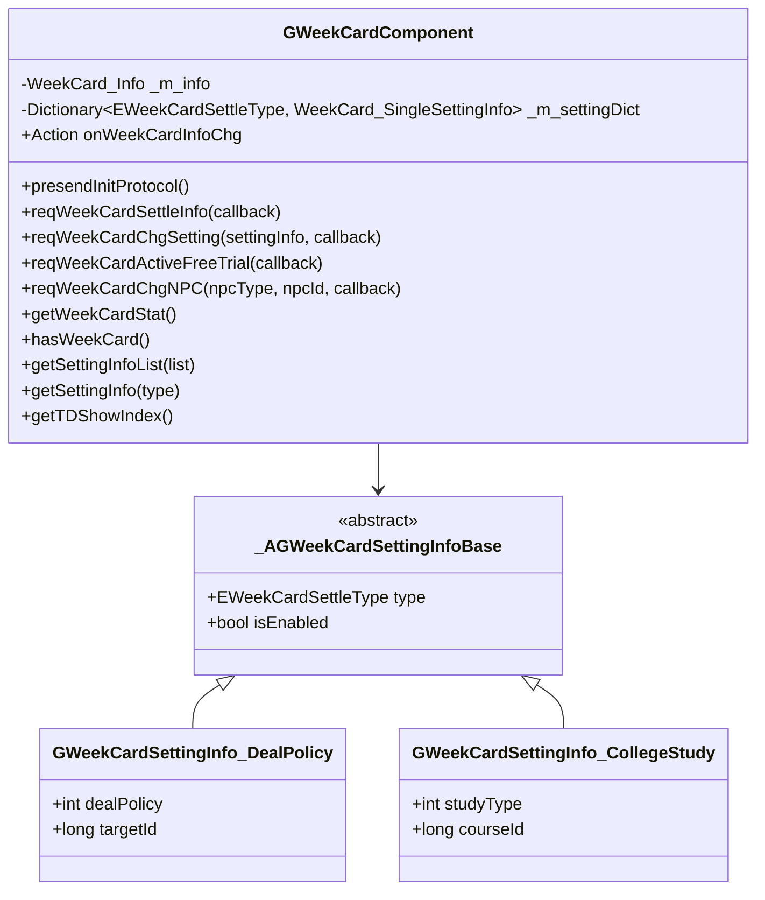
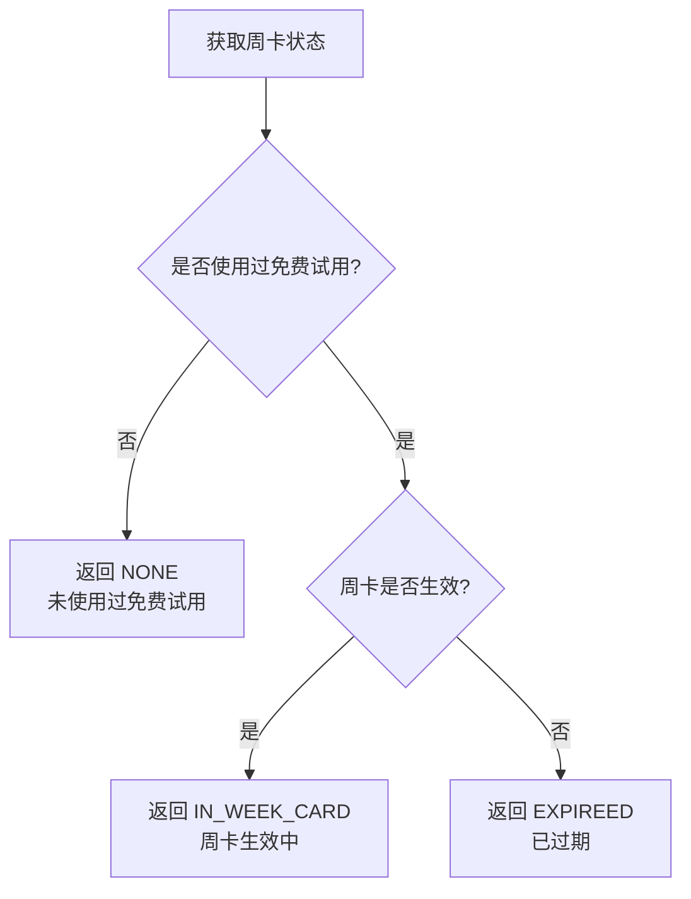

# 周卡模块 - 客户端开发文档

**模块名称**: WeekCard（周卡系统）
**文档版本**: 2.0
**更新日期**: 2026-04-12

---

## 一、模块架构



---

## 二、组件数据层

### 2.1 核心组件类

#### GWeekCardComponent

**路径**: `GameComponent/WeekCard/GWeekCardComponent.cs`

**继承关系**:
```
GWeekCardComponent : _ANPBasicPlayerComponent
```

**主要属性**:

| 属性名 | 类型 | 说明 |
|--------|------|------|
| expireTimeTagS | int | 过期时间戳(秒) |
| hadUseFreeTrial | bool | 是否使用过免费试用 |
| npcType | EWeekCardNPCType | NPC类型 |
| npcId | long | NPC ID |
| onWeekCardInfoChg | Action | 周卡信息变化事件 |

**主要方法**:

| 方法名 | 返回类型 | 说明 |
|--------|----------|------|
| presendInitProtocol() | void | 发送初始化协议 |
| reqWeekCardSettleInfo(Action callback) | void | 请求结算信息 |
| reqWeekCardChgSetting(WeekCard_SingleSettingInfo, Action callback) | void | 修改设置 |
| reqWeekCardActiveFreeTrial(Action callback) | void | 激活免费试用 |
| reqWeekCardChgNPC(EWeekCardNPCType, long, Action callback) | void | 修改NPC形象 |
| getWeekCardStat() | EWeekCardStat | 获取周卡状态 |
| hasWeekCard() | bool | 判断周卡是否生效 |
| getSettingInfoList(List) | void | 获取设置信息列表 |
| getSettingInfo(EWeekCardSettleType) | _AGWeekCardSettingInfoBase | 获取指定类型设置 |
| getTDShowIndex() | NPGGoIndex | 获取执政官形象索引 |

---

## 三、周卡状态判断

### 3.1 状态判断逻辑



### 3.2 代码实现

```csharp
/// <summary>
/// 获取周卡状态
/// </summary>
public EWeekCardStat getWeekCardStat()
{
    // 未使用过免费试用
    if (!_m_hadUseFreeTrial)
        return EWeekCardStat.NONE;

    // 周卡是否生效
    if (hasWeekCard())
        return EWeekCardStat.IN_WEEK_CARD;

    // 已过期
    return EWeekCardStat.EXPIREED;
}

/// <summary>
/// 判断周卡是否生效
/// </summary>
public bool hasWeekCard()
{
    if (_m_info == null)
        return false;

    return _m_info.expireTimeTagS > FpsAndPingMgr.instance.serverTimeTagS;
}

/// <summary>
/// 获取剩余时间(秒)
/// </summary>
public int getRemainTimeSec()
{
    if (_m_info == null)
        return 0;

    int serverTime = FpsAndPingMgr.instance.serverTimeTagS;
    return Math.Max(0, _m_info.expireTimeTagS - serverTime);
}

/// <summary>
/// 获取剩余时间格式化字符串
/// </summary>
public string getRemainTimeStr()
{
    int remainSec = getRemainTimeSec();
    if (remainSec <= 0)
        return "已过期";

    int days = remainSec / 86400;
    int hours = (remainSec % 86400) / 3600;
    int minutes = (remainSec % 3600) / 60;

    if (days > 0)
        return $"{days}天{hours}小时";
    else if (hours > 0)
        return $"{hours}小时{minutes}分钟";
    else
        return $"{minutes}分钟";
}
```

---

## 四、设置信息管理

### 4.1 获取设置信息

```csharp
/// <summary>
/// 获取设置信息列表
/// </summary>
public void getSettingInfoList(List<_AGWeekCardSettingInfoBase> settingList)
{
    settingList.Clear();

    foreach (var kvp in _m_settingDict)
    {
        var settingInfo = _parseSettingInfo(kvp.Value);
        if (settingInfo != null)
        {
            settingList.Add(settingInfo);
        }
    }
}

/// <summary>
/// 获取指定类型设置
/// </summary>
public _AGWeekCardSettingInfoBase getSettingInfo(EWeekCardSettleType type)
{
    if (!_m_settingDict.TryGetValue(type, out var settingInfo))
        return null;

    return _parseSettingInfo(settingInfo);
}

/// <summary>
/// 解析设置信息
/// </summary>
private _AGWeekCardSettingInfoBase _parseSettingInfo(WeekCard_SingleSettingInfo proto)
{
    switch (proto.type)
    {
        case EWeekCardSettleType.LEVY:
        case EWeekCardSettleType.ANECDOTE:
        case EWeekCardSettleType.CONSORT_RND_CALL:
        case EWeekCardSettleType.TRAVEL:
            return proto.getSetting<GWeekCardSettingInfo_DealPolicy>();

        case EWeekCardSettleType.COLLEGE_STUDY:
            return proto.getSetting<GWeekCardSettingInfo_CollegeStudy>();

        default:
            return null;
    }
}
```

### 4.2 设置信息类型

| 类型 | 类名 | 说明 | 特有字段 |
|------|------|------|----------|
| LEVY | GWeekCardSettingInfo_DealPolicy | 征收设置 | dealPolicy, targetId |
| ANECDOTE | GWeekCardSettingInfo_DealPolicy | 政务设置 | dealPolicy, targetId |
| CONSORT_RND_CALL | GWeekCardSettingInfo_DealPolicy | 妃子倾诉设置 | dealPolicy, targetId |
| COLLEGE_STUDY | GWeekCardSettingInfo_CollegeStudy | 大学学习设置 | studyType, courseId |
| TRAVEL | GWeekCardSettingInfo_DealPolicy | 游历设置 | dealPolicy, targetId |

### 4.3 设置数据结构

```csharp
/// <summary>
/// 处理策略设置基类
/// </summary>
public class GWeekCardSettingInfo_DealPolicy : _AGWeekCardSettingInfoBase
{
    /// <summary>
    /// 处理策略（0随机，1优先银两，2优先经验等）
    /// </summary>
    public int dealPolicy;

    /// <summary>
    /// 目标ID（如妃子ID、政务类型等）
    /// </summary>
    public long targetId;
}

/// <summary>
/// 大学学习设置
/// </summary>
public class GWeekCardSettingInfo_CollegeStudy : _AGWeekCardSettingInfoBase
{
    /// <summary>
    /// 学习类型（0自动选择最短，1指定课程）
    /// </summary>
    public int studyType;

    /// <summary>
    /// 课程ID
    /// </summary>
    public long courseId;
}
```

---

## 五、请求方法详解

### 5.1 初始化请求

```csharp
/// <summary>
/// 发送初始化协议
/// </summary>
public void presendInitProtocol()
{
    var msg = new GC2GS_002_037_ReqWeekCardInit();
    NPPlayer.instance.sendMsg(msg);

    // 注册响应回调
    NPPlayer.instance.registerMsgHandler<GS2GC_002_037_RetWeekCardInit>(_onRetWeekCardInit);
}

/// <summary>
/// 初始化响应处理
/// </summary>
private void _onRetWeekCardInit(GS2GC_002_037_RetWeekCardInit msg)
{
    if (msg == null) return;

    // 更新周卡信息
    _m_info = msg.info;

    // 更新设置列表
    _m_settingDict.Clear();
    foreach (var setting in msg.settingList)
    {
        _m_settingDict[setting.type] = setting;
    }

    // 触发变化事件
    onWeekCardInfoChg?.Invoke();

    // 刷新红点
    _refreshRed();
}
```

### 5.2 请求结算信息

```csharp
/// <summary>
/// 请求结算信息
/// </summary>
/// <param name="callback">回调函数</param>
public void reqWeekCardSettleInfo(Action<GS2GC_004_015_RetWeekCardSettleInfo> callback)
{
    var msg = new GC2GS_004_015_ReqWeekCardSettleInfo();
    NPPlayer.instance.sendMsg(msg, (response) =>
    {
        var settleMsg = response as GS2GC_004_015_RetWeekCardSettleInfo;
        callback?.Invoke(settleMsg);
    });
}

/// <summary>
/// 处理结算信息
/// </summary>
private void _processSettleInfo(WeekCard_SettleInfo settleInfo)
{
    if (settleInfo == null || !settleInfo.hasSettleReward())
    {
        Debug.Log("无结算收益");
        return;
    }

    // 显示结算界面
    _showSettleUI(settleInfo);
}
```

### 5.3 修改设置

```csharp
/// <summary>
/// 修改周卡设置
/// </summary>
/// <param name="settingInfo">设置信息</param>
/// <param name="callback">回调函数</param>
public void reqWeekCardChgSetting(WeekCard_SingleSettingInfo settingInfo,
    Action<GS2GC_004_016_RetWeekCardChgSetting> callback)
{
    // 检查周卡是否生效
    if (!hasWeekCard())
    {
        Debug.LogWarning("周卡未生效，无法修改设置");
        return;
    }

    var msg = new GC2GS_004_016_ReqWeekCardChgSetting();
    msg.settingInfo = settingInfo;

    NPPlayer.instance.sendMsg(msg, (response) =>
    {
        var chgMsg = response as GS2GC_004_016_RetWeekCardChgSetting;
        if (chgMsg != null)
        {
            // 更新本地设置
            _m_settingDict[settingInfo.type] = chgMsg.settingInfo;
            Debug.Log($"设置修改成功: {settingInfo.type}");
        }
        callback?.Invoke(chgMsg);
    });
}

/// <summary>
/// 修改征收设置
/// </summary>
public void changeLevySetting(bool isEnabled, int dealPolicy)
{
    var setting = new GWeekCardSettingInfo_DealPolicy
    {
        type = EWeekCardSettleType.LEVY,
        isEnabled = isEnabled,
        dealPolicy = dealPolicy
    };

    var proto = new WeekCard_SingleSettingInfo();
    proto.type = EWeekCardSettleType.LEVY;
    proto.setSetting(setting);

    reqWeekCardChgSetting(proto, (msg) =>
    {
        if (msg != null)
        {
            Debug.Log("征收设置修改成功");
        }
    });
}
```

### 5.4 激活免费试用

```csharp
/// <summary>
/// 激活免费试用
/// </summary>
/// <param name="callback">回调函数</param>
public void reqWeekCardActiveFreeTrial(Action<GS2GC_004_017_RetWeekCardActiveFreeTrial> callback)
{
    // 检查是否已使用过
    if (_m_hadUseFreeTrial)
    {
        Debug.LogWarning("免费试用已使用过");
        return;
    }

    var msg = new GC2GS_004_017_ReqWeekCardActiveFreeTrial();
    NPPlayer.instance.sendMsg(msg, (response) =>
    {
        var activateMsg = response as GS2GC_004_017_RetWeekCardActiveFreeTrial;
        if (activateMsg != null)
        {
            // 更新周卡信息
            _m_info = activateMsg.info;
            _m_hadUseFreeTrial = true;

            // 触发变化事件
            onWeekCardInfoChg?.Invoke();

            Debug.Log($"免费试用激活成功，过期时间: {_m_info.expireTimeTagS}");
        }
        callback?.Invoke(activateMsg);
    });
}
```

### 5.5 修改NPC形象

```csharp
/// <summary>
/// 修改NPC形象
/// </summary>
/// <param name="npcType">NPC类型</param>
/// <param name="npcId">NPC ID</param>
/// <param name="callback">回调函数</param>
public void reqWeekCardChgNPC(EWeekCardNPCType npcType, long npcId,
    Action<GS2GC_004_018_RetWeekCardChgNPC> callback)
{
    // 检查周卡是否生效
    if (!hasWeekCard())
    {
        Debug.LogWarning("周卡未生效，无法修改NPC形象");
        return;
    }

    // 验证NPC
    if (!_validateNPC(npcType, npcId))
    {
        Debug.LogWarning($"NPC验证失败: type={npcType}, id={npcId}");
        return;
    }

    var msg = new GC2GS_004_018_ReqWeekCardChgNPC();
    msg.npcType = npcType;
    msg.npcId = npcId;

    NPPlayer.instance.sendMsg(msg, (response) =>
    {
        var chgMsg = response as GS2GC_004_018_RetWeekCardChgNPC;
        if (chgMsg != null)
        {
            // 更新周卡信息
            _m_info = chgMsg.info;

            // 触发变化事件
            onWeekCardInfoChg?.Invoke();

            Debug.Log($"NPC形象修改成功: type={npcType}, id={npcId}");
        }
        callback?.Invoke(chgMsg);
    });
}

/// <summary>
/// 验证NPC是否有效
/// </summary>
private bool _validateNPC(EWeekCardNPCType npcType, long npcId)
{
    switch (npcType)
    {
        case EWeekCardNPCType.NONE:
            return true;

        case EWeekCardNPCType.HERO:
            return NPPlayer.instance.heroComp.hasHero(npcId);

        case EWeekCardNPCType.CONSORT:
            return NPPlayer.instance.consortComp.hasConsort(npcId);

        default:
            return false;
    }
}
```

---

## 六、执政官形象

### 6.1 获取执政官形象

```csharp
/// <summary>
/// 获取执政官形象索引
/// </summary>
public NPGGoIndex getTDShowIndex()
{
    if (_m_info == null)
        return _getDefaultTDShowIndex();

    switch (_m_info.npcType)
    {
        case EWeekCardNPCType.HERO:
            return _getHeroTDShowIndex(_m_info.npcId);

        case EWeekCardNPCType.CONSORT:
            return _getConsortTDShowIndex(_m_info.npcId);

        default:
            return _getDefaultTDShowIndex();
    }
}

/// <summary>
/// 获取默认执政官形象
/// </summary>
private NPGGoIndex _getDefaultTDShowIndex()
{
    // 从配置获取默认形象
    var defaultShow = GRefdataCoreMgr.instance.generalRef.week_card_assign_default_td_show;
    if (defaultShow != null)
    {
        return new NPGGoIndex
        {
            goType = (ENPGGoType)defaultShow.npcType,
            goId = defaultShow.npcId
        };
    }

    // 返回系统默认
    return new NPGGoIndex
    {
        goType = ENPGGoType.NONE,
        goId = 0
    };
}

/// <summary>
/// 获取英雄执政官形象
/// </summary>
private NPGGoIndex _getHeroTDShowIndex(long heroId)
{
    var heroInfo = NPPlayer.instance.heroComp.getHeroInfo(heroId);
    if (heroInfo == null)
        return _getDefaultTDShowIndex();

    return new NPGGoIndex
    {
        goType = ENPGGoType.HERO,
        goId = heroId
    };
}

/// <summary>
/// 获取妃子执政官形象
/// </summary>
private NPGGoIndex _getConsortTDShowIndex(long consortId)
{
    var consortInfo = NPPlayer.instance.consortComp.getConsortInfo(consortId);
    if (consortInfo == null)
        return _getDefaultTDShowIndex();

    return new NPGGoIndex
    {
        goType = ENPGGoType.CONSORT,
        goId = consortId
    };
}
```

---

## 七、消息事件

### 7.1 周卡相关消息

| 消息类型 | 说明 | 触发时机 |
|----------|------|----------|
| ON_WEEK_CARD_CHG | 周卡信息变化 | 购买、续费、过期、NPC变化 |
| ON_WEEK_CARD_SETTLE | 结算信息推送 | 玩家上线且有离线收益 |

### 7.2 事件监听示例

```csharp
/// <summary>
/// 注册周卡事件监听
/// </summary>
public void registerEvents()
{
    // 监听周卡变化
    NPPlayer.instance.weekCardComp.onWeekCardInfoChg += _onWeekCardInfoChanged;

    // 监听结算推送
    NPPlayer.instance.registerMsgHandler<GS2GC_004_063_OnWeekCardChg>(_onWeekCardChgPush);
}

/// <summary>
/// 取消周卡事件监听
/// </summary>
public void unregisterEvents()
{
    NPPlayer.instance.weekCardComp.onWeekCardInfoChg -= _onWeekCardInfoChanged;
}

/// <summary>
/// 周卡信息变化处理
/// </summary>
private void _onWeekCardInfoChanged()
{
    // 刷新UI
    _refreshUI();

    // 更新红点
    _refreshRed();

    // 更新执政官形象
    _updateTDShow();
}

/// <summary>
/// 周卡变化推送处理
/// </summary>
private void _onWeekCardChgPush(GS2GC_004_063_OnWeekCardChg msg)
{
    if (msg == null) return;

    // 更新周卡信息
    NPPlayer.instance.weekCardComp.updateInfo(msg.info);

    // 触发变化事件
    _onWeekCardInfoChanged();
}
```

---

## 八、UI窗口开发

### 8.1 窗口目录结构

```
GameWndGui/GGui/WeekCard/
├── GGUIWndWeekCard.cs          # 周卡主界面
├── GGUIWndWeekCardSettle.cs    # 结算界面
├── GGUIWndWeekCardAssign.cs    # 分配界面
├── GGUIWndWeekCardSelectedHero.cs  # 选择英雄界面
├── WeekCardSettingItem.cs      # 设置项组件
├── WeekCardSettleDetailItem.cs # 结算详情组件
└── WeekCardRewardItem.cs       # 奖励项组件
```

### 8.2 周卡主界面

```csharp
/// <summary>
/// 周卡主界面
/// </summary>
public class GGUIWndWeekCard : GGUIWndBase
{
    [SerializeField]
    private Text _remainTimeText;        // 剩余时间文本

    [SerializeField]
    private GameObject _activateBtn;     // 激活按钮

    [SerializeField]
    private GameObject _renewBtn;        // 续费按钮

    [SerializeField]
    private Transform _settingListRoot;  // 设置列表根节点

    [SerializeField]
    private Image _npcIcon;              // NPC图标

    private List<WeekCardSettingItem> _settingItems = new List<WeekCardSettingItem>();

    protected override void _onInit()
    {
        base._onInit();

        // 注册事件
        NPPlayer.instance.weekCardComp.onWeekCardInfoChg += _refreshUI;
    }

    protected override void _onDestroy()
    {
        // 取消注册事件
        NPPlayer.instance.weekCardComp.onWeekCardInfoChg -= _refreshUI;

        base._onDestroy();
    }

    protected override void _onOpen(object param)
    {
        base._onOpen(param);

        // 刷新UI
        _refreshUI();
    }

    /// <summary>
    /// 刷新UI
    /// </summary>
    private void _refreshUI()
    {
        var weekCardComp = NPPlayer.instance.weekCardComp;
        var stat = weekCardComp.getWeekCardStat();

        // 更新状态显示
        switch (stat)
        {
            case EWeekCardStat.NONE:
                _showActivateUI();
                break;

            case EWeekCardStat.IN_WEEK_CARD:
                _showActiveUI();
                break;

            case EWeekCardStat.EXPIREED:
                _showRenewUI();
                break;
        }

        // 更新剩余时间
        _remainTimeText.text = weekCardComp.getRemainTimeStr();

        // 更新NPC形象
        _updateNPCIcon();

        // 刷新设置列表
        _refreshSettingList();
    }

    /// <summary>
    /// 显示激活界面
    /// </summary>
    private void _showActivateUI()
    {
        _activateBtn.SetActive(true);
        _renewBtn.SetActive(false);
        _remainTimeText.gameObject.SetActive(false);
    }

    /// <summary>
    /// 显示生效界面
    /// </summary>
    private void _showActiveUI()
    {
        _activateBtn.SetActive(false);
        _renewBtn.SetActive(true);
        _remainTimeText.gameObject.SetActive(true);
    }

    /// <summary>
    /// 显示续费界面
    /// </summary>
    private void _showRenewUI()
    {
        _activateBtn.SetActive(false);
        _renewBtn.SetActive(true);
        _remainTimeText.text = "已过期";
        _remainTimeText.gameObject.SetActive(true);
    }

    /// <summary>
    /// 更新NPC图标
    /// </summary>
    private void _updateNPCIcon()
    {
        var tdShowIndex = NPPlayer.instance.weekCardComp.getTDShowIndex();

        switch (tdShowIndex.goType)
        {
            case ENPGGoType.HERO:
                _loadHeroIcon(tdShowIndex.goId);
                break;

            case ENPGGoType.CONSORT:
                _loadConsortIcon(tdShowIndex.goId);
                break;

            default:
                _loadDefaultIcon();
                break;
        }
    }

    /// <summary>
    /// 刷新设置列表
    /// </summary>
    private void _refreshSettingList()
    {
        // 清空旧数据
        foreach (var item in _settingItems)
        {
            Destroy(item.gameObject);
        }
        _settingItems.Clear();

        // 获取设置列表
        List<_AGWeekCardSettingInfoBase> settingList = new List<_AGWeekCardSettingInfoBase>();
        NPPlayer.instance.weekCardComp.getSettingInfoList(settingList);

        // 创建设置项
        foreach (var setting in settingList)
        {
            var item = Instantiate(_settingItemPrefab, _settingListRoot);
            item.SetData(setting);
            _settingItems.Add(item);
        }
    }

    /// <summary>
    /// 点击激活免费试用
    /// </summary>
    public void OnClickActivateFreeTrial()
    {
        NPPlayer.instance.weekCardComp.reqWeekCardActiveFreeTrial((msg) =>
        {
            if (msg != null)
            {
                GCommon.showToast("免费试用激活成功");
            }
        });
    }

    /// <summary>
    /// 点击购买/续费
    /// </summary>
    public void OnClickBuy()
    {
        // 打开购买界面
        GGUIWndMgr.instance.openWnd(typeof(GGUIWndShop), new ShopOpenParam
        {
            shopType = EShopType.WEEK_CARD
        });
    }

    /// <summary>
    /// 点击修改NPC形象
    /// </summary>
    public void OnClickChangeNPC()
    {
        GGUIWndMgr.instance.openWnd(typeof(GGUIWndWeekCardSelectedHero));
    }
}
```

### 8.3 结算界面

```csharp
/// <summary>
/// 周卡结算界面
/// </summary>
public class GGUIWndWeekCardSettle : GGUIWndBase
{
    [SerializeField]
    private Transform _detailListRoot;    // 详情列表根节点

    [SerializeField]
    private Transform _rewardListRoot;    // 奖励列表根节点

    [SerializeField]
    private Text _totalRewardText;        // 总奖励文本

    private WeekCard_SettleInfo _settleInfo;

    protected override void _onOpen(object param)
    {
        base._onOpen(param);

        _settleInfo = param as WeekCard_SettleInfo;
        if (_settleInfo != null)
        {
            _refreshUI();
        }
    }

    /// <summary>
    /// 刷新UI
    /// </summary>
    private void _refreshUI()
    {
        // 显示结算详情
        _refreshDetailList();

        // 显示奖励列表
        _refreshRewardList();

        // 更新总奖励数量
        _totalRewardText.text = $"共获得 {_settleInfo.getTotalRewardCount()} 个奖励";
    }

    /// <summary>
    /// 刷新详情列表
    /// </summary>
    private void _refreshDetailList()
    {
        GCommon.clearChildren(_detailListRoot);

        if (_settleInfo.detailList == null) return;

        foreach (var detail in _settleInfo.detailList)
        {
            var item = Instantiate(_detailItemPrefab, _detailListRoot);
            item.SetData(detail);
        }
    }

    /// <summary>
    /// 刷新奖励列表
    /// </summary>
    private void _refreshRewardList()
    {
        GCommon.clearChildren(_rewardListRoot);

        if (_settleInfo.itemList == null) return;

        foreach (var reward in _settleInfo.itemList)
        {
            var item = Instantiate(_rewardItemPrefab, _rewardListRoot);
            item.SetData(reward);
        }
    }

    /// <summary>
    /// 点击领取
    /// </summary>
    public void OnClickReceive()
    {
        // 发送领取请求
        // TODO: 添加领取协议

        // 关闭界面
        closeWnd();
    }
}
```

---

## 九、红点系统

### 9.1 红点刷新逻辑

```csharp
/// <summary>
/// 刷新红点
/// </summary>
private void _refreshRed()
{
    // 检查是否有离线结算奖励
    bool hasSettleReward = _hasSettleReward();

    // 检查是否可以激活免费试用
    bool canActivateFreeTrial = _canActivateFreeTrial();

    // 设置红点数量
    int redCount = 0;
    if (hasSettleReward) redCount++;
    if (canActivateFreeTrial) redCount++;

    if (redCount > 0)
    {
        RedTipMgr.instance.setCountByRefRedTipId(RedTipConst.WEEK_CARD, redCount);
    }
    else
    {
        RedTipMgr.instance.clearByRefRedTipId(RedTipConst.WEEK_CARD);
    }
}

/// <summary>
/// 检查是否有结算奖励
/// </summary>
private bool _hasSettleReward()
{
    // 检查是否有未领取的离线收益
    // TODO: 实现检查逻辑
    return false;
}

/// <summary>
/// 检查是否可以激活免费试用
/// </summary>
private bool _canActivateFreeTrial()
{
    if (_m_hadUseFreeTrial)
        return false;

    // 检查功能是否解锁
    int unlockId = GRefdataCoreMgr.instance.generalRef.week_card_func_simple_unlock_id;
    return NPPlayer.instance.funcUnlockComp.isFuncUnlock(unlockId);
}
```

---

## 十、工具方法

### 10.1 时间格式化

```csharp
/// <summary>
/// 格式化剩余时间
/// </summary>
public static string FormatRemainTime(int remainSec)
{
    if (remainSec <= 0)
        return "已过期";

    int days = remainSec / 86400;
    int hours = (remainSec % 86400) / 3600;
    int minutes = (remainSec % 3600) / 60;
    int seconds = remainSec % 60;

    if (days > 0)
        return $"{days}天{hours}小时{minutes}分钟";
    else if (hours > 0)
        return $"{hours}小时{minutes}分钟{seconds}秒";
    else if (minutes > 0)
        return $"{minutes}分钟{seconds}秒";
    else
        return $"{seconds}秒";
}
```

### 10.2 状态文本获取

```csharp
/// <summary>
/// 获取状态文本
/// </summary>
public static string GetStatText(EWeekCardStat stat)
{
    switch (stat)
    {
        case EWeekCardStat.NONE:
            return "未激活";
        case EWeekCardStat.IN_WEEK_CARD:
            return "生效中";
        case EWeekCardStat.EXPIREED:
            return "已过期";
        default:
            return "未知状态";
    }
}

/// <summary>
/// 获取结算类型文本
/// </summary>
public static string GetSettleTypeText(EWeekCardSettleType type)
{
    switch (type)
    {
        case EWeekCardSettleType.LEVY:
            return "征收";
        case EWeekCardSettleType.ANECDOTE:
            return "政务";
        case EWeekCardSettleType.CONSORT_RND_CALL:
            return "妃子倾诉";
        case EWeekCardSettleType.CHILD_TRAIN:
            return "子嗣培养";
        case EWeekCardSettleType.COLLEGE_STUDY:
            return "大学学习";
        case EWeekCardSettleType.TRAVEL:
            return "游历";
        default:
            return "未知类型";
    }
}
```

---

## 十一、性能优化建议

### 11.1 减少协议请求

```csharp
// 推荐：使用本地缓存
public bool hasWeekCard()
{
    // 直接使用本地缓存的数据判断
    return _m_info != null && _m_info.expireTimeTagS > FpsAndPingMgr.instance.serverTimeTagS;
}

// 不推荐：每次都请求服务器
public void checkWeekCardStatus()
{
    // 避免频繁请求服务器
    reqWeekCardStatus((msg) => {
        // ...
    });
}
```

### 11.2 事件监听管理

```csharp
/// <summary>
/// 正确管理事件监听生命周期
/// </summary>
public class WeekCardUI : MonoBehaviour
{
    private bool _isEventRegistered = false;

    private void OnEnable()
    {
        if (!_isEventRegistered)
        {
            NPPlayer.instance.weekCardComp.onWeekCardInfoChg += _refreshUI;
            _isEventRegistered = true;
        }
    }

    private void OnDisable()
    {
        if (_isEventRegistered)
        {
            NPPlayer.instance.weekCardComp.onWeekCardInfoChg -= _refreshUI;
            _isEventRegistered = false;
        }
    }
}
```

### 11.3 UI刷新优化

```csharp
/// <summary>
/// 使用脏标记减少UI刷新
/// </summary>
private bool _isUIDirty = false;

private void _onWeekCardInfoChanged()
{
    _isUIDirty = true;
}

private void Update()
{
    if (_isUIDirty)
    {
        _refreshUI();
        _isUIDirty = false;
    }
}
```

---

*文档生成时间: 2026-04-12*
*文档版本: v2.0*
