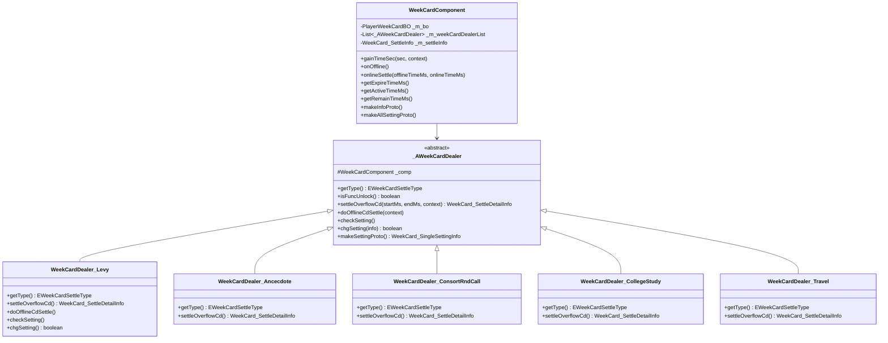

# 周卡模块 - 服务端开发文档

**模块名称**: WeekCard（周卡系统）
**文档版本**: 2.0
**更新日期**: 2026-04-12

---

## 一、模块架构



---

## 二、模块概述

### 2.1 模块职责

周卡模块（WeekCard Module）负责管理玩家的周卡数据，主要逻辑包括：
- 周卡时间管理
- 离线挂机收益结算
- 溢出CD计算
- 各功能模块挂机代理

### 2.2 组件类型

**组件类型**: `ENPPlayerCompType.WEEK_CARD`

**注册位置**: `NPUSUserData.java`

```java
// 组件注册
registerComp(new WeekCardComponent(this));
```

---

## 三、核心数据结构

### 3.1 周卡组件 (WeekCardComponent)

**路径**: `NPUSServer/NPUSUserMgr/UserComp/WeekCardComp/WeekCardComponent.java`

| 字段名 | 类型 | 说明 |
|--------|------|------|
| _m_bo | PlayerWeekCardBO | 数据库对象 |
| _m_weekCardDealerList | List&lt;_AWeekCardDealer&gt; | 周卡处理器列表 |
| _m_settleInfo | WeekCard_SettleInfo | 结算信息(内存) |

### 3.2 数据库对象 (PlayerWeekCardBO)

**路径**: `NPUSServer/NPUSUserMgr/UserComp/WeekCardComp/PlayerWeekCardBO.java`

| 字段名 | 类型 | 说明 |
|--------|------|------|
| id | long | 主键 |
| cid | long | 玩家CID |
| active_time_ms | long | 激活时间(毫秒) |
| expire_time_ms | long | 过期时间(毫秒) |
| had_use_free_trial | int | 是否使用过免费试用(0/1) |
| npc_type | int | NPC类型 |
| npc_id | long | NPC ID |

---

## 四、核心逻辑实现

### 4.1 获得周卡时间

```java
/**
 * 获得周卡时间
 * @param _sec 秒数
 * @param _context 玩家上下文
 */
public void gainTimeSec(int _sec, NPPlayerContext _context)
{
    long nowTimeMS = CommonFunc.getNowTimeMS();
    boolean isFirstGain = false;

    if (_m_bo.getExpireTimeMs() == 0)
    {
        // 首次获得
        _m_bo.setActiveTimeMs(getUSServer().getBM(), nowTimeMS);
        _m_bo.setExpireTimeMs(getUSServer().getBM(), nowTimeMS + _sec * 1000L);
        isFirstGain = true;
    }
    else
    {
        if (nowTimeMS > _m_bo.getExpireTimeMs())
        {
            // 已过期，重新激活
            _m_bo.setActiveTimeMs(getUSServer().getBM(), nowTimeMS);
            _m_bo.setExpireTimeMs(getUSServer().getBM(), nowTimeMS + _sec * 1000L);
        }
        else
        {
            // 未过期，延长时间
            _m_bo.setExpireTimeMs(getUSServer().getBM(),
                _m_bo.getExpireTimeMs() + _sec * 1000L);
        }
    }

    // 保存数据
    _m_bo.saveAllMarked(getUSServer().getBM());

    // 如果是首次获得，检查各模块设置
    if (isFirstGain)
    {
        for (_AWeekCardDealer dealer : _m_weekCardDealerList)
        {
            dealer.checkSetting();
        }
    }

    // 推送变化
    getUserData().sendMsgToGC(
        US2GCWriter_004_PlayerOp.make_063_OnWeekCardChg(makeInfoProto())
    );
}
```

### 4.2 离线处理

```java
/**
 * 离线处理
 */
public void onOffline()
{
    // 周卡未生效，不处理
    if (getRemainTimeMs() <= 0)
        return;

    NPPlayerContext context = NPPlayerContext.createNew(ENPGameEvent.PLAYER_LOGIC_OFFLINE);

    // 遍历所有代理处理器
    for (_AWeekCardDealer dealer : _m_weekCardDealerList)
    {
        // 对CD进行一次结算
        dealer.doOfflineCdSettle(context);

        // 检查设置信息
        dealer.checkSetting();
    }
}
```

### 4.3 在线结算

```java
/**
 * 在线结算（玩家上线时调用）
 * @param _offlineTimeMs 离线时间(毫秒)
 * @param _onlineTimeMs 上线时间(毫秒)
 * @return 是否有结算收益
 */
public boolean onlineSettle(long _offlineTimeMs, long _onlineTimeMs)
{
    // 验证周卡状态
    if (getExpireTimeMs() < _offlineTimeMs)
        return false;

    if (getActiveTimeMs() > _onlineTimeMs)
        return false;

    // 验证离线时长
    long offlineDurationMs = _onlineTimeMs - _offlineTimeMs;
    long minOfflineTimeMs = RefGeneral.Ref().week_card_offline_active_min_time_sec * 1000L;

    if (offlineDurationMs <= minOfflineTimeMs)
        return false;

    // 计算结算时间范围
    long startSettleTimeMs = _offlineTimeMs;
    long endSettleTimeMs = Math.min(_onlineTimeMs, getExpireTimeMs());

    // 限制结算时长
    long maxProfitTimeMs = RefGeneral.Ref().week_card_offline_hosting_max_profit_time_sec * 1000L;
    if (endSettleTimeMs - startSettleTimeMs > maxProfitTimeMs)
    {
        endSettleTimeMs = startSettleTimeMs + maxProfitTimeMs;
    }

    // 创建上下文
    NPPlayerContext context = NPPlayerContext.createNew(ENPGameEvent.PLAYER_LOGIC_ONLINE);

    // 执行结算
    settleOverflowCd(startSettleTimeMs, endSettleTimeMs, context);

    return _m_settleInfo != null && !_m_settleInfo.itemList.isEmpty();
}

/**
 * 结算溢出CD
 */
private void settleOverflowCd(long _startMs, long _endMs, NPPlayerContext _context)
{
    _m_settleInfo = new WeekCard_SettleInfo();
    _m_settleInfo.detailList = new ArrayList<>();
    _m_settleInfo.itemList = new ArrayList<>();

    // 遍历所有代理处理器
    for (_AWeekCardDealer dealer : _m_weekCardDealerList)
    {
        // 检查功能是否解锁
        if (!dealer.isFuncUnlock())
            continue;

        // 执行结算
        WeekCard_SettleDetailInfo detail = dealer.settleOverflowCd(_startMs, _endMs, _context);
        if (detail != null && detail.rewardList != null && !detail.rewardList.isEmpty())
        {
            _m_settleInfo.detailList.add(detail);
            _m_settleInfo.itemList.addAll(detail.rewardList);
        }
    }
}
```

---

## 五、周卡处理器

### 5.1 处理器基类

```java
/**
 * 周卡处理器基类
 */
public abstract class _AWeekCardDealer
{
    protected WeekCardComponent _comp;

    public _AWeekCardDealer(WeekCardComponent comp)
    {
        _comp = comp;
    }

    /**
     * 获取代理类型
     */
    public abstract EWeekCardSettleType getType();

    /**
     * 检查功能是否解锁
     */
    public abstract boolean isFuncUnlock();

    /**
     * 结算溢出CD
     */
    public abstract WeekCard_SettleDetailInfo settleOverflowCd(
        long _startMs, long _endMs, NPPlayerContext _context);

    /**
     * 离线时处理CD
     */
    public abstract void doOfflineCdSettle(NPPlayerContext _context);

    /**
     * 检查设置
     */
    public abstract void checkSetting();

    /**
     * 修改设置
     */
    public abstract boolean chgSetting(WeekCard_SingleSettingInfo _info);

    /**
     * 构建设置协议
     */
    public abstract WeekCard_SingleSettingInfo makeSettingProto();

    /**
     * 获取用户数据
     */
    protected NPUSUserData getUserData()
    {
        return _comp.getUserData();
    }
}
```

### 5.2 处理器注册

```java
/**
 * 周卡组件构造函数
 */
public WeekCardComponent(NPUSUserData _userData)
{
    super(_userData, NPCommonEnum.ENPPlayerCompType.WEEK_CARD);

    // 初始化处理器列表
    _m_weekCardDealerList = new ArrayList<>();

    // 注册各代理处理器
    _m_weekCardDealerList.add(new WeekCardDealer_Levy(this));
    _m_weekCardDealerList.add(new WeekCardDealer_Ancecdote(this));
    _m_weekCardDealerList.add(new WeekCardDealer_ConsortRndCall(this));
    _m_weekCardDealerList.add(new WeekCardDealer_ChildTrain(this));
    _m_weekCardDealerList.add(new WeekCardDealer_CollegeStudy(this));
    _m_weekCardDealerList.add(new WeekCardDealer_Travel(this));
}
```

### 5.3 征收处理器实现示例

```java
/**
 * 征收处理器
 */
public class WeekCardDealer_Levy extends _AWeekCardDealer
{
    private LevySettingBO _setting;

    public WeekCardDealer_Levy(WeekCardComponent comp)
    {
        super(comp);
    }

    @Override
    public EWeekCardSettleType getType()
    {
        return EWeekCardSettleType.LEVY;
    }

    @Override
    public boolean isFuncUnlock()
    {
        int unlockId = RefGeneral.Ref().week_card_func_simple_unlock_id;
        return getUserData().funcUnlockComp.isFuncUnlock(unlockId);
    }

    @Override
    public WeekCard_SettleDetailInfo settleOverflowCd(
        long _startMs, long _endMs, NPPlayerContext _context)
    {
        // 检查功能解锁
        if (!isFuncUnlock())
            return null;

        // 检查设置是否开启
        if (_setting == null || !_setting.isEnabled)
            return null;

        // 获取征收组件
        LevyComponent levyComp = getUserData().levyComp;

        // 计算溢出次数
        long durationMs = _endMs - _startMs;
        int cdMs = LevyConfig.getLevyCdMs(); // 征收CD，如10分钟
        int overflowCount = (int) (durationMs / cdMs);

        if (overflowCount <= 0)
            return null;

        // 执行征收
        List<RewardItem> rewards = new ArrayList<>();
        for (int i = 0; i < overflowCount; i++)
        {
            LevyResult result = levyComp.doLevy(_context, _setting.dealPolicy);
            if (result != null && result.rewards != null)
            {
                rewards.addAll(result.rewards);
            }
        }

        // 构建结算信息
        WeekCard_SettleDetailInfo detail = new WeekCard_SettleDetailInfo();
        detail.type = EWeekCardSettleType.LEVY;
        detail.count = overflowCount;
        detail.rewardList = rewards;

        return detail;
    }

    @Override
    public void doOfflineCdSettle(NPPlayerContext _context)
    {
        // 对征收CD进行一次结算
        LevyComponent levyComp = getUserData().levyComp;
        levyComp.settleCd(_context);
    }

    @Override
    public void checkSetting()
    {
        // 从数据库加载设置
        if (_setting == null)
        {
            _setting = loadSettingFromDb();
        }

        // 检查设置有效性
        if (_setting == null)
        {
            // 创建默认设置
            _setting = new LevySettingBO();
            _setting.isEnabled = true;
            _setting.dealPolicy = 0;
            saveSettingToDb(_setting);
        }
    }

    @Override
    public boolean chgSetting(WeekCard_SingleSettingInfo _info)
    {
        // 解析设置数据
        LevySettingData data = ProtocolHelper.deserialize(
            _info.settingData, LevySettingData.class);

        if (data == null)
            return false;

        // 更新设置
        _setting.isEnabled = data.isEnabled;
        _setting.dealPolicy = data.dealPolicy;

        // 保存到数据库
        saveSettingToDb(_setting);

        return true;
    }

    @Override
    public WeekCard_SingleSettingInfo makeSettingProto()
    {
        WeekCard_SingleSettingInfo proto = new WeekCard_SingleSettingInfo();
        proto.type = EWeekCardSettleType.LEVY;

        LevySettingData data = new LevySettingData();
        data.isEnabled = _setting.isEnabled;
        data.dealPolicy = _setting.dealPolicy;

        proto.settingData = ProtocolHelper.serialize(data);
        return proto;
    }
}
```

---

## 六、物品接口实现

### 6.1 物品类型

周卡实现 `_IUserItemBasicDealer` 接口，支持将周卡时间作为物品处理：

```java
/**
 * 获取物品类型
 */
@Override
public ENPItemType getItemType()
{
    return ENPItemType.WEEK_CARD;
}

/**
 * 获取物品数量（剩余秒数）
 */
@Override
public long getItemCount(long _itemId)
{
    return getRemainTimeMs() / 1000;
}

/**
 * 检查是否拥有物品
 */
@Override
public boolean hasItem(long _itemId, long _count)
{
    return (getRemainTimeMs() / 1000) >= _count;
}

/**
 * 使用物品（增加周卡时间）
 */
@Override
public CommErr useItem(NPPlayerContext _context, long _itemId, long _count)
{
    if (_count <= 0)
        return CommErr.PARAM_ERROR;

    gainTimeSec((int) _count, _context);
    return CommErr.SUCCESS;
}
```

---

## 七、协议处理

### 7.1 初始化协议

```java
/**
 * 处理周卡初始化请求
 */
public void handleReqWeekCardInit(long _cid, GC2GS_002_037_ReqWeekCardInit _msg)
{
    // 构建响应
    GS2GC_002_037_RetWeekCardInit response = new GS2GC_002_037_RetWeekCardInit();
    response.info = makeInfoProto();
    response.settingList = makeAllSettingProto();

    // 发送响应
    getUserData().sendMsgToGC(response);
}
```

### 7.2 激活免费试用

```java
/**
 * 处理激活免费试用请求
 */
public CommErr handleActiveFreeTrial(long _cid, GC2GS_004_017_ReqWeekCardActiveFreeTrial _msg)
{
    // 检查是否已使用过
    if (_m_bo.getHadUseFreeTrial() == 1)
    {
        return PlayerErr.WEEK_CARD_FREE_TRIAL_HAD_USE;
    }

    // 检查功能是否解锁
    int unlockId = RefGeneral.Ref().week_card_func_simple_unlock_id;
    if (!getUserData().funcUnlockComp.isFuncUnlock(unlockId))
    {
        return PlayerErr.FUNC_NOT_UNLOCK;
    }

    // 获取免费试用时长
    int freeTrialTimeSec = RefGeneral.Ref().week_card_free_trial_time_sec;

    // 激活周卡
    long nowTimeMs = CommonFunc.getNowTimeMS();
    _m_bo.setActiveTimeMs(getUSServer().getBM(), nowTimeMs);
    _m_bo.setExpireTimeMs(getUSServer().getBM(), nowTimeMs + freeTrialTimeSec * 1000L);
    _m_bo.setHadUseFreeTrial(getUSServer().getBM(), 1);

    // 保存数据
    _m_bo.saveAllMarked(getUSServer().getBM());

    // 检查各模块设置
    for (_AWeekCardDealer dealer : _m_weekCardDealerList)
    {
        dealer.checkSetting();
    }

    // 推送变化
    GS2GC_004_017_RetWeekCardActiveFreeTrial response = new GS2GC_004_017_RetWeekCardActiveFreeTrial();
    response.info = makeInfoProto();
    getUserData().sendMsgToGC(response);

    return CommErr.SUCCESS;
}
```

### 7.3 修改NPC形象

```java
/**
 * 处理修改NPC请求
 */
public CommErr handleChgNPC(long _cid, GC2GS_004_018_ReqWeekCardChgNPC _msg)
{
    // 检查周卡是否生效
    if (getRemainTimeMs() <= 0)
    {
        return PlayerErr.WEEK_CARD_NOT_EFFECTIVE;
    }

    EWeekCardNPCType npcType = _msg.npcType;
    long npcId = _msg.npcId;

    // 验证NPC
    switch (npcType)
    {
        case NONE:
            // 恢复默认形象
            npcId = 0;
            break;

        case HERO:
            // 验证英雄是否解锁
            if (!getUserData().heroComp.hasHero(npcId))
            {
                return PlayerErr.WEEK_CARD_NPC_NOT_UNLOCK;
            }
            break;

        case CONSORT:
            // 验证妃子是否解锁
            if (!getUserData().consortComp.hasConsort(npcId))
            {
                return PlayerErr.WEEK_CARD_NPC_NOT_UNLOCK;
            }
            break;

        default:
            return PlayerErr.PARAM_ERROR;
    }

    // 更新NPC数据
    _m_bo.setNpcType(getUSServer().getBM(), npcType.getValue());
    _m_bo.setNpcId(getUSServer().getBM(), npcId);

    // 保存数据
    _m_bo.saveAllMarked(getUSServer().getBM());

    // 推送变化
    GS2GC_004_018_RetWeekCardChgNPC response = new GS2GC_004_018_RetWeekCardChgNPC();
    response.info = makeInfoProto();
    getUserData().sendMsgToGC(response);

    return CommErr.SUCCESS;
}
```

---

## 八、数据库操作

### 8.1 数据加载

```java
/**
 * 从数据库加载周卡数据
 */
@Override
public void loadFromDB(ResultSet _rs) throws SQLException
{
    _m_bo = new PlayerWeekCardBO();
    _m_bo.id = _rs.getLong("id");
    _m_bo.cid = _rs.getLong("cid");
    _m_bo.active_time_ms = _rs.getLong("active_time_ms");
    _m_bo.expire_time_ms = _rs.getLong("expire_time_ms");
    _m_bo.had_use_free_trial = _rs.getInt("had_use_free_trial");
    _m_bo.npc_type = _rs.getInt("npc_type");
    _m_bo.npc_id = _rs.getLong("npc_id");

    // 加载设置数据
    loadSettingsFromDB();
}

/**
 * 加载周卡设置数据
 */
private void loadSettingsFromDB()
{
    // 从player_week_card_setting表加载设置
    List<PlayerWeekCardSettingBO> settings = weekCardSettingDao.getByCid(_m_bo.cid);

    for (PlayerWeekCardSettingBO setting : settings)
    {
        // 根据类型找到对应的处理器并设置数据
        for (_AWeekCardDealer dealer : _m_weekCardDealerList)
        {
            if (dealer.getType().getValue() == setting.settle_type)
            {
                dealer.loadSettingData(setting.setting_data);
                break;
            }
        }
    }
}
```

### 8.2 数据保存

```java
/**
 * 保存周卡数据到数据库
 */
public void saveToDB()
{
    _m_bo.saveAllMarked(getUSServer().getBM());

    // 保存设置数据
    for (_AWeekCardDealer dealer : _m_weekCardDealerList)
    {
        dealer.saveSettingToDB();
    }
}
```

---

## 九、协议构造

### 9.1 构造周卡信息

```java
/**
 * 构造周卡信息协议
 */
public WeekCard_Info makeInfoProto()
{
    WeekCard_Info info = new WeekCard_Info();
    info.setExpireTimeTagS((int) (getExpireTimeMs() / 1000));
    info.setHadUseFreeTrial(_m_bo.getHadUseFreeTrial() == 1);
    info.setNpcType(EWeekCardNPCType.fromInt(_m_bo.getNpcType()));
    info.setNpcId(_m_bo.getNpcId());
    return info;
}
```

### 9.2 构造设置列表

```java
/**
 * 构造所有设置协议
 */
public List<WeekCard_SingleSettingInfo> makeAllSettingProto()
{
    List<WeekCard_SingleSettingInfo> list = new ArrayList<>();

    for (_AWeekCardDealer dealer : _m_weekCardDealerList)
    {
        WeekCard_SingleSettingInfo setting = dealer.makeSettingProto();
        if (setting != null)
        {
            list.add(setting);
        }
    }

    return list;
}
```

---

## 十、辅助方法

### 10.1 时间相关

```java
/**
 * 获取过期时间(毫秒)
 */
public long getExpireTimeMs()
{
    return _m_bo.getExpireTimeMs();
}

/**
 * 获取激活时间(毫秒)
 */
public long getActiveTimeMs()
{
    return _m_bo.getActiveTimeMs();
}

/**
 * 获取剩余时间(毫秒)
 */
public long getRemainTimeMs()
{
    long remainMs = _m_bo.getExpireTimeMs() - CommonFunc.getNowTimeMS();
    return Math.max(0, remainMs);
}

/**
 * 判断周卡是否生效
 */
public boolean isEffective()
{
    return getRemainTimeMs() > 0;
}
```

---

## 十一、性能优化

### 11.1 缓存策略

```java
/**
 * 使用本地缓存减少数据库访问
 */
public class WeekCardComponent
{
    // 设置缓存
    private Map<EWeekCardSettleType, PlayerWeekCardSettingBO> _settingCache;

    /**
     * 获取设置（优先从缓存获取）
     */
    public PlayerWeekCardSettingBO getSetting(EWeekCardSettleType type)
    {
        if (_settingCache == null)
        {
            _settingCache = new HashMap<>();
            loadSettingsFromDB();
        }

        return _settingCache.get(type);
    }
}
```

### 11.2 批量操作

```java
/**
 * 批量执行代理处理
 */
public void batchSettleOverflowCd(long _startMs, long _endMs, NPPlayerContext _context)
{
    // 并行处理（如果支持）
    _m_weekCardDealerList.parallelStream()
        .filter(dealer -> dealer.isFuncUnlock())
        .forEach(dealer -> {
            WeekCard_SettleDetailInfo detail = dealer.settleOverflowCd(_startMs, _endMs, _context);
            if (detail != null)
            {
                synchronized (_m_settleInfo)
                {
                    _m_settleInfo.detailList.add(detail);
                    _m_settleInfo.itemList.addAll(detail.rewardList);
                }
            }
        });
}
```

---

## 十二、日志记录

### 12.1 关键操作日志

```java
/**
 * 记录周卡激活日志
 */
private void logWeekCardActivate(int _sec, boolean _isFreeTrial)
{
    WeekCardLog log = new WeekCardLog();
    log.cid = _m_bo.cid;
    log.action = _isFreeTrial ? "free_trial" : "buy";
    log.durationSec = _sec;
    log.expireTimeMs = _m_bo.getExpireTimeMs();
    log.createTime = new Date();

    logService.addLog(log);
}

/**
 * 记录离线结算日志
 */
private void logOnlineSettle(WeekCard_SettleInfo _settleInfo)
{
    WeekCardSettleLog log = new WeekCardSettleLog();
    log.cid = _m_bo.cid;
    log.detailCount = _settleInfo.detailList.size();
    log.rewardCount = _settleInfo.itemList.size();
    log.createTime = new Date();

    logService.addLog(log);
}
```

---

*文档生成时间: 2026-04-12*
*文档版本: v2.0*
