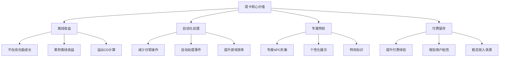
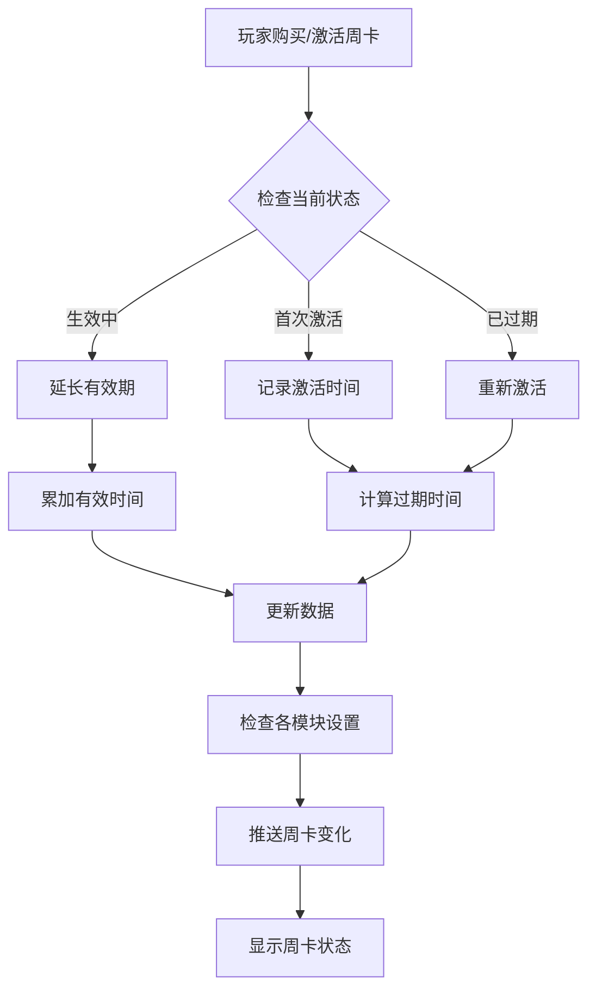
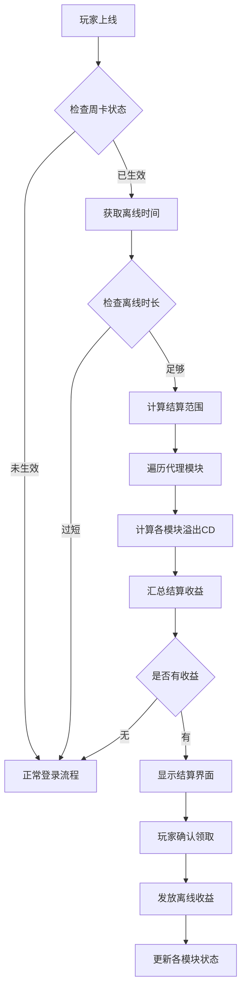
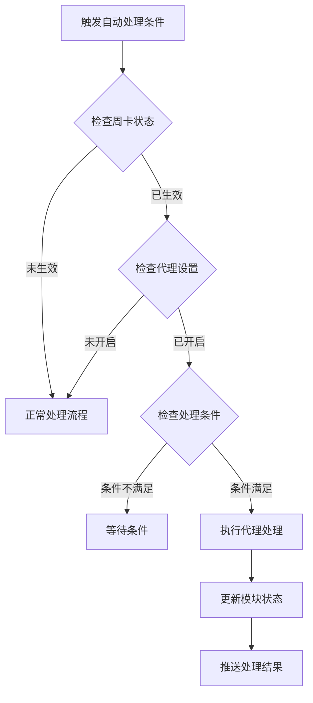
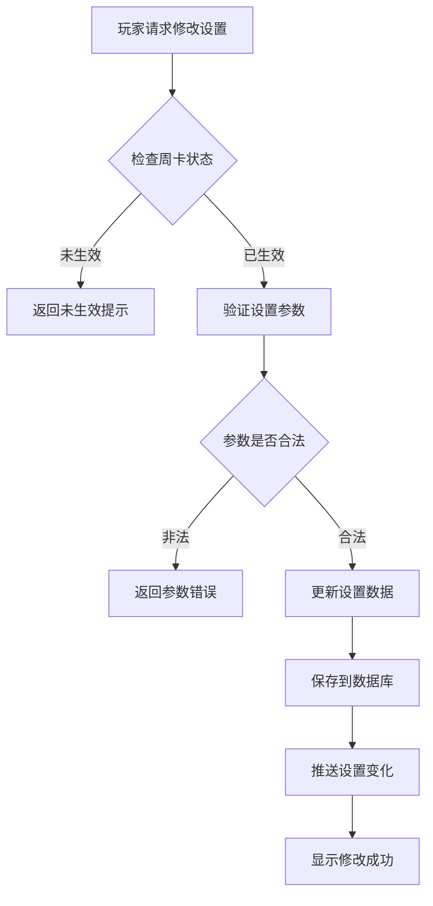
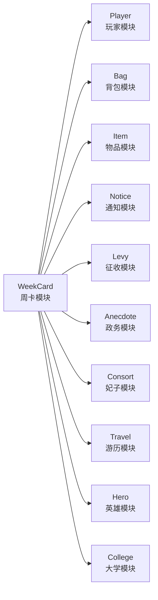

# 周卡模块 - 完整说明

**模块名称**: WeekCard（周卡系统）
**文档版本**: 2.0
**更新日期**: 2026-04-12

---

## 一、模块概述

### 1.1 业务背景

周卡模块是 K2C 游戏的付费特权系统，玩家购买周卡后可获得持续一周的特权福利，包括离线挂机收益、自动处理功能、专属NPC形象等。该模块通过离线收益机制，为付费玩家提供便捷的游戏体验，同时也为游戏带来稳定的收入。

### 1.2 目标用户

| 用户类型 | 特征 | 核心需求 |
|---------|------|----------|
| 付费玩家 | 愿意为便利付费 | 特权福利、专属形象 |
| 时间有限玩家 | 每日游戏时间短 | 离线挂机、自动处理 |
| 追求效率玩家 | 注重资源获取效率 | 自动化日常、快速成长 |

### 1.3 核心价值



---

## 二、功能清单

### 2.1 周卡基础功能

| 功能名称 | 功能描述 | 用户价值 | 优先级 |
|---------|---------|---------|--------|
| 周卡购买 | 购买周卡获得特权 | 开启特权体验 | P0 |
| 免费试用 | 新玩家免费体验周卡 | 体验特权功能 | P0 |
| 周卡状态 | 显示周卡剩余时间 | 了解特权状态 | P0 |
| 周卡续费 | 延长周卡有效时间 | 持续享受特权 | P0 |

### 2.2 离线挂机功能

| 功能名称 | 功能描述 | 用户价值 | 优先级 |
|---------|---------|---------|--------|
| 离线收益 | 离线期间获得收益 | 不在线也能成长 | P0 |
| 收益结算 | 上线时领取离线收益 | 获得累积奖励 | P0 |
| 溢出CD | 处理离线期间的冷却时间 | 自动推进游戏进度 | P0 |
| 最大时长 | 限制离线收益时长 | 平衡游戏节奏 | P1 |

### 2.3 自动处理功能

| 功能名称 | 功能描述 | 用户价值 | 优先级 |
|---------|---------|---------|--------|
| 征收代理 | 自动完成征收任务 | 减少日常操作 | P0 |
| 政务代理 | 自动处理政务事件 | 提升游戏效率 | P0 |
| 妃子倾诉代理 | 自动处理妃子事件 | 维护妃子关系 | P1 |
| 游历代理 | 自动处理游历事件 | 轻松获取奖励 | P1 |
| 大学学习代理 | 自动完成学习任务 | 持续获得收益 | P1 |

### 2.4 执政官形象功能

| 功能名称 | 功能描述 | 用户价值 | 优先级 |
|---------|---------|---------|--------|
| 形象选择 | 选择执政官NPC形象 | 个性化展示 | P1 |
| 英雄形象 | 使用英雄作为执政官 | 展示收集成果 | P1 |
| 妃子形象 | 使用妃子作为执政官 | 展示养成成果 | P1 |
| 形象切换 | 随时更换执政官形象 | 灵活定制外观 | P2 |

### 2.5 设置管理功能

| 功能名称 | 功能描述 | 用户价值 | 优先级 |
|---------|---------|---------|--------|
| 功能开关 | 开启/关闭各项代理 | 自定义代理行为 | P0 |
| 参数配置 | 配置代理处理参数 | 精细化控制 | P1 |
| 设置预览 | 查看当前设置状态 | 了解代理配置 | P2 |

---

## 三、业务流程详解

### 3.1 周卡激活流程



**详细步骤说明**：

1. **状态检查**
   - 检查是否首次激活
   - 检查当前周卡状态
   - 计算新过期时间

2. **时间计算**
   - 首次：当前时间 + 周卡时长
   - 已过期：重新开始计算
   - 生效中：累加到当前过期时间

3. **初始化**
   - 检查各代理模块设置
   - 初始化默认配置
   - 推送状态变化

### 3.2 离线结算流程



**详细步骤说明**：

1. **离线验证**
   - 检查周卡是否生效
   - 检查离线时长是否达标
   - 验证结算条件

2. **收益计算**
   - 遍历所有代理模块
   - 计算各模块溢出CD
   - 汇总所有收益

3. **结算发放**
   - 显示结算界面
   - 玩家确认后发放
   - 更新各模块状态

### 3.3 自动处理流程



**详细步骤说明**：

1. **条件检查**
   - 检查周卡是否生效
   - 检查代理功能是否开启
   - 检查处理条件是否满足

2. **代理执行**
   - 按配置的策略执行
   - 更新相关数据
   - 记录处理日志

3. **结果推送**
   - 推送处理结果给客户端
   - 更新红点提示

### 3.4 设置修改流程



---

## 四、关键规则

### 4.1 周卡时间规则

| 规则项 | 规则说明 | 配置来源 |
|--------|----------|----------|
| 有效时长 | 购买获得7天（168小时） | 商品配置 |
| 时间累计 | 可累计延长，无上限 | 业务规则 |
| 时间精度 | 以服务器时间为准，精确到秒 | 系统规则 |
| 过期处理 | 过期后特权失效，数据保留 | 业务规则 |

### 4.2 离线收益规则

| 规则项 | 规则说明 | 配置来源 |
|--------|----------|----------|
| 最小离线时长 | 30分钟 | RefGeneral |
| 最大收益时长 | 12小时 | RefGeneral |
| 收益计算 | 按离线时间比例计算 | 业务规则 |
| 领取方式 | 上线时弹出结算界面，需手动确认 | 业务规则 |

### 4.3 代理处理规则

| 代理类型 | 处理条件 | 处理策略 |
|---------|----------|----------|
| 征收 | CD溢出 | 根据设置选择征收类型 |
| 政务 | 事件触发 | 根据设置优先处理 |
| 妃子倾诉 | CD溢出 | 根据设置选择妃子 |
| 大学学习 | CD溢出 | 根据设置选择课程 |
| 游历 | CD溢出 | 自动完成游历事件 |

### 4.4 免费试用规则

| 规则项 | 规则说明 | 配置来源 |
|--------|----------|----------|
| 试用条件 | 新玩家首次体验，每账号仅一次 | 业务规则 |
| 试用时长 | 24小时（可配置） | RefGeneral |
| 试用转正 | 试用期间购买，时间累加 | 业务规则 |

---

## 五、用户故事

### 5.1 付费玩家故事

> 作为一名付费玩家，我购买了周卡，获得了7天的特权。每天早上上线时，我都会看到离线收益界面，显示昨晚我离线期间获得了大量收益。而且征收、政务等日常任务都自动处理了，大大节省了我的游戏时间。我还可以设置自己的英雄作为执政官形象，朋友看到都说很酷。

**关键需求**：
- 离线收益可视化展示
- 自动处理日常任务
- 个性化NPC形象

### 5.2 时间有限玩家故事

> 作为一名上班族，我每天只有晚上有时间玩游戏。周卡的离线挂机功能非常适合我，白天上班时游戏角色也会自动获得收益。政务事件会自动处理，妃子倾诉也会自动回应，我不用担心错过任何收益。这样我可以在有限的游戏时间里专注于更重要的玩法。

**关键需求**：
- 离线挂机稳定可靠
- 自动处理各类事件
- 收益不遗漏

### 5.3 新玩家故事

> 作为一名新玩家，系统提示我可以免费试用周卡24小时。试用期间，我体验了离线挂机和自动处理的便利，感受到了周卡的价值。试用期结束后，我决定购买周卡继续享受这些特权，并且获得了首购优惠。

**关键需求**：
- 免费试用入口明显
- 试用体验完整
- 首购优惠吸引

---

## 六、示例

### 6.1 周卡激活示例

**初始状态**：
```
周卡状态：未激活
过期时间：无
免费试用：未使用
```

**操作**：购买7天周卡

**激活结果**：
```
周卡状态：生效中
激活时间：2026-04-07 10:00:00
过期时间：2026-04-14 10:00:00
剩余时间：7天
代理功能：已初始化
执政官形象：默认形象
```

### 6.2 离线结算示例

**离线数据**：
```
下线时间：2026-04-07 22:00:00
上线时间：2026-04-08 08:00:00
离线时长：10小时
周卡过期时间：2026-04-14 10:00:00
```

**结算计算**：
```
有效离线时长：10小时（未超过12小时上限）
征收溢出CD：10小时 × 6次/小时 = 60次
政务溢出CD：10小时 × 3次/小时 = 30次
妃子倾诉溢出CD：10小时 ÷ 2小时/次 = 5次
```

**结算收益**：
```
征收收益：
  - 银两 × 60000（60次 × 1000银两）
政务收益：
  - 经验 × 30000（30次 × 1000经验）
  - 银两 × 15000（30次 × 500银两）
妃子倾诉收益：
  - 好感度道具 × 10（5次 × 2个）
总计：
  - 银两 × 75000
  - 经验 × 30000
  - 好感度道具 × 10
```

### 6.3 代理设置示例

**当前设置**：
```
征收代理：开启，自动使用银两征收
政务代理：开启，优先处理银两政务
妃子倾诉代理：开启，选择妃子"小红"
游历代理：关闭
大学学习代理：开启，自动学习最短课程
```

**修改操作**：关闭妃子倾诉代理

**修改结果**：
```
征收代理：开启
政务代理：开启
妃子倾诉代理：关闭
游历代理：关闭
大学学习代理：开启
```

### 6.4 执政官形象示例

**当前形象**：
```
形象类型：默认
形象ID：0
```

**修改操作**：选择英雄"暗影刺客"（ID: 1001）作为执政官形象

**修改结果**：
```
形象类型：英雄
形象ID：1001
形象展示：执政官显示为英雄"暗影刺客"
```

---

## 七、系统交互

### 7.1 与其他模块的交互



### 7.2 接口依赖

| 依赖模块 | 接口名称 | 用途 |
|---------|---------|------|
| Player | isFuncUnlock | 验证功能解锁 |
| Bag | addItems | 发放结算收益 |
| Item | createItem | 创建奖励物品 |
| Notice | pushMsg | 推送状态变化 |
| Hero | hasHero | 验证英雄解锁 |
| Consort | hasConsort | 验证妃子解锁 |

---

## 八、配置参考

### 8.1 通用配置

| 配置项 | 推荐值 | 说明 |
|--------|--------|------|
| week_card_free_trial_time_sec | 86400 | 24小时免费试用 |
| week_card_offline_active_min_time_sec | 1800 | 最小30分钟离线 |
| week_card_offline_hosting_max_profit_time_sec | 43200 | 最大12小时收益 |

### 8.2 功能解锁配置

| 功能ID | 解锁条件 | 说明 |
|--------|---------|------|
| week_card_func_simple_unlock_id | 等级达到20级 | 周卡功能解锁 |

---

## 九、FAQ

### Q1: 周卡过期后数据会丢失吗？

**A**: 不会。周卡过期后，所有设置数据和NPC形象数据都会保留，续费后可以继续使用。

### Q2: 离线收益有时间上限吗？

**A**: 有的。最大收益时长为12小时，超出部分不计收益。这是为了平衡游戏节奏。

### Q3: 免费试用可以重复使用吗？

**A**: 不可以。每个账号只能使用一次免费试用，试用期结束后需要购买周卡。

### Q4: 购买多张周卡时间如何计算？

**A**: 时间累加。如果在有效期内购买，会延长到期时间；如果已过期，会重新激活。

### Q5: 代理功能可以单独关闭吗？

**A**: 可以。每个代理功能都可以独立开启/关闭，支持精细化控制。

---

*文档生成时间: 2026-04-12*
*文档版本: v2.0*
