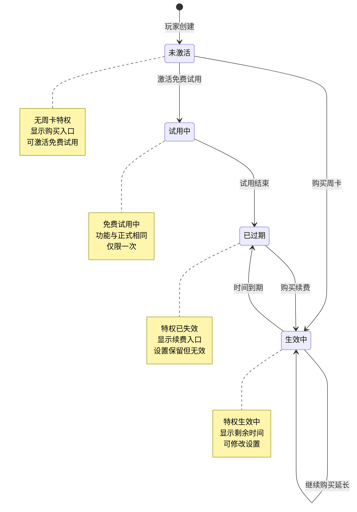
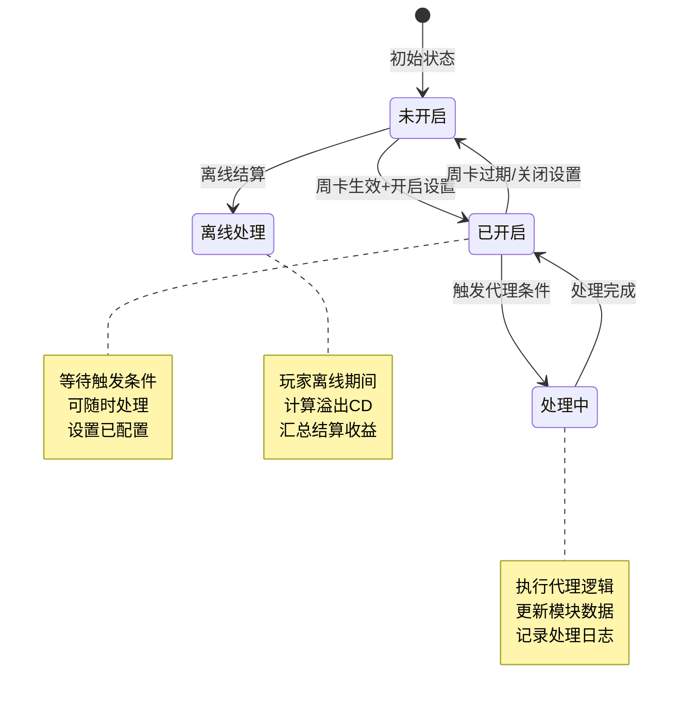
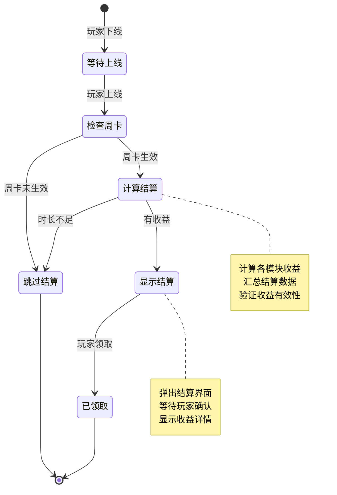
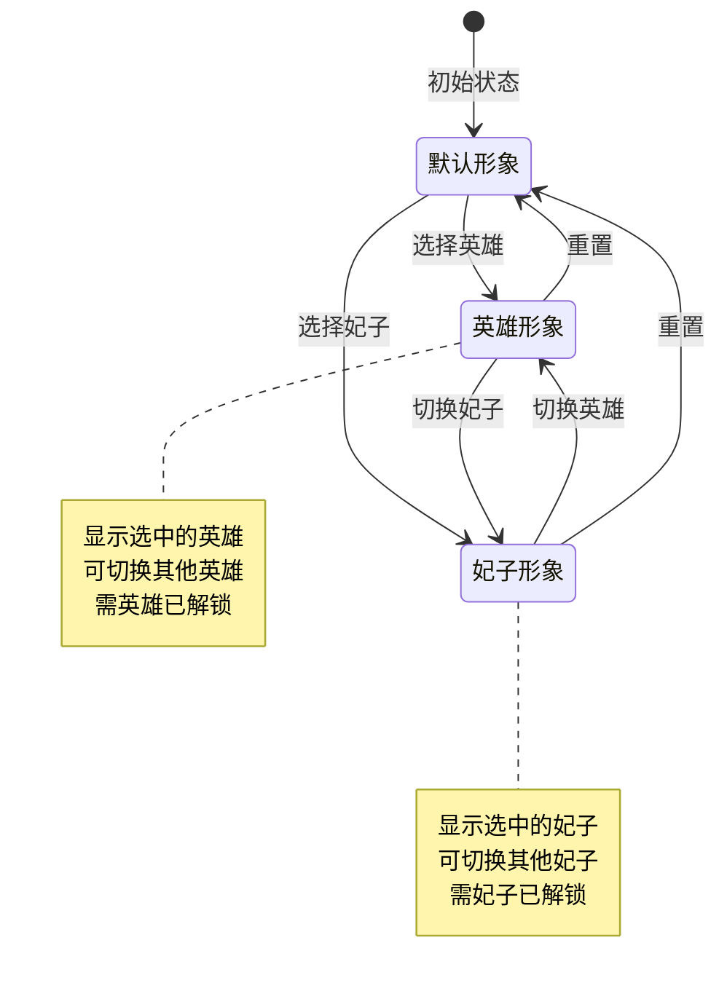
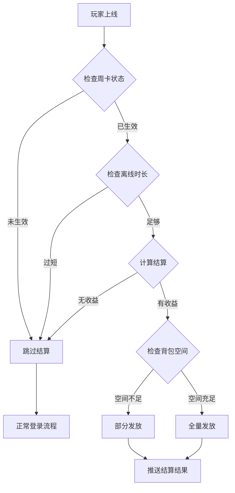
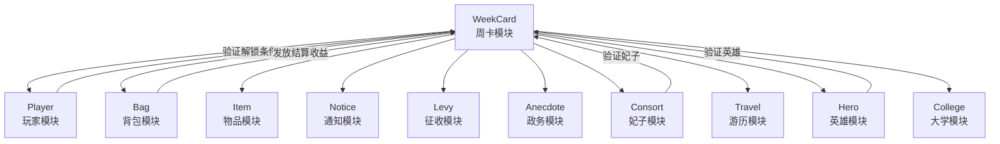

# 周卡模块 - 实现细节

**模块名称**: WeekCard（周卡系统）
**文档版本**: 2.0
**更新日期**: 2026-04-12

---

## 一、计算公式

### 1.1 周卡剩余时间计算公式

```
剩余时间(秒) = max(过期时间戳 - 当前时间戳, 0)
```

**示例计算**：
```
过期时间戳：1713081600（2026-04-14 10:00:00）
当前时间戳：1712476800（2026-04-07 10:00:00）

剩余时间 = 1713081600 - 1712476800 = 604800秒 = 7天
```

### 1.2 离线结算时间计算公式

```
结算开始时间 = max(下线时间, 激活时间)
结算结束时间 = min(上线时间, 过期时间)
有效结算时长 = min(结算结束时间 - 结算开始时间, 最大收益时长)
```

**示例计算**：
```
下线时间：2026-04-07 22:00:00
上线时间：2026-04-08 08:00:00
激活时间：2026-04-07 10:00:00
过期时间：2026-04-14 10:00:00
最大收益时长：12小时

结算开始时间 = max(22:00, 10:00) = 22:00
结算结束时间 = min(08:00, 过期时间) = 08:00
有效结算时长 = min(10小时, 12小时) = 10小时
```

### 1.3 溢出CD收益计算公式

```
溢出次数 = floor(结算时长 / CD周期)
实际收益 = 溢出次数 × 单次收益 × 收益系数
```

**示例计算**：
```
征收CD周期：10分钟
结算时长：10小时 = 600分钟
单次收益：1000银两
收益系数：1.0

溢出次数 = floor(600 / 10) = 60次
实际收益 = 60 × 1000 × 1.0 = 60000银两
```

### 1.4 免费试用时长计算公式

```
免费试用过期时间 = 当前时间 + 试用时长(秒)
```

---

## 二、状态机定义

### 2.1 周卡状态机



### 2.2 代理模块状态机



### 2.3 离线结算状态机



### 2.4 执政官形象状态机



---

## 三、数据约束

### 3.1 周卡主数据约束

| 字段名 | 数据类型 | 取值范围 | 必填 | 说明 |
|--------|----------|----------|------|------|
| id | bigint | > 0 | 是 | 主键 |
| cid | bigint | > 0 | 是 | 玩家CID，唯一 |
| active_time_ms | bigint | >= 0 | 是 | 激活时间戳(毫秒) |
| expire_time_ms | bigint | >= 0 | 是 | 过期时间戳(毫秒) |
| had_use_free_trial | tinyint | 0-1 | 是 | 是否使用过免费试用 |
| npc_type | int | 0-2 | 是 | NPC类型：0默认，1英雄，2妃子 |
| npc_id | bigint | >= 0 | 是 | NPC ID |
| create_time | datetime | - | 是 | 创建时间 |
| update_time | datetime | - | 是 | 更新时间 |

### 3.2 代理设置数据约束

| 字段名 | 数据类型 | 取值范围 | 必填 | 说明 |
|--------|----------|----------|------|------|
| id | bigint | > 0 | 是 | 主键 |
| cid | bigint | > 0 | 是 | 玩家CID |
| settle_type | int | 1-6 | 是 | 结算类型枚举 |
| setting_data | blob | - | 是 | 设置数据(序列化) |
| is_enabled | tinyint | 0-1 | 是 | 是否开启 |
| update_time | datetime | - | 是 | 更新时间 |

### 3.3 离线结算数据约束

| 字段名 | 数据类型 | 取值范围 | 必填 | 说明 |
|--------|----------|----------|------|------|
| settle_info | json | - | 否 | 结算信息（内存） |
| offline_time_ms | bigint | >= 0 | 否 | 离线时间戳 |
| online_time_ms | bigint | >= 0 | 否 | 上线时间戳 |

### 3.4 配置数据约束

| 字段名 | 数据类型 | 取值范围 | 必填 | 说明 |
|--------|----------|----------|------|------|
| week_card_func_unlock_id | int | > 0 | 是 | 功能解锁条件ID |
| week_card_free_trial_time_sec | int | 0-604800 | 是 | 免费试用时长(秒) |
| week_card_offline_active_min_time_sec | int | 0-86400 | 是 | 离线激活最小时间(秒) |
| week_card_offline_hosting_max_profit_time_sec | int | 0-604800 | 是 | 离线挂机最大收益时间(秒) |

---

## 四、错误处理策略

### 4.1 周卡模块错误码

| 错误码 | 错误信息 | 处理策略 | 用户提示 |
|--------|----------|----------|----------|
| 00237 | 周卡未激活 | 检查周卡状态 | "周卡未激活，请先购买" |
| 00415 | 周卡未生效 | 检查过期时间 | "周卡已过期" |
| 00416 | 免费试用已使用 | 检查试用状态 | "免费试用已使用过" |
| 00417 | 设置参数错误 | 验证参数格式 | "设置参数错误" |
| 00418 | NPC不存在 | 检查NPC ID | "选择的NPC不存在" |
| 00419 | NPC未解锁 | 检查NPC解锁状态 | "该NPC尚未解锁" |
| 00420 | 代理功能未开启 | 检查代理设置 | "该代理功能未开启" |

### 4.2 离线结算错误处理流程



### 4.3 异常处理策略

| 异常场景 | 处理策略 | 数据处理 |
|----------|----------|----------|
| 时间服务器异常 | 使用本地时间缓存 | 记录告警日志 |
| 结算发放失败 | 保留结算数据 | 可重新领取 |
| 代理执行异常 | 跳过该模块 | 记录错误日志 |
| 设置保存失败 | 重试机制 | 使用缓存数据 |
| NPC验证失败 | 返回错误码 | 不修改数据 |

---

## 五、关键代码示例

### 5.1 周卡激活伪代码

```java
/**
 * 获得周卡时间
 */
public void gainTimeSec(int seconds, NPPlayerContext context)
{
    PlayerWeekCard weekCard = weekCardDao.getByPlayer(playerId);
    long nowTimeMs = System.currentTimeMillis();
    boolean isFirstGain = false;

    if (weekCard.expire_time_ms == 0)
    {
        // 首次获得
        weekCard.active_time_ms = nowTimeMs;
        weekCard.expire_time_ms = nowTimeMs + seconds * 1000L;
        isFirstGain = true;
    }
    else
    {
        if (nowTimeMs > weekCard.expire_time_ms)
        {
            // 已过期，重新激活
            weekCard.active_time_ms = nowTimeMs;
            weekCard.expire_time_ms = nowTimeMs + seconds * 1000L;
        }
        else
        {
            // 未过期，延长时间
            weekCard.expire_time_ms += seconds * 1000L;
        }
    }

    weekCardDao.update(weekCard);

    // 如果是首次获得，检查各模块设置
    if (isFirstGain)
    {
        for (var dealer : weekCardDealerList)
        {
            dealer.checkSetting();
        }
    }

    // 推送变化
    pushWeekCardChange(playerId, makeInfoProto(weekCard));
}
```

### 5.2 离线结算伪代码

```java
/**
 * 在线结算
 */
public boolean onlineSettle(long playerId, long offlineTimeMs, long onlineTimeMs)
{
    PlayerWeekCard weekCard = weekCardDao.getByPlayer(playerId);

    // 验证条件
    if (weekCard.expire_time_ms < offlineTimeMs || weekCard.active_time_ms > onlineTimeMs)
        return false;

    if (onlineTimeMs - offlineTimeMs <= OFFLINE_ACTIVE_MIN_TIME_SEC * 1000L)
        return false;

    // 计算结算时间范围
    long startSettleTimeMs = offlineTimeMs;
    long endSettleTimeMs = Math.min(onlineTimeMs, weekCard.expire_time_ms);

    // 限制结算时长
    if (endSettleTimeMs - startSettleTimeMs > OFFLINE_HOSTING_MAX_PROFIT_TIME_SEC * 1000L)
    {
        endSettleTimeMs = startSettleTimeMs + OFFLINE_HOSTING_MAX_PROFIT_TIME_SEC * 1000L;
    }

    // 执行各模块结算
    WeekCard_SettleInfo settleInfo = new WeekCard_SettleInfo();
    for (var dealer : weekCardDealerList)
    {
        var detail = dealer.settleOverflowCd(startSettleTimeMs, endSettleTimeMs);
        if (detail != null)
        {
            settleInfo.detailList.add(detail);
            settleInfo.itemList.addAll(detail.rewardList);
        }
    }

    // 如果有收益，保存结算信息
    if (settleInfo.itemList.size() > 0)
    {
        saveSettleInfo(playerId, settleInfo);
        return true;
    }

    return false;
}
```

### 5.3 代理模块基类伪代码

```java
/**
 * 周卡处理器抽象基类
 */
public abstract class AWeekCardDealer
{
    protected WeekCardComponent _comp;

    // 获取代理类型
    public abstract EWeekCardSettleType getType();

    // 检查功能是否解锁
    public abstract boolean isFuncUnlock();

    // 结算溢出CD
    public abstract WeekCard_SettleDetailInfo settleOverflowCd(
        long startMs, long endMs, NPPlayerContext context);

    // 离线时处理CD
    public abstract void doOfflineCdSettle(NPPlayerContext context);

    // 检查设置
    public abstract void checkSetting();

    // 修改设置
    public abstract boolean chgSetting(WeekCard_SingleSettingInfo info);

    // 构建设置协议
    public abstract WeekCard_SingleSettingInfo makeSettingProto();
}
```

### 5.4 征收代理实现示例伪代码

```java
/**
 * 征收处理器
 */
public class WeekCardDealer_Levy extends AWeekCardDealer
{
    private LevySettingBO _setting;

    @Override
    public EWeekCardSettleType getType()
    {
        return EWeekCardSettleType.LEVY;
    }

    @Override
    public boolean isFuncUnlock()
    {
        return _comp.getUserData().funcUnlockComp
            .isFuncUnlock(FunctionType.LEVY);
    }

    @Override
    public WeekCard_SettleDetailInfo settleOverflowCd(
        long startMs, long endMs, NPPlayerContext context)
    {
        if (!isFuncUnlock()) return null;
        if (_setting == null || !_setting.isEnabled) return null;

        LevyComponent levyComp = _comp.getUserData().levyComp;

        // 计算溢出次数
        long durationMs = endMs - startMs;
        int cdMs = LevyConfig.CD_MS; // 征收CD，如10分钟
        int overflowCount = (int)(durationMs / cdMs);

        if (overflowCount <= 0) return null;

        // 执行征收
        List<RewardItem> rewards = new ArrayList<>();
        for (int i = 0; i < overflowCount; i++)
        {
            var result = levyComp.doLevy(context, _setting.dealPolicy);
            if (result != null)
            {
                rewards.addAll(result.Rewards);
            }
        }

        // 构建结算信息
        return new WeekCard_SettleDetailInfo
        {
            type = EWeekCardSettleType.LEVY,
            count = overflowCount,
            rewardList = rewards
        };
    }

    @Override
    public void checkSetting()
    {
        if (_setting == null)
        {
            _setting = loadSettingFromDb();
        }
        if (_setting == null)
        {
            _setting = new LevySettingBO();
            _setting.isEnabled = true;
            _setting.dealPolicy = 0;
            saveSettingToDb(_setting);
        }
    }

    @Override
    public WeekCard_SingleSettingInfo makeSettingProto()
    {
        var setting = GetSetting();
        return new WeekCard_SingleSettingInfo
        {
            type = EWeekCardSettleType.LEVY,
            settingData = SerializeSetting(setting)
        };
    }
}
```

### 5.5 领取离线收益伪代码

```java
/**
 * 领取离线收益
 */
public Result drawSettleReward(long playerId)
{
    // 1. 获取结算信息
    WeekCard_SettleInfo settleInfo = getSettleInfo(playerId);
    if (settleInfo == null || settleInfo.itemList.isEmpty())
    {
        return Result.Error(ErrorCode.NO_SETTLE_REWARD, "无结算收益");
    }

    // 2. 检查背包空间
    if (!bagService.hasSpace(playerId, settleInfo.itemList))
    {
        // 部分发放
        var canGive = bagService.getCanGiveItems(playerId, settleInfo.itemList);
        bagService.addItems(playerId, canGive);

        // 剩余部分保留
        var remaining = settleInfo.itemList.Except(canGive).ToList();
        updateSettleInfo(playerId, remaining);

        return Result.Success(new { rewards = canGive, partial = true });
    }

    // 3. 全量发放
    bagService.addItems(playerId, settleInfo.itemList);

    // 4. 清空结算信息
    clearSettleInfo(playerId);

    // 5. 推送领取结果
    pushSettleDrawn(playerId, settleInfo.itemList);

    return Result.Success(new { rewards = settleInfo.itemList, partial = false });
}
```

### 5.6 修改执政官形象伪代码

```java
/**
 * 修改执政官形象
 */
public Result changeNPC(long playerId, EWeekCardNPCType npcType, long npcId)
{
    // 1. 检查周卡状态
    PlayerWeekCard weekCard = weekCardDao.getByPlayer(playerId);
    if (weekCard.expire_time_ms < System.currentTimeMillis())
    {
        return Result.Error(00415, "周卡未生效");
    }

    // 2. 验证NPC
    switch (npcType)
    {
        case EWeekCardNPCType.HERO:
            if (!heroService.hasHero(playerId, npcId))
            {
                return Result.Error(00419, "英雄未解锁");
            }
            break;
        case EWeekCardNPCType.CONSORT:
            if (!consortService.hasConsort(playerId, npcId))
            {
                return Result.Error(00419, "妃子未解锁");
            }
            break;
        case EWeekCardNPCType.NONE:
            npcId = 0;
            break;
    }

    // 3. 更新NPC形象
    weekCard.npc_type = (int)npcType;
    weekCard.npc_id = npcId;
    weekCardDao.update(weekCard);

    // 4. 推送变化
    pushNPCChange(playerId, weekCard);

    return Result.Success(makeInfoProto(weekCard));
}
```

---

## 六、跨模块依赖

### 6.1 模块依赖关系



### 6.2 接口依赖

```java
// 玩家模块接口
interface IPlayerService
{
    boolean isFunctionUnlock(long playerId, FunctionType type);
}

// 英雄模块接口
interface IHeroService
{
    boolean hasHero(long playerId, long heroId);
    HeroInfo getHeroInfo(long playerId, long heroId);
}

// 妃子模块接口
interface IConsortService
{
    boolean hasConsort(long playerId, long consortId);
    ConsortInfo getConsortInfo(long playerId, long consortId);
}

// 征收模块接口
interface ILevyService
{
    int getCdMs();
    LevyResult doLevy(long playerId);
}

// 背包模块接口
interface IBagService
{
    boolean hasSpace(long playerId, List<RewardItem> items);
    void addItems(long playerId, List<RewardItem> items);
}
```

### 6.3 事件依赖

| 事件类型 | 触发时机 | 处理逻辑 |
|----------|----------|----------|
| 玩家下线 | 离开游戏 | 记录离线时间，准备结算 |
| 玩家上线 | 进入游戏 | 执行离线结算 |
| 周卡到期 | 定时检查 | 推送过期通知 |
| 代理触发 | 条件满足 | 执行代理处理 |

---

## 七、性能考量

### 7.1 数据库索引

```sql
-- 周卡主表索引
CREATE INDEX idx_cid ON player_week_card(cid);
CREATE INDEX idx_expire_time ON player_week_card(expire_time_ms);

-- 周卡设置表索引
CREATE UNIQUE INDEX uk_cid_settle_type ON player_week_card_setting(cid, settle_type);
CREATE INDEX idx_cid ON player_week_card_setting(cid);
```

### 7.2 缓存策略

```java
// 周卡数据缓存Key设计
String cacheKey = "weekcard:" + cid;

// 设置数据缓存Key设计
String settingCacheKey = "weekcard:setting:" + cid + ":" + settleType;

// 缓存过期时间
int cacheExpireSec = 300; // 5分钟
```

### 7.3 并发控制

```java
// 使用乐观锁处理并发修改
public boolean chgSetting(long cid, WeekCard_SingleSettingInfo info)
{
    // 获取当前版本
    int currentVersion = getSettingVersion(cid, info.type);

    // 更新时检查版本
    int affected = settingDao.updateWithVersion(cid, info, currentVersion);

    if (affected == 0)
    {
        // 版本冲突，重试
        return false;
    }

    return true;
}
```

---

## 八、测试要点

### 8.1 单元测试用例

| 测试项 | 输入 | 预期输出 |
|--------|------|----------|
| 首次激活周卡 | 时间=7天 | 激活时间=当前时间，过期时间=+7天 |
| 延长周卡时间 | 时间=7天，已有3天 | 过期时间=+7天 |
| 过期后续费 | 时间=7天，已过期 | 激活时间=当前时间，过期时间=+7天 |
| 离线结算计算 | 离线10小时 | 有效时长=10小时 |
| 离线时长超限 | 离线15小时 | 有效时长=12小时（上限） |

### 8.2 集成测试场景

1. **周卡生命周期测试**
   - 激活 → 使用 → 过期 → 续费

2. **离线结算完整流程**
   - 下线 → 离线 → 上线 → 结算 → 领取

3. **代理功能联调**
   - 开启代理 → 触发条件 → 自动处理

---

*文档生成时间: 2026-04-12*
*文档版本: v2.0*
