# K2C 游戏框架 - 数据流向图

## 一、概述

本文档描述 K2C 游戏框架中数据在各模块间的流转过程，包括数据输入、处理、存储和输出的完整链路。

---

## 二、数据流总览

### 2.1 整体数据流向

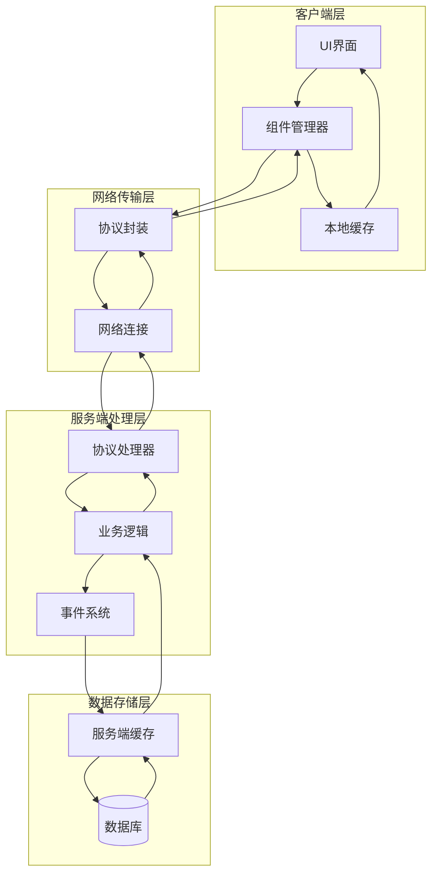

### 2.2 数据流层次说明

| 层次 | 职责 | 数据形态 |
|------|------|----------|
| **客户端层** | 用户交互、数据展示 | UI数据、本地缓存 |
| **网络传输层** | 数据序列化、网络传输 | 协议消息 |
| **服务端处理层** | 业务逻辑处理 | 业务对象 |
| **数据存储层** | 数据持久化 | 数据库记录 |

---

## 三、核心数据流

### 3.1 玩家数据流

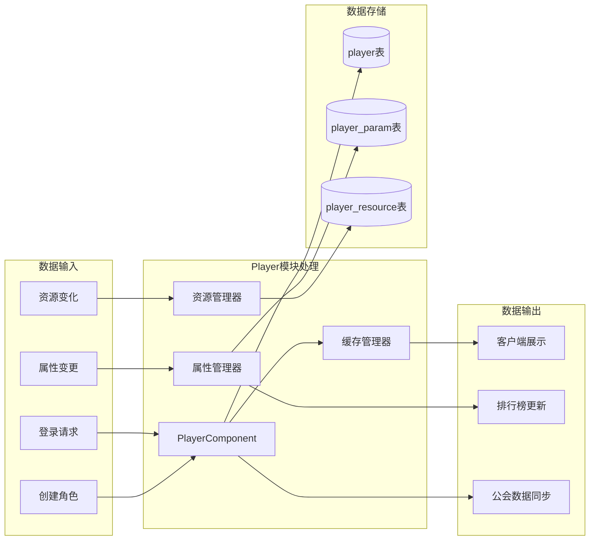

### 3.2 物品数据流

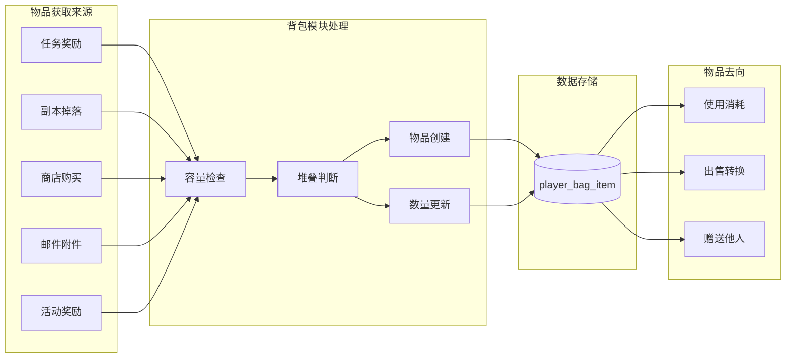

### 3.3 英雄数据流

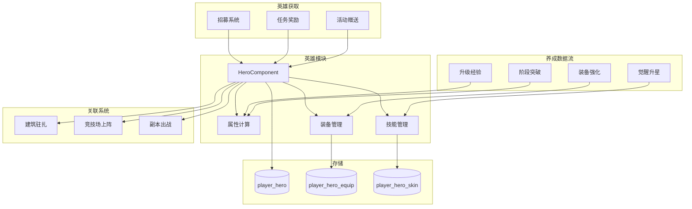

---

## 四、业务数据流

### 4.1 任务系统数据流

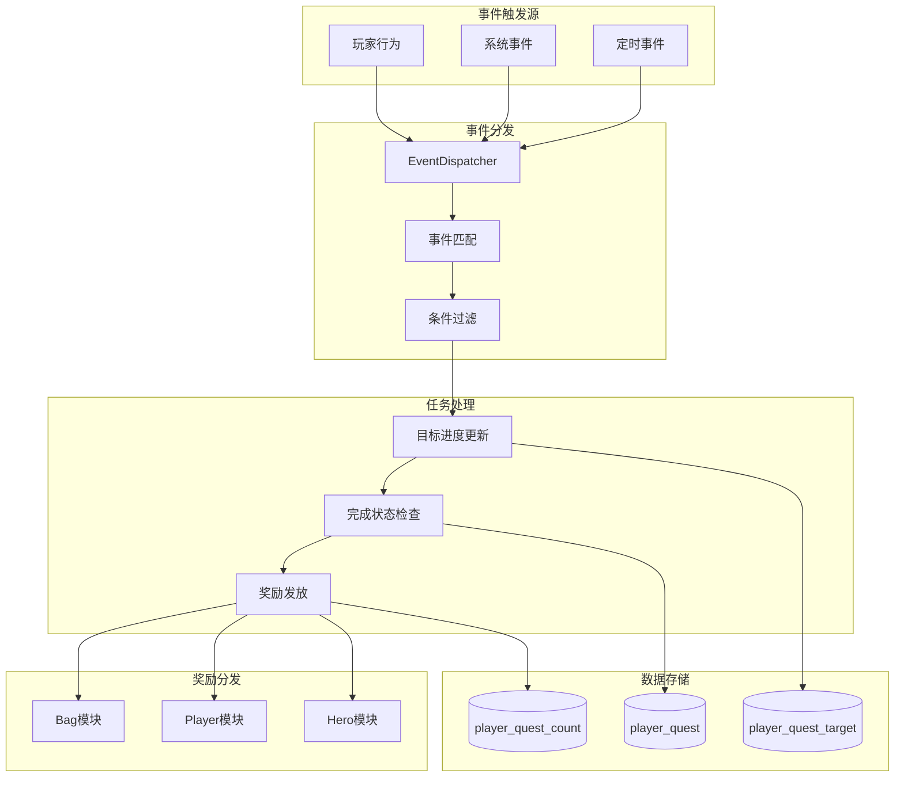

### 4.2 公会系统数据流

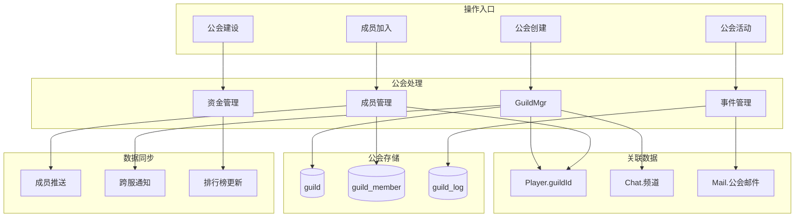

### 4.3 商店系统数据流

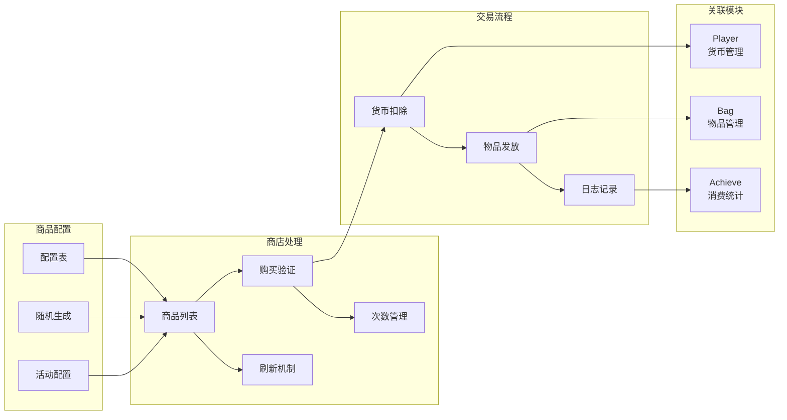

---

## 五、资源流转图

### 5.1 货币流转

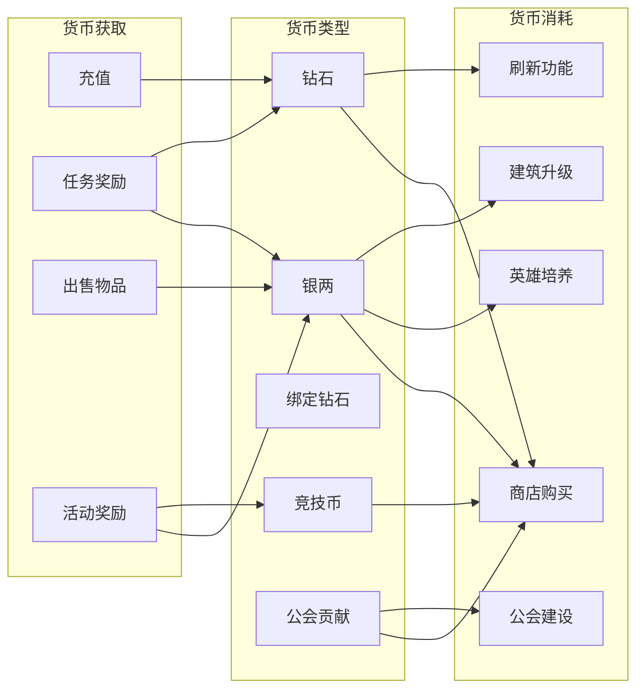

### 5.2 经验流转

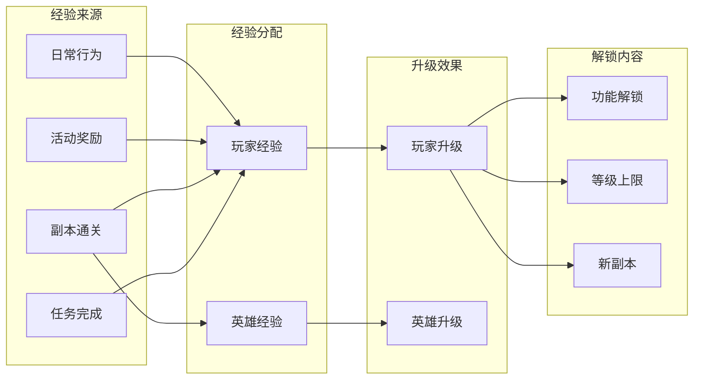

### 5.3 道具流转

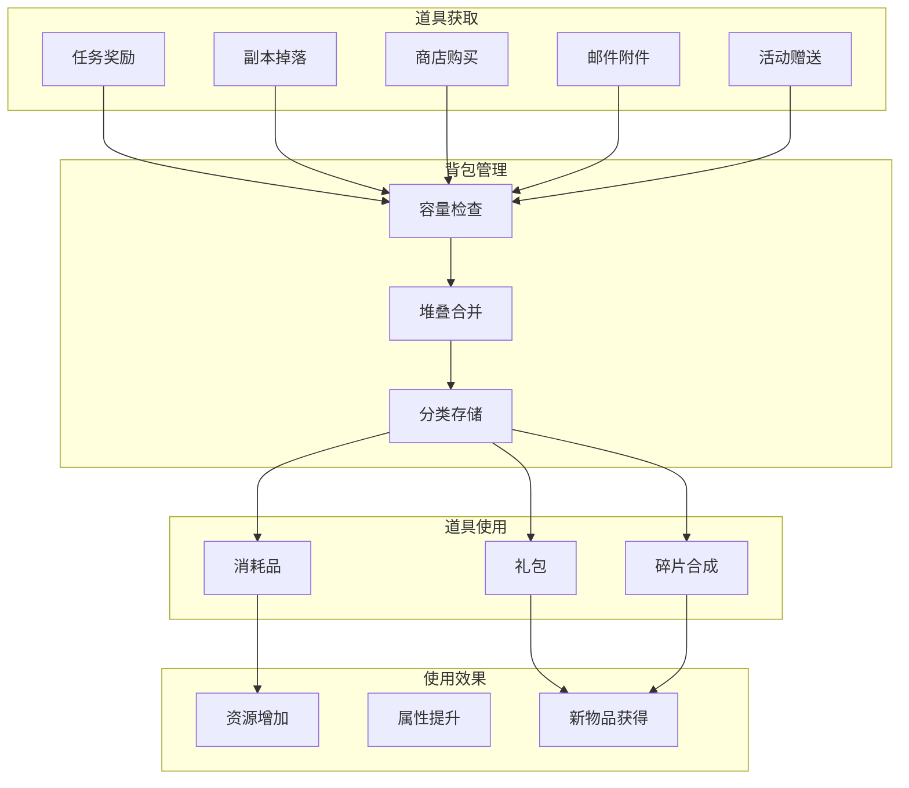

---

## 六、跨模块数据流

### 6.1 战斗系统数据流

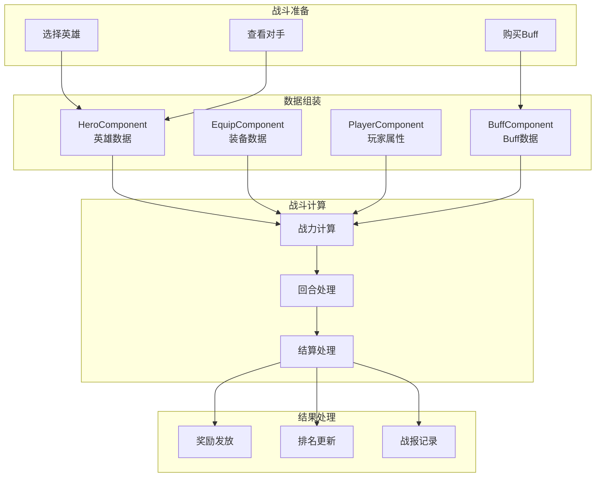

### 6.2 活动系统数据流

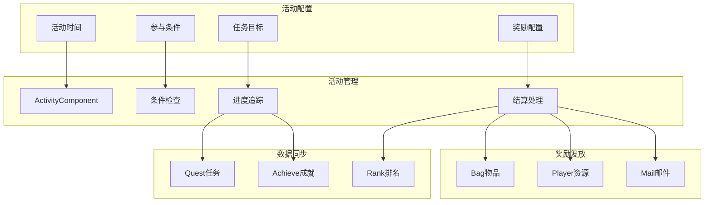

### 6.3 社交系统数据流

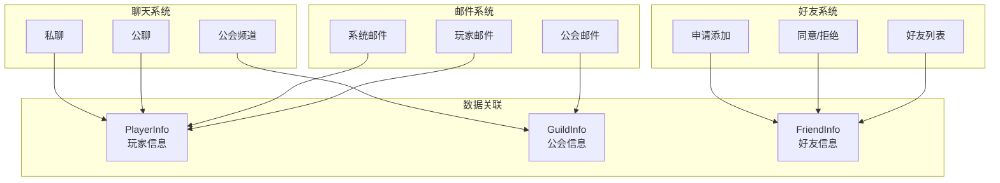

---

## 七、数据同步机制

### 7.1 实时同步流程

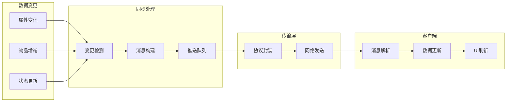

### 7.2 批量同步策略

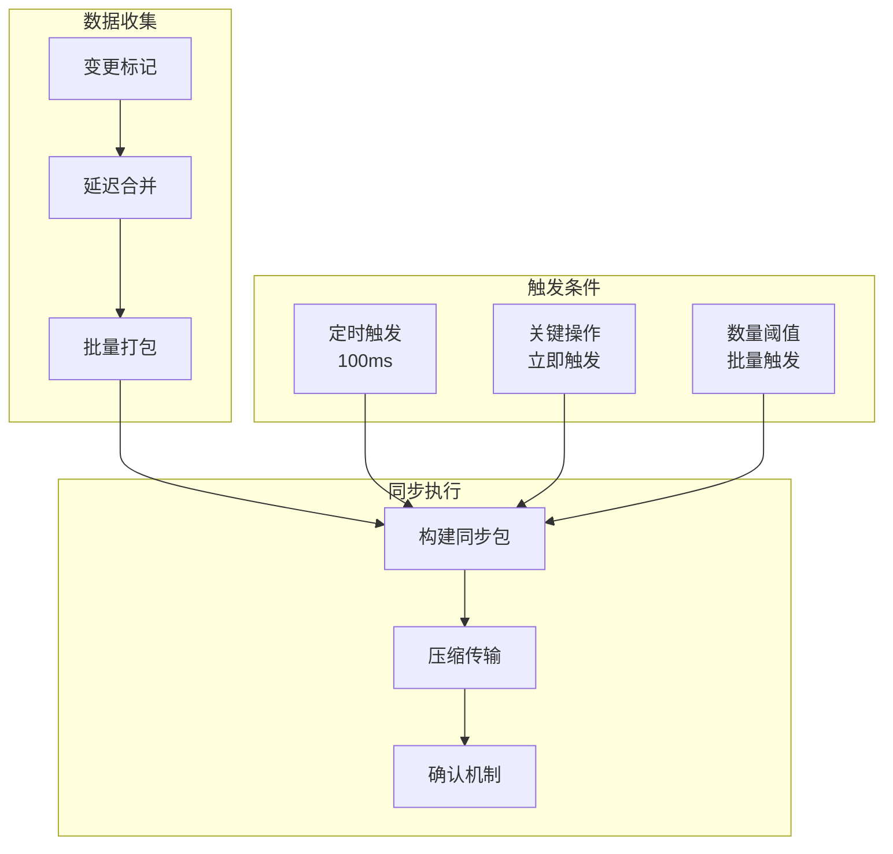

---

## 八、数据一致性保障

### 8.1 写入流程

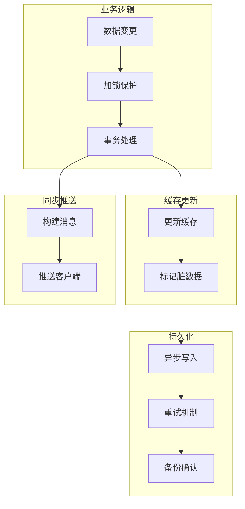

### 8.2 读取流程

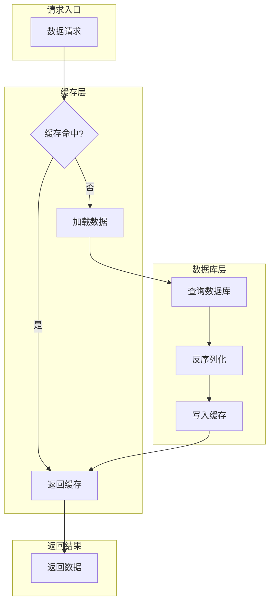

---

## 九、数据流向总结

### 9.1 数据流向统计

| 数据类型 | 主要来源 | 主要去向 | 存储位置 |
|----------|----------|----------|----------|
| 玩家数据 | 登录、行为 | 展示、排行 | player表 |
| 物品数据 | 奖励、购买 | 使用、出售 | player_bag_item表 |
| 英雄数据 | 招募、培养 | 战斗、驻扎 | player_hero表 |
| 任务数据 | 行为触发 | 奖励发放 | player_quest表 |
| 公会数据 | 创建、加入 | 社交、活动 | guild表 |
| 货币数据 | 充值、奖励 | 消费、兑换 | player_resource表 |

### 9.2 关键数据流特点

1. **实时性要求高**：战斗数据、聊天消息需要实时同步
2. **一致性要求高**：货币、物品数据需要严格一致性保护
3. **批量处理优化**：任务进度、成就统计采用批量处理
4. **缓存策略重要**：频繁访问数据采用多级缓存

---

*文档生成时间: 2026-04-11*
