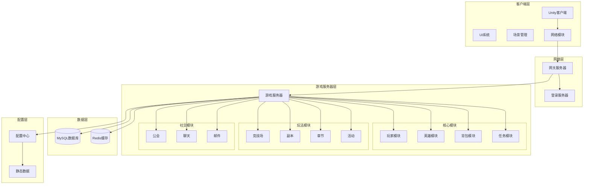
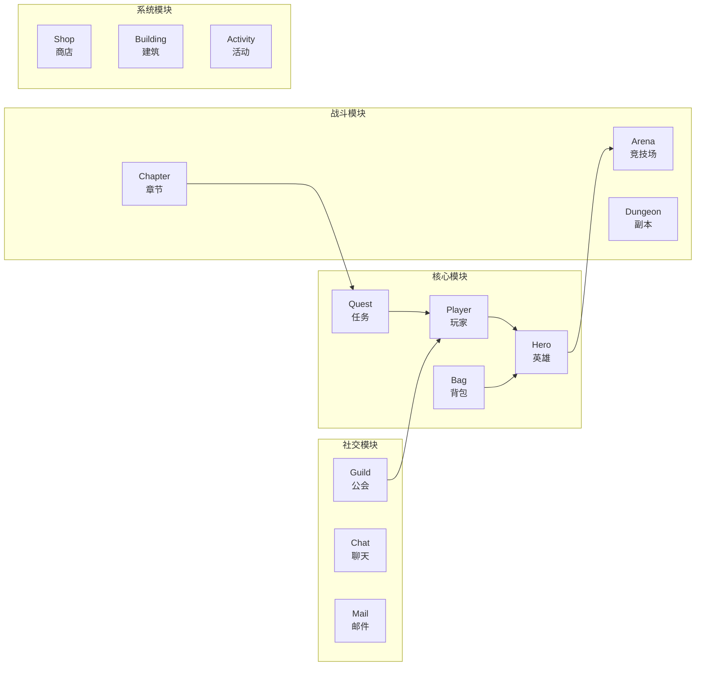
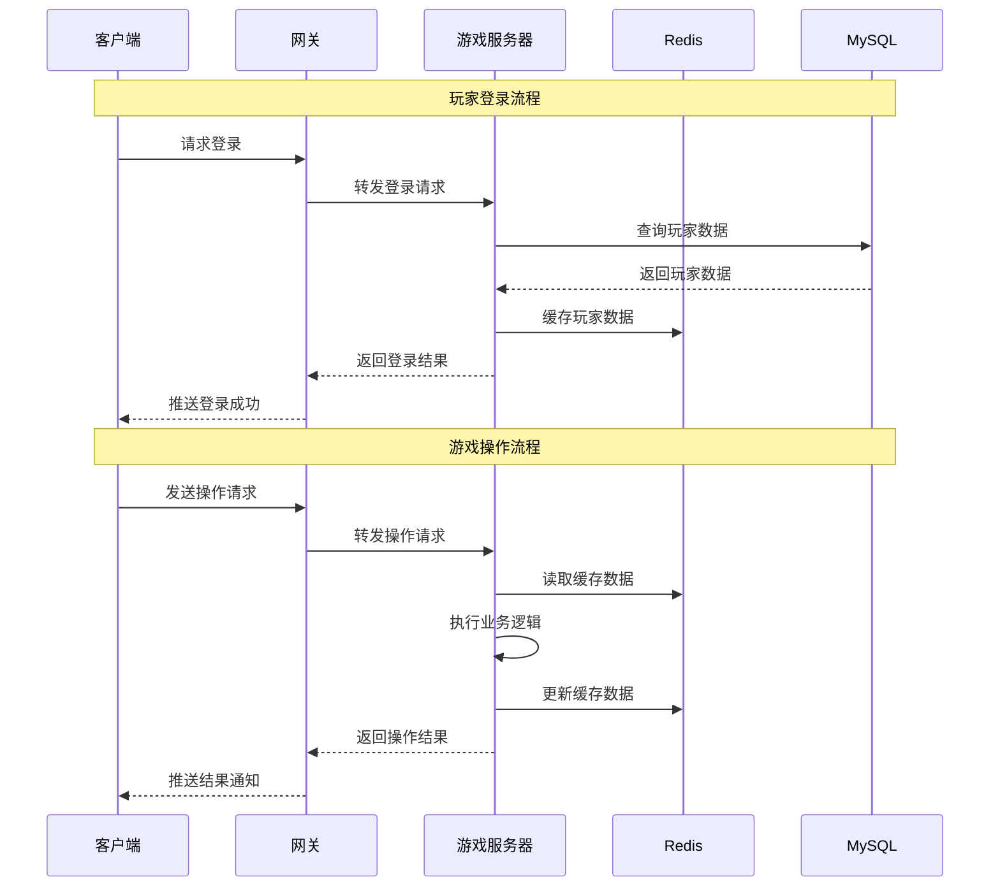
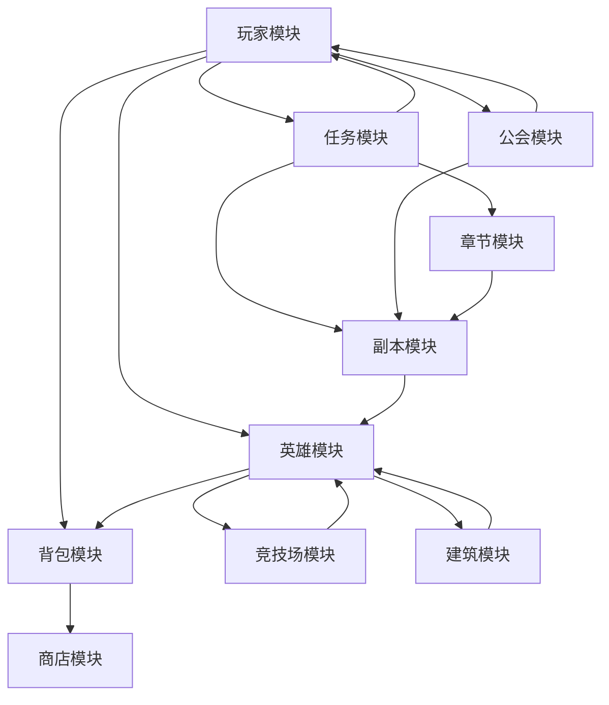
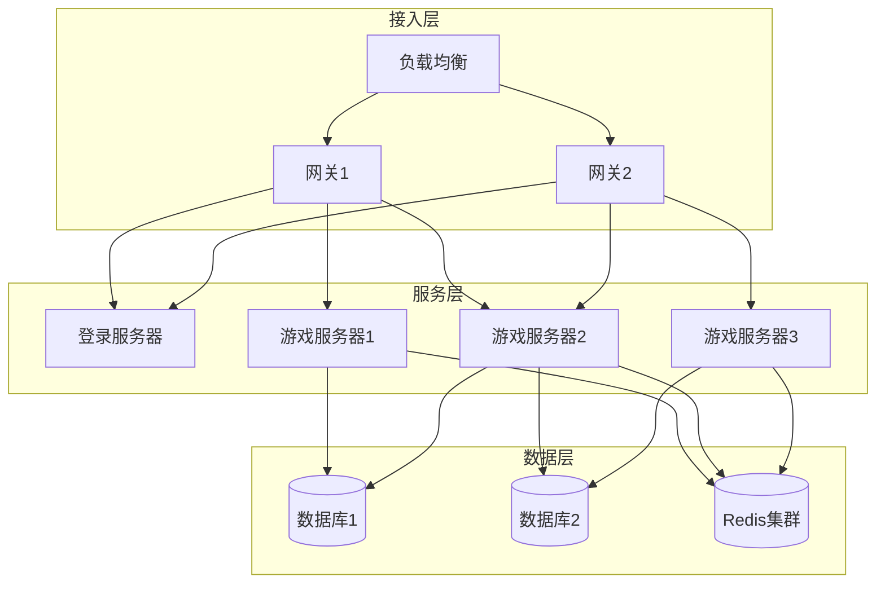

# K2C 游戏框架架构总览

## 一、系统架构

### 1.1 整体架构图



### 1.2 技术栈说明

| 层级 | 技术选型 | 说明 |
|------|----------|------|
| 客户端 | Unity 2021.x + C# | 3D游戏引擎，支持热更新 |
| 网络通信 | 自研二进制协议 | 高效、低带宽消耗 |
| 服务端 | Java + 自研框架 | 分布式架构，支持横向扩展 |
| 数据库 | MySQL | 关系型数据库，持久化存储 |
| 缓存 | Redis | 高性能缓存，减少数据库压力 |
| 配置 | JSON | 静态配置数据 |

---

## 二、模块架构

### 2.1 模块分类



### 2.2 模块职责

| 模块类型 | 模块名称 | 核心职责 | 协议编号 |
|----------|----------|----------|----------|
| **核心模块** | Player | 玩家基础数据、资源管理 | p004, p021 |
| | Hero | 英雄培养、装备管理 | p013 |
| | Bag | 物品管理、使用消耗 | p006 |
| | Quest | 任务系统、进度追踪 | p028 |
| **战斗模块** | Arena | 玩家对战、排名竞技 | p023 |
| | Dungeon | 副本挑战、奖励获取 | p024 |
| | Chapter | 关卡推进、剧情引导 | p016 |
| **社交模块** | Guild | 公会管理、团队玩法 | p032, p042 |
| | Chat | 聊天通讯、消息推送 | p022 |
| | Mail | 邮件系统、奖励发放 | p009 |
| **系统模块** | Shop | 商店购买、充值消费 | p030 |
| | Building | 建筑建造、资源产出 | p010 |
| | Activity | 活动系统、限时玩法 | p017, p033 |

---

## 三、数据流向

### 3.1 核心数据流



### 3.2 数据同步策略

| 数据类型 | 同步方式 | 说明 |
|----------|----------|------|
| 实时数据 | 即时推送 | 英雄属性、资源变化等 |
| 列表数据 | 批量推送 | 背包物品、英雄列表等 |
| 配置数据 | 启动加载 | 静态配置，客户端本地缓存 |

---

## 四、模块依赖关系

### 4.1 模块依赖图



### 4.2 依赖说明

| 模块 | 依赖模块 | 依赖原因 |
|------|----------|----------|
| Hero | Player | 英雄属于玩家，受玩家等级限制 |
| Hero | Bag | 装备穿戴/卸下需要背包操作 |
| Hero | Building | 英雄驻扎建筑需要建筑系统 |
| Quest | Player | 任务追踪玩家等级、资源等 |
| Quest | Chapter | 主线任务关联章节进度 |
| Guild | Player | 公会成员信息来自玩家模块 |
| Arena | Hero | 竞技场战斗使用英雄数据 |
| Dungeon | Hero | 副本战斗使用英雄数据 |

---

## 五、协议设计

### 5.1 协议结构

```
协议包结构：
┌────────────────────────────────────────┐
│ 主序号 (1 byte) │ 子序号 (1 byte) │ 数据体 │
└────────────────────────────────────────┘

协议命名规则：
- 客户端请求：GC2GS_主序号_子序号_功能名
- 服务端响应：GS2GC_主序号_子序号_功能名
```

### 5.2 协议分类

| 协议类型 | 命名前缀 | 说明 |
|----------|----------|------|
| 请求协议 | GC2GS | 客户端发起的请求 |
| 响应协议 | GS2GC | 服务端返回的结果 |
| 推送协议 | GS2GC_OnXXX | 服务端主动推送 |

### 5.3 协议模块编号分配

| 编号范围 | 模块类型 | 示例模块 |
|----------|----------|----------|
| p002-p011 | 核心模块 | Init, Player, Bag, Mail |
| p012-p024 | 玩法模块 | Hero, Chapter, Arena, Dungeon |
| p028-p042 | 功能模块 | Quest, Shop, Guild, Activity |

---

## 六、服务器架构

### 6.1 服务器拓扑



### 6.2 服务器职责

| 服务器类型 | 职责 | 数量建议 |
|------------|------|----------|
| 负载均衡 | 流量分发、故障转移 | 2台（主备） |
| 网关服务器 | 连接管理、协议转发 | 按在线量扩展 |
| 登录服务器 | 账号验证、Token管理 | 2台 |
| 游戏服务器 | 游戏逻辑处理 | 按负载扩展 |

---

## 七、扩展性设计

### 7.1 横向扩展

1. **无状态设计**：游戏服务器无状态，可任意扩展
2. **数据分片**：玩家数据按ID分片存储
3. **缓存分离**：Redis集群分担数据库压力

### 7.2 模块扩展

1. **协议扩展**：预留协议编号空间
2. **配置驱动**：新功能通过配置实现，减少代码改动
3. **插件机制**：支持动态加载新模块

---

*文档生成时间: 2026-04-06*
