# K2C 游戏框架模块交互图

## 一、核心模块交互

### 1.1 玩家登录交互流程

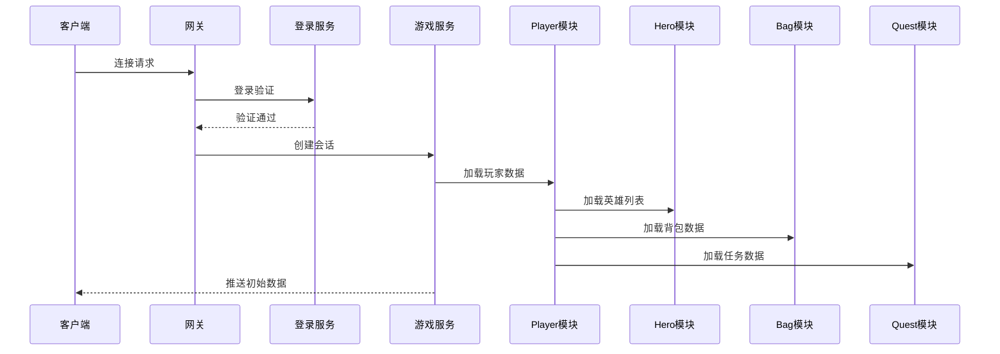
```mermaid
sequenceDiagram
    participant Client as 客户端
    participant Gateway as 网关
    participant Login as 登录服务
    participant GameServer as 游戏服务
    participant Player as Player模块
    participant Hero as Hero模块
    participant Bag as Bag模块
    participant Quest as Quest模块

    Client->>Gateway: 连接请求
    Gateway->>Login: 登录验证
    Login-->>Gateway: 验证通过
    Gateway->>GameServer: 创建会话
    GameServer->>Player: 加载玩家数据
    Player->>Hero: 加载英雄列表
    Player->>Bag: 加载背包数据
    Player->>Quest: 加载任务数据
    GameServer-->>Client: 推送初始数据
```

### 1.2 英雄升级交互流程

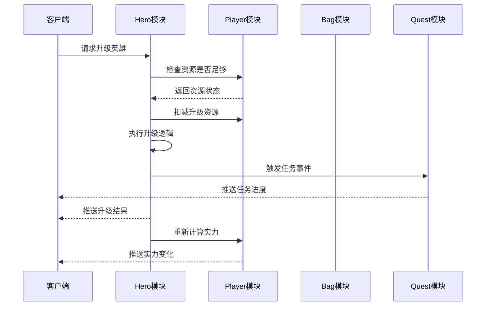
```mermaid
sequenceDiagram
    participant Client as 客户端
    participant Hero as Hero模块
    participant Player as Player模块
    participant Bag as Bag模块
    participant Quest as Quest模块

    Client->>Hero: 请求升级英雄
    Hero->>Player: 检查资源是否足够
    Player-->>Hero: 返回资源状态
    Hero->>Player: 扣减升级资源
    Hero->>Hero: 执行升级逻辑
    Hero->>Quest: 触发任务事件
    Quest-->>Client: 推送任务进度
    Hero-->>Client: 推送升级结果
    Hero->>Player: 重新计算实力
    Player-->>Client: 推送实力变化
```

### 1.3 装备穿戴交互流程

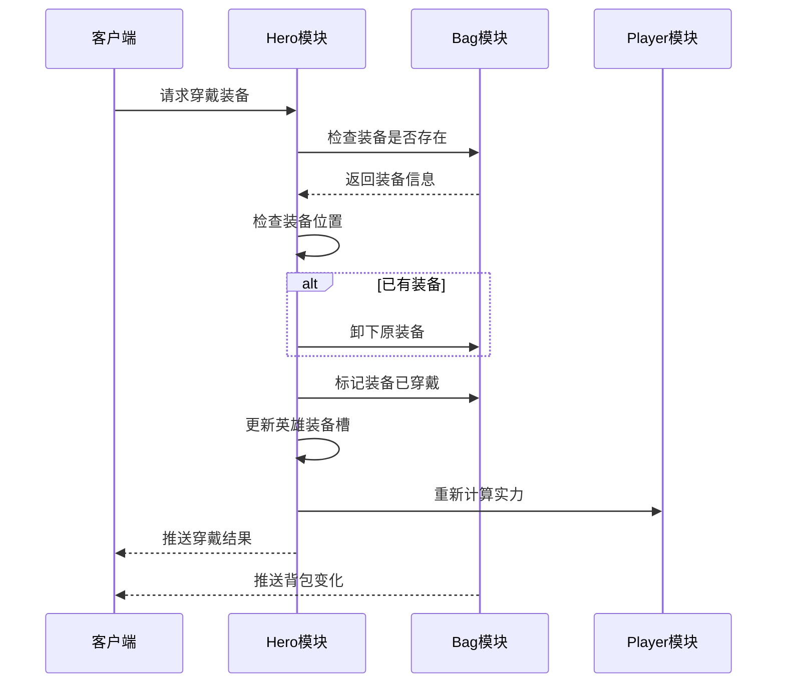
```mermaid
sequenceDiagram
    participant Client as 客户端
    participant Hero as Hero模块
    participant Bag as Bag模块
    participant Player as Player模块

    Client->>Hero: 请求穿戴装备
    Hero->>Bag: 检查装备是否存在
    Bag-->>Hero: 返回装备信息
    Hero->>Hero: 检查装备位置
    alt 已有装备
        Hero->>Bag: 卸下原装备
    end
    Hero->>Bag: 标记装备已穿戴
    Hero->>Hero: 更新英雄装备槽
    Hero->>Player: 重新计算实力
    Hero-->>Client: 推送穿戴结果
    Bag-->>Client: 推送背包变化
```

---

## 二、战斗模块交互

### 2.1 竞技场挑战交互流程

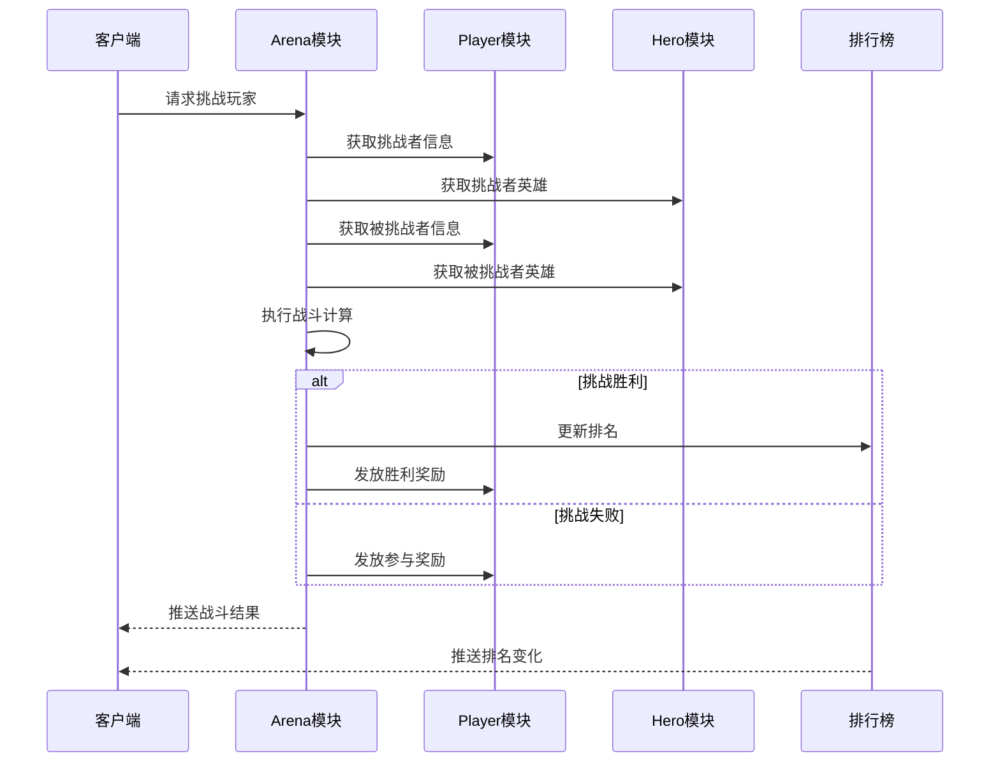
```mermaid
sequenceDiagram
    participant Client as 客户端
    participant Arena as Arena模块
    participant Player as Player模块
    participant Hero as Hero模块
    participant Rank as 排行榜

    Client->>Arena: 请求挑战玩家
    Arena->>Player: 获取挑战者信息
    Arena->>Hero: 获取挑战者英雄
    Arena->>Player: 获取被挑战者信息
    Arena->>Hero: 获取被挑战者英雄
    Arena->>Arena: 执行战斗计算
    alt 挑战胜利
        Arena->>Rank: 更新排名
        Arena->>Player: 发放胜利奖励
    else 挑战失败
        Arena->>Player: 发放参与奖励
    end
    Arena-->>Client: 推送战斗结果
    Rank-->>Client: 推送排名变化
```

### 2.2 副本挑战交互流程

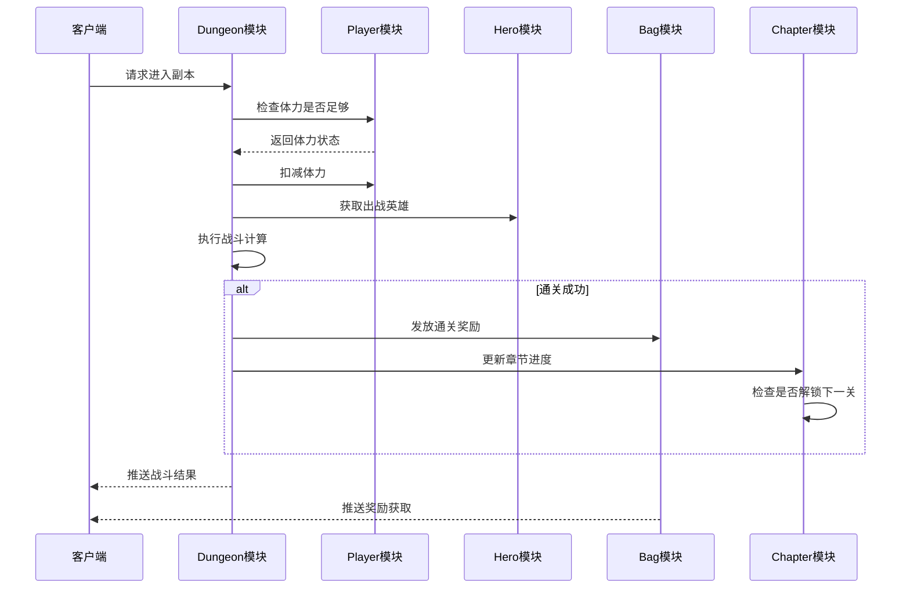
```mermaid
sequenceDiagram
    participant Client as 客户端
    participant Dungeon as Dungeon模块
    participant Player as Player模块
    participant Hero as Hero模块
    participant Bag as Bag模块
    participant Chapter as Chapter模块

    Client->>Dungeon: 请求进入副本
    Dungeon->>Player: 检查体力是否足够
    Player-->>Dungeon: 返回体力状态
    Dungeon->>Player: 扣减体力
    Dungeon->>Hero: 获取出战英雄
    Dungeon->>Dungeon: 执行战斗计算
    alt 通关成功
        Dungeon->>Bag: 发放通关奖励
        Dungeon->>Chapter: 更新章节进度
        Chapter->>Chapter: 检查是否解锁下一关
    end
    Dungeon-->>Client: 推送战斗结果
    Bag-->>Client: 推送奖励获取
```

### 2.3 章节推进交互流程

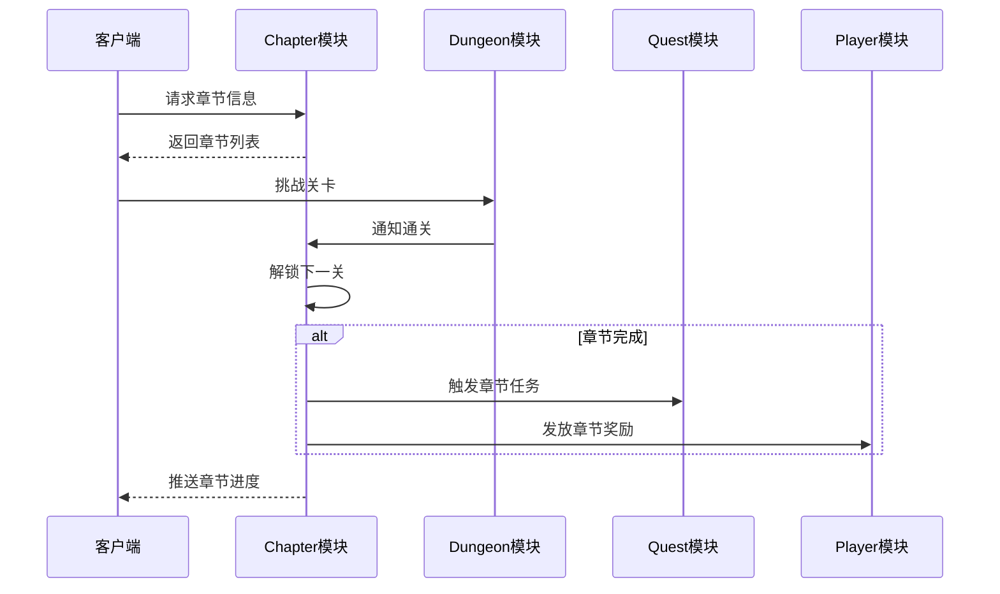
```mermaid
sequenceDiagram
    participant Client as 客户端
    participant Chapter as Chapter模块
    participant Dungeon as Dungeon模块
    participant Quest as Quest模块
    participant Player as Player模块

    Client->>Chapter: 请求章节信息
    Chapter-->>Client: 返回章节列表
    Client->>Dungeon: 挑战关卡
    Dungeon->>Chapter: 通知通关
    Chapter->>Chapter: 解锁下一关
    alt 章节完成
        Chapter->>Quest: 触发章节任务
        Chapter->>Player: 发放章节奖励
    end
    Chapter-->>Client: 推送章节进度
```

---

## 三、社交模块交互

### 3.1 公会创建交互流程

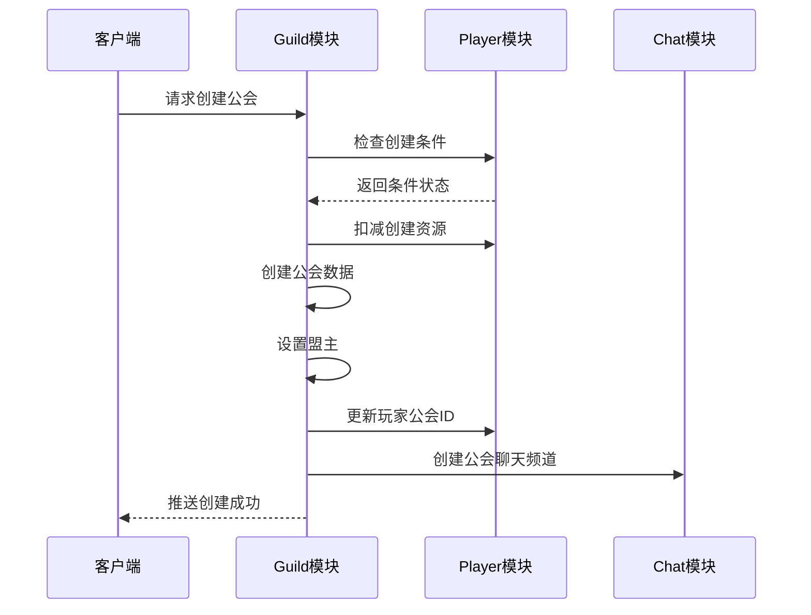
```mermaid
sequenceDiagram
    participant Client as 客户端
    participant Guild as Guild模块
    participant Player as Player模块
    participant Chat as Chat模块

    Client->>Guild: 请求创建公会
    Guild->>Player: 检查创建条件
    Player-->>Guild: 返回条件状态
    Guild->>Player: 扣减创建资源
    Guild->>Guild: 创建公会数据
    Guild->>Guild: 设置盟主
    Guild->>Player: 更新玩家公会ID
    Guild->>Chat: 创建公会聊天频道
    Guild-->>Client: 推送创建成功
```

### 3.2 公会捐献交互流程

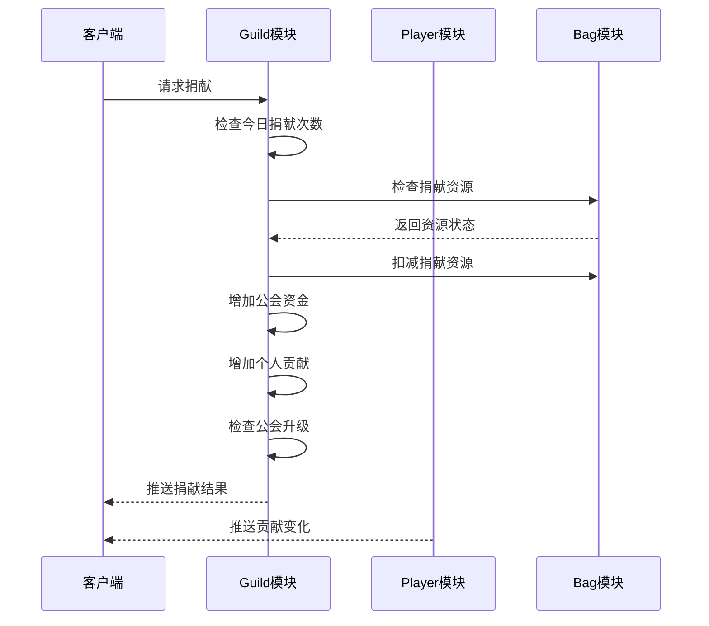
```mermaid
sequenceDiagram
    participant Client as 客户端
    participant Guild as Guild模块
    participant Player as Player模块
    participant Bag as Bag模块

    Client->>Guild: 请求捐献
    Guild->>Guild: 检查今日捐献次数
    Guild->>Bag: 检查捐献资源
    Bag-->>Guild: 返回资源状态
    Guild->>Bag: 扣减捐献资源
    Guild->>Guild: 增加公会资金
    Guild->>Guild: 增加个人贡献
    Guild->>Guild: 检查公会升级
    Guild-->>Client: 推送捐献结果
    Player-->>Client: 推送贡献变化
```

### 3.3 聊天消息交互流程

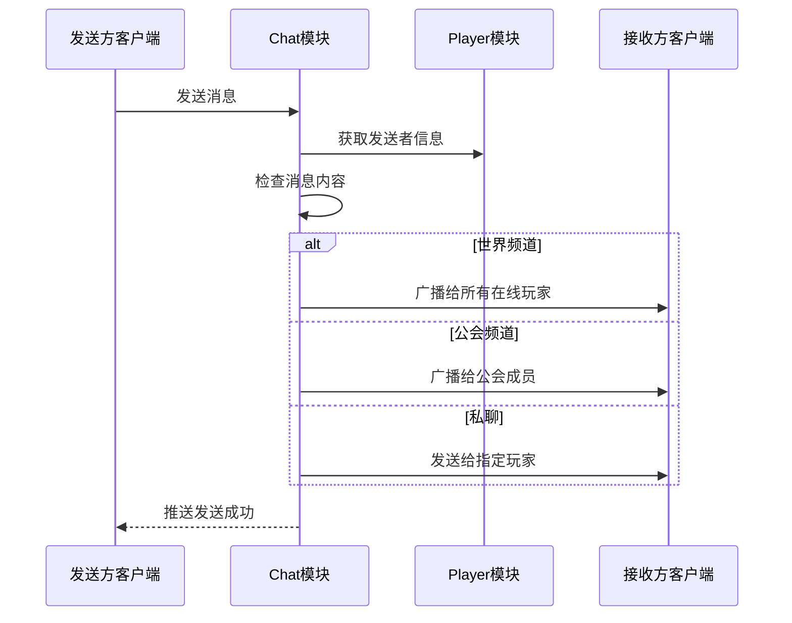
```mermaid
sequenceDiagram
    participant Client1 as 发送方客户端
    participant Chat as Chat模块
    participant Player as Player模块
    participant Client2 as 接收方客户端

    Client1->>Chat: 发送消息
    Chat->>Player: 获取发送者信息
    Chat->>Chat: 检查消息内容
    alt 世界频道
        Chat->>Client2: 广播给所有在线玩家
    else 公会频道
        Chat->>Client2: 广播给公会成员
    else 私聊
        Chat->>Client2: 发送给指定玩家
    end
    Chat-->>Client1: 推送发送成功
```

---

## 四、任务系统交互

### 4.1 任务触发交互流程

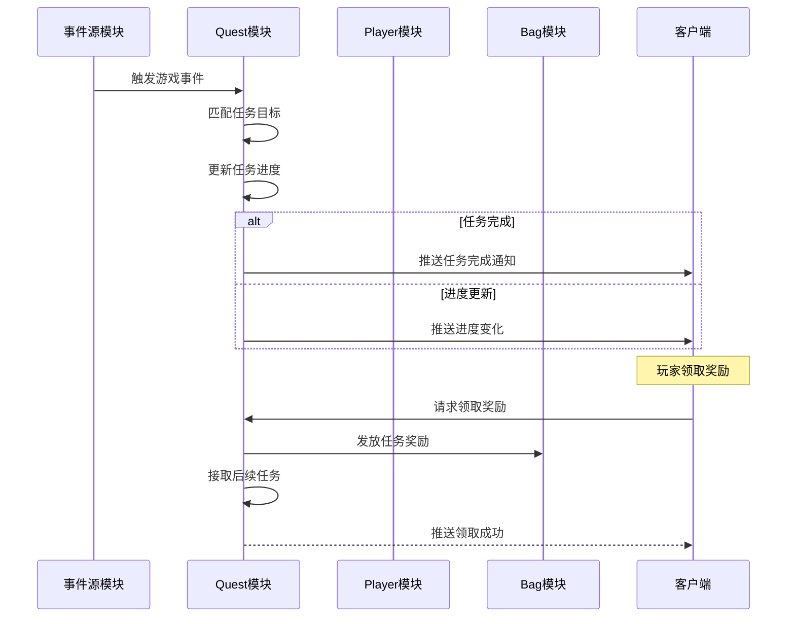
```mermaid
sequenceDiagram
    participant EventSource as 事件源模块
    participant Quest as Quest模块
    participant Player as Player模块
    participant Bag as Bag模块
    participant Client as 客户端

    EventSource->>Quest: 触发游戏事件
    Quest->>Quest: 匹配任务目标
    Quest->>Quest: 更新任务进度
    alt 任务完成
        Quest->>Client: 推送任务完成通知
    else 进度更新
        Quest->>Client: 推送进度变化
    end

    Note over Client: 玩家领取奖励
    Client->>Quest: 请求领取奖励
    Quest->>Bag: 发放任务奖励
    Quest->>Quest: 接取后续任务
    Quest-->>Client: 推送领取成功
```

### 4.2 活跃度计算交互流程

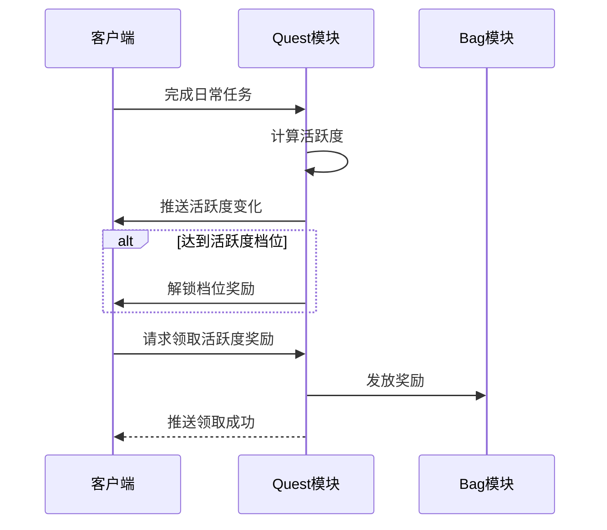
```mermaid
sequenceDiagram
    participant Client as 客户端
    participant Quest as Quest模块
    participant Bag as Bag模块

    Client->>Quest: 完成日常任务
    Quest->>Quest: 计算活跃度
    Quest->>Client: 推送活跃度变化
    alt 达到活跃度档位
        Quest->>Client: 解锁档位奖励
    end

    Client->>Quest: 请求领取活跃度奖励
    Quest->>Bag: 发放奖励
    Quest-->>Client: 推送领取成功
```

---

## 五、商店系统交互

### 5.1 商店购买交互流程

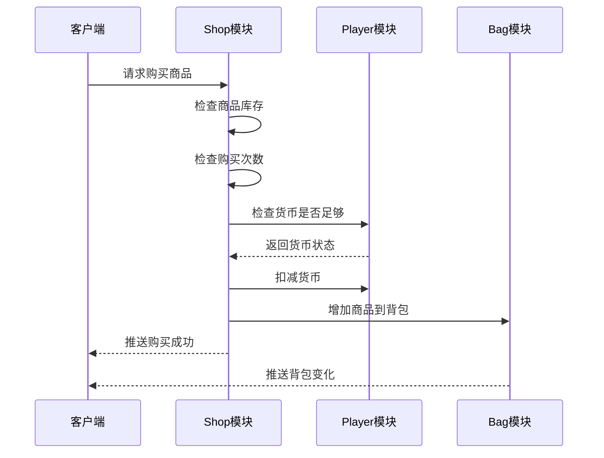
```mermaid
sequenceDiagram
    participant Client as 客户端
    participant Shop as Shop模块
    participant Player as Player模块
    participant Bag as Bag模块

    Client->>Shop: 请求购买商品
    Shop->>Shop: 检查商品库存
    Shop->>Shop: 检查购买次数
    Shop->>Player: 检查货币是否足够
    Player-->>Shop: 返回货币状态
    Shop->>Player: 扣减货币
    Shop->>Bag: 增加商品到背包
    Shop-->>Client: 推送购买成功
    Bag-->>Client: 推送背包变化
```

### 5.2 充值流程交互

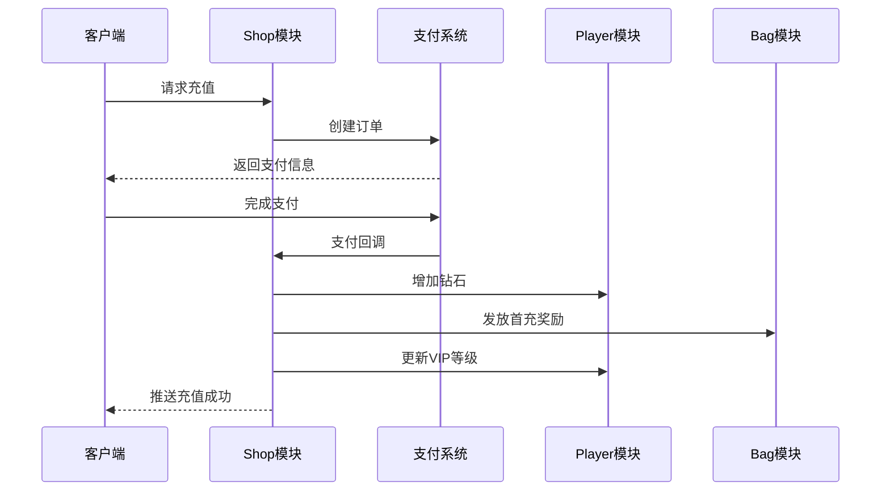
```mermaid
sequenceDiagram
    participant Client as 客户端
    participant Shop as Shop模块
    participant Payment as 支付系统
    participant Player as Player模块
    participant Bag as Bag模块

    Client->>Shop: 请求充值
    Shop->>Payment: 创建订单
    Payment-->>Client: 返回支付信息
    Client->>Payment: 完成支付
    Payment->>Shop: 支付回调
    Shop->>Player: 增加钻石
    Shop->>Bag: 发放首充奖励
    Shop->>Player: 更新VIP等级
    Shop-->>Client: 推送充值成功
```

---

## 六、建筑系统交互

### 6.1 英雄驻扎交互流程

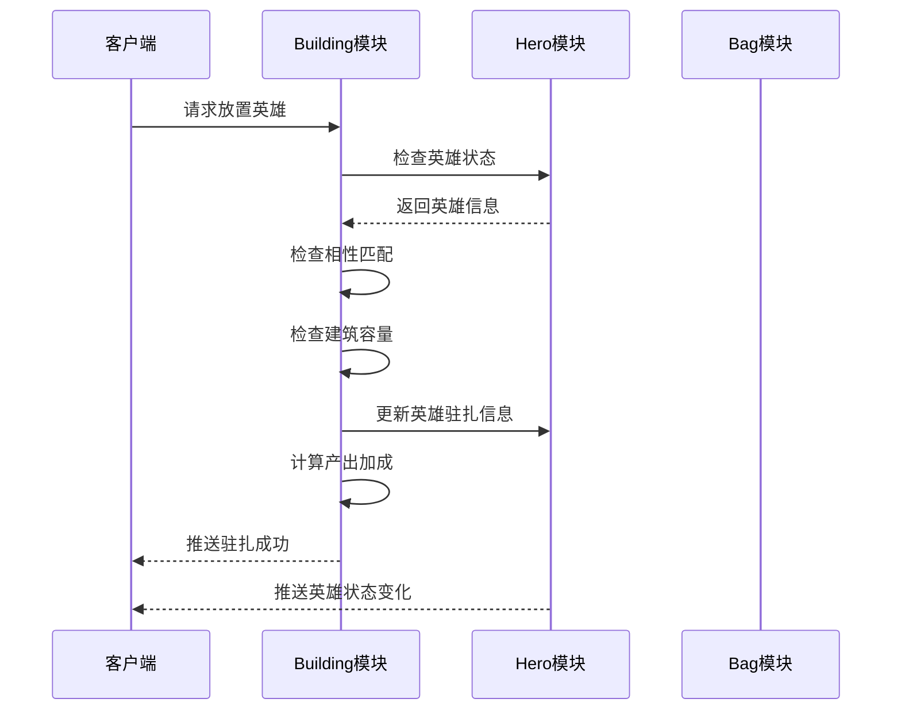
```mermaid
sequenceDiagram
    participant Client as 客户端
    participant Building as Building模块
    participant Hero as Hero模块
    participant Bag as Bag模块

    Client->>Building: 请求放置英雄
    Building->>Hero: 检查英雄状态
    Hero-->>Building: 返回英雄信息
    Building->>Building: 检查相性匹配
    Building->>Building: 检查建筑容量
    Building->>Hero: 更新英雄驻扎信息
    Building->>Building: 计算产出加成
    Building-->>Client: 推送驻扎成功
    Hero-->>Client: 推送英雄状态变化
```

### 6.2 资源收取交互流程

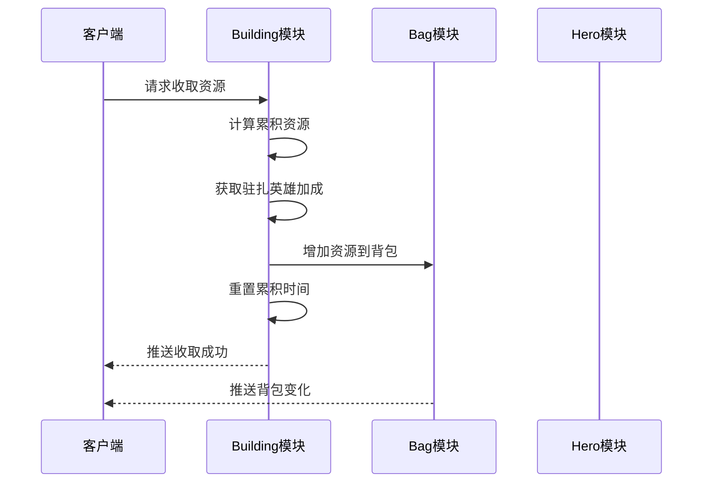
```mermaid
sequenceDiagram
    participant Client as 客户端
    participant Building as Building模块
    participant Bag as Bag模块
    participant Hero as Hero模块

    Client->>Building: 请求收取资源
    Building->>Building: 计算累积资源
    Building->>Building: 获取驻扎英雄加成
    Building->>Bag: 增加资源到背包
    Building->>Building: 重置累积时间
    Building-->>Client: 推送收取成功
    Bag-->>Client: 推送背包变化
```

---

## 七、系统间调用关系总览

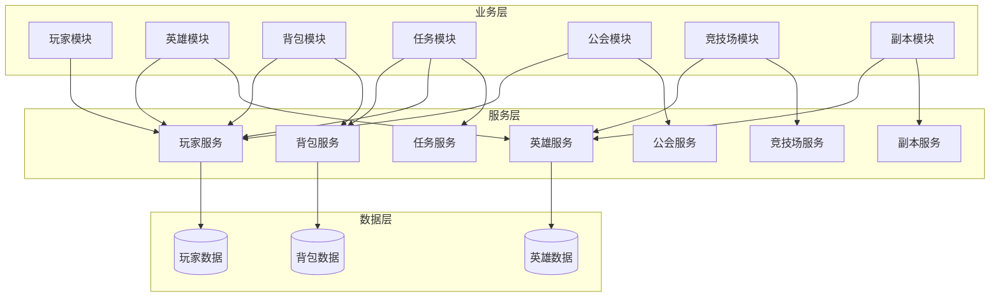
```mermaid
graph TB
    subgraph 数据层
        PlayerData[(玩家数据)]
        HeroData[(英雄数据)]
        BagData[(背包数据)]
    end

    subgraph 服务层
        PlayerSvc[玩家服务]
        HeroSvc[英雄服务]
        BagSvc[背包服务]
        QuestSvc[任务服务]
        GuildSvc[公会服务]
        ArenaSvc[竞技场服务]
        DungeonSvc[副本服务]
    end

    subgraph 业务层
        Player[玩家模块]
        Hero[英雄模块]
        Bag[背包模块]
        Quest[任务模块]
        Guild[公会模块]
        Arena[竞技场模块]
        Dungeon[副本模块]
    end

    Player --> PlayerSvc
    Hero --> HeroSvc
    Bag --> BagSvc
    Quest --> QuestSvc
    Guild --> GuildSvc
    Arena --> ArenaSvc
    Dungeon --> DungeonSvc

    PlayerSvc --> PlayerData
    HeroSvc --> HeroData
    BagSvc --> BagData

    Hero --> PlayerSvc
    Bag --> PlayerSvc
    Quest --> PlayerSvc
    Guild --> PlayerSvc

    Arena --> HeroSvc
    Dungeon --> HeroSvc
    Quest --> BagSvc
```

---

*文档生成时间: 2026-04-06*
