# K2C 游戏框架 - 模块交互时序图

## 一、概述

本文档描述 K2C 游戏框架中关键业务流程的模块交互时序。通过时序图展示模块间的协作关系和数据流转过程。

---

## 二、玩家核心流程

### 2.1 玩家登录流程

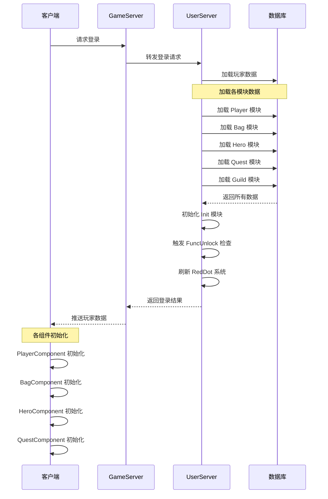
```mermaid
sequenceDiagram
    participant Client as 客户端
    participant GS as GameServer
    participant US as UserServer
    participant DB as 数据库

    Client->>GS: 请求登录
    GS->>US: 转发登录请求
    US->>DB: 加载玩家数据

    Note over US, DB: 加载各模块数据
    US->>DB: 加载 Player 模块
    US->>DB: 加载 Bag 模块
    US->>DB: 加载 Hero 模块
    US->>DB: 加载 Quest 模块
    US->>DB: 加载 Guild 模块

    DB-->>US: 返回所有数据
    US->>US: 初始化 Init 模块
    US->>US: 触发 FuncUnlock 检查
    US->>US: 刷新 RedDot 系统

    US-->>GS: 返回登录结果
    GS-->>Client: 推送玩家数据

    Note over Client: 各组件初始化
    Client->>Client: PlayerComponent 初始化
    Client->>Client: BagComponent 初始化
    Client->>Client: HeroComponent 初始化
    Client->>Client: QuestComponent 初始化
```

### 2.2 玩家创建角色流程

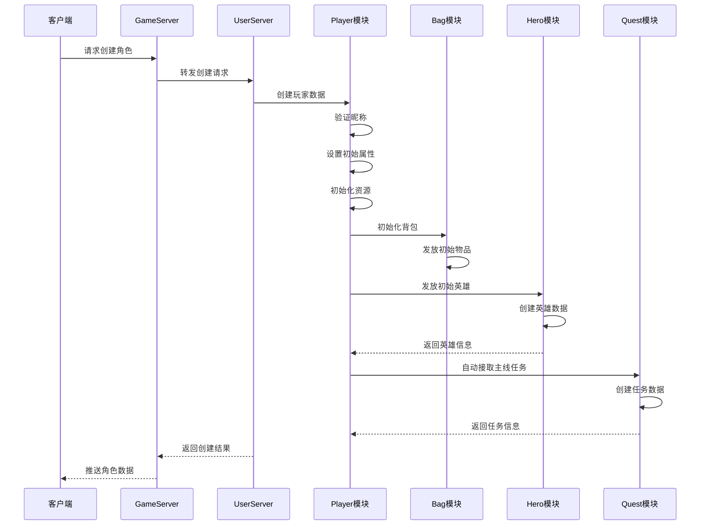
```mermaid
sequenceDiagram
    participant Client as 客户端
    participant GS as GameServer
    participant US as UserServer
    participant Player as Player模块
    participant Bag as Bag模块
    participant Hero as Hero模块
    participant Quest as Quest模块

    Client->>GS: 请求创建角色
    GS->>US: 转发创建请求

    US->>Player: 创建玩家数据
    Player->>Player: 验证昵称
    Player->>Player: 设置初始属性
    Player->>Player: 初始化资源

    Player->>Bag: 初始化背包
    Bag->>Bag: 发放初始物品

    Player->>Hero: 发放初始英雄
    Hero->>Hero: 创建英雄数据
    Hero-->>Player: 返回英雄信息

    Player->>Quest: 自动接取主线任务
    Quest->>Quest: 创建任务数据
    Quest-->>Player: 返回任务信息

    US-->>GS: 返回创建结果
    GS-->>Client: 推送角色数据
```

---

## 三、养成系统交互

### 3.1 英雄升级流程

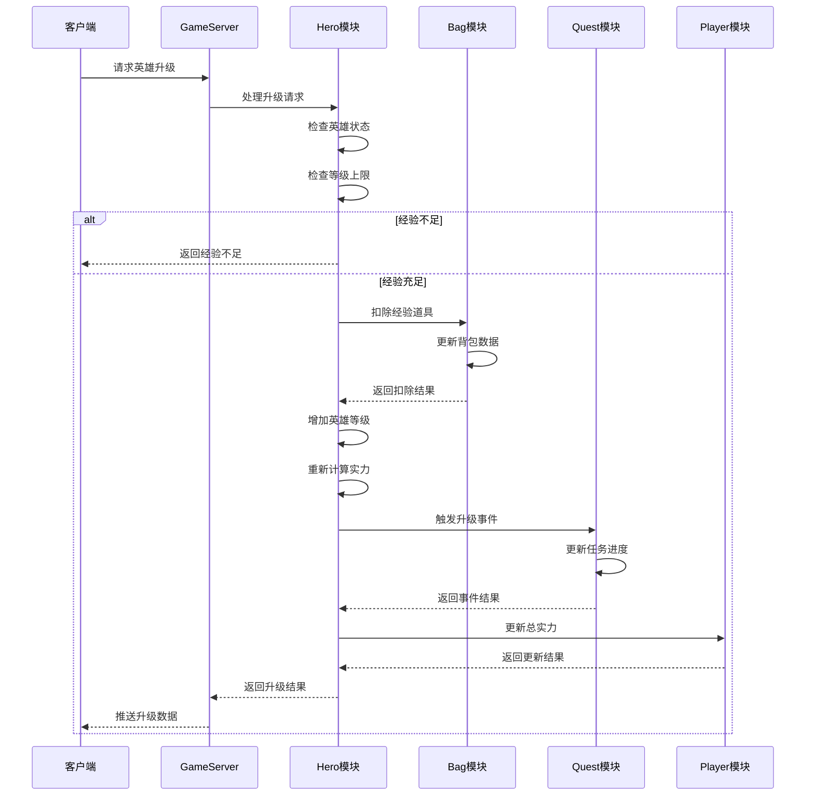
```mermaid
sequenceDiagram
    participant Client as 客户端
    participant GS as GameServer
    participant Hero as Hero模块
    participant Bag as Bag模块
    participant Quest as Quest模块
    participant Player as Player模块

    Client->>GS: 请求英雄升级
    GS->>Hero: 处理升级请求

    Hero->>Hero: 检查英雄状态
    Hero->>Hero: 检查等级上限

    alt 经验不足
        Hero-->>Client: 返回经验不足
    else 经验充足
        Hero->>Bag: 扣除经验道具
        Bag->>Bag: 更新背包数据
        Bag-->>Hero: 返回扣除结果

        Hero->>Hero: 增加英雄等级
        Hero->>Hero: 重新计算实力

        Hero->>Quest: 触发升级事件
        Quest->>Quest: 更新任务进度
        Quest-->>Hero: 返回事件结果

        Hero->>Player: 更新总实力
        Player-->>Hero: 返回更新结果

        Hero-->>GS: 返回升级结果
        GS-->>Client: 推送升级数据
    end
```

### 3.2 英雄驻扎建筑流程

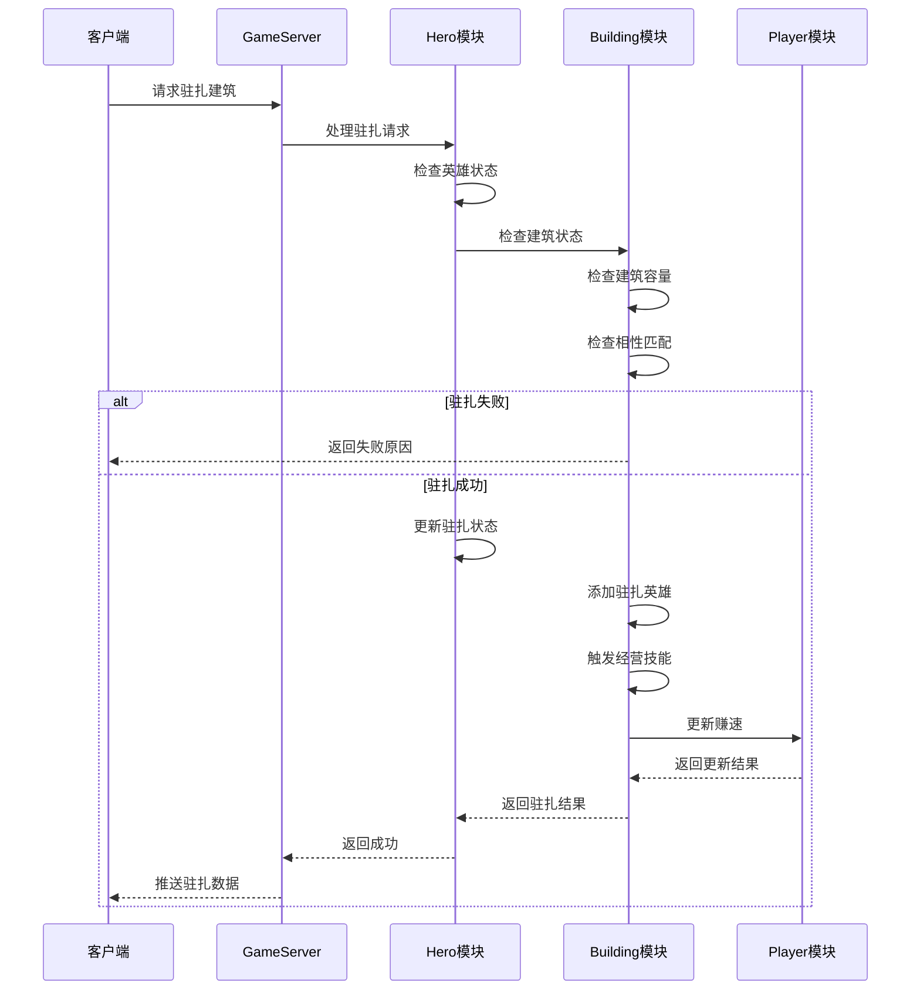
```mermaid
sequenceDiagram
    participant Client as 客户端
    participant GS as GameServer
    participant Hero as Hero模块
    participant Building as Building模块
    participant Player as Player模块

    Client->>GS: 请求驻扎建筑
    GS->>Hero: 处理驻扎请求

    Hero->>Hero: 检查英雄状态
    Hero->>Building: 检查建筑状态

    Building->>Building: 检查建筑容量
    Building->>Building: 检查相性匹配

    alt 驻扎失败
        Building-->>Client: 返回失败原因
    else 驻扎成功
        Hero->>Hero: 更新驻扎状态
        Building->>Building: 添加驻扎英雄

        Building->>Building: 触发经营技能
        Building->>Player: 更新赚速

        Player-->>Building: 返回更新结果
        Building-->>Hero: 返回驻扎结果

        Hero-->>GS: 返回成功
        GS-->>Client: 推送驻扎数据
    end
```

### 3.3 子嗣养成流程

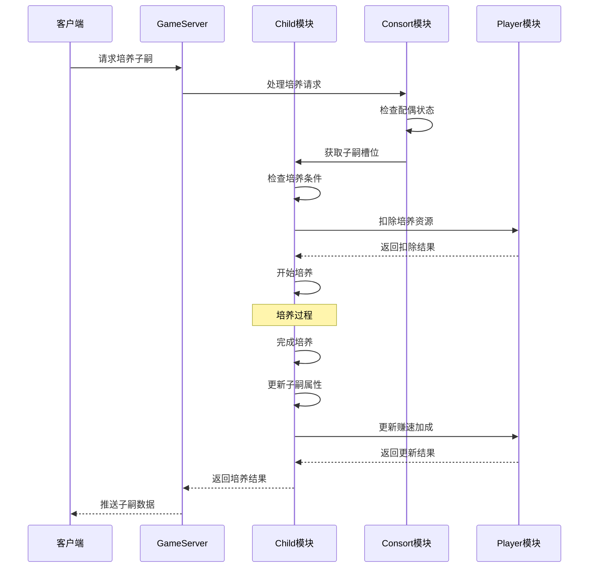
```mermaid
sequenceDiagram
    participant Client as 客户端
    participant GS as GameServer
    participant Child as Child模块
    participant Consort as Consort模块
    participant Player as Player模块

    Client->>GS: 请求培养子嗣
    GS->>Consort: 处理培养请求

    Consort->>Consort: 检查配偶状态
    Consort->>Child: 获取子嗣槽位

    Child->>Child: 检查培养条件
    Child->>Player: 扣除培养资源

    Player-->>Child: 返回扣除结果
    Child->>Child: 开始培养

    Note over Child: 培养过程

    Child->>Child: 完成培养
    Child->>Child: 更新子嗣属性

    Child->>Player: 更新赚速加成
    Player-->>Child: 返回更新结果

    Child-->>GS: 返回培养结果
    GS-->>Client: 推送子嗣数据
```

---

## 四、社交系统交互

### 4.1 公会创建流程

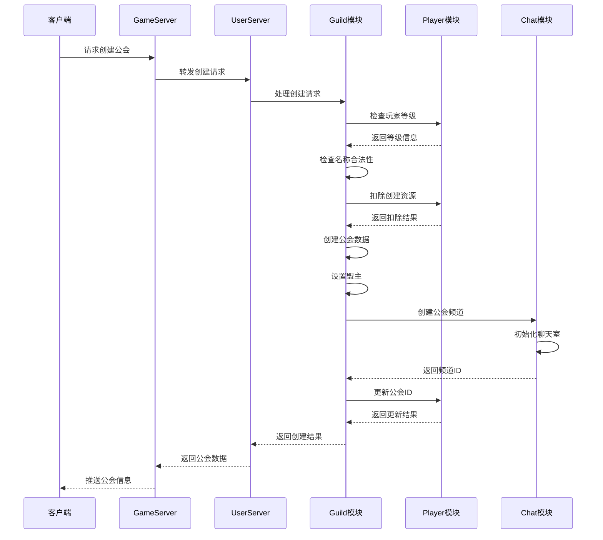
```mermaid
sequenceDiagram
    participant Client as 客户端
    participant GS as GameServer
    participant US as UserServer
    participant Guild as Guild模块
    participant Player as Player模块
    participant Chat as Chat模块

    Client->>GS: 请求创建公会
    GS->>US: 转发创建请求
    US->>Guild: 处理创建请求

    Guild->>Player: 检查玩家等级
    Player-->>Guild: 返回等级信息

    Guild->>Guild: 检查名称合法性
    Guild->>Player: 扣除创建资源

    Player-->>Guild: 返回扣除结果
    Guild->>Guild: 创建公会数据
    Guild->>Guild: 设置盟主

    Guild->>Chat: 创建公会频道
    Chat->>Chat: 初始化聊天室
    Chat-->>Guild: 返回频道ID

    Guild->>Player: 更新公会ID
    Player-->>Guild: 返回更新结果

    Guild-->>US: 返回创建结果
    US-->>GS: 返回公会数据
    GS-->>Client: 推送公会信息
```

### 4.2 公会申请审批流程

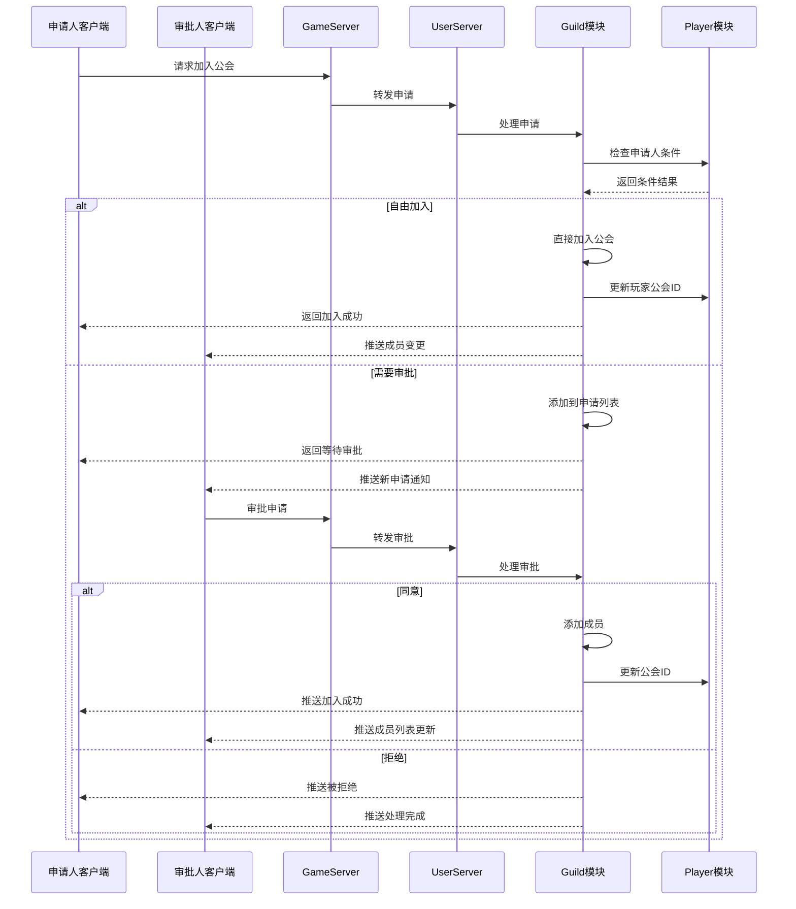
```mermaid
sequenceDiagram
    participant A as 申请人客户端
    participant B as 审批人客户端
    participant GS as GameServer
    participant US as UserServer
    participant Guild as Guild模块
    participant Player as Player模块

    A->>GS: 请求加入公会
    GS->>US: 转发申请
    US->>Guild: 处理申请

    Guild->>Player: 检查申请人条件
    Player-->>Guild: 返回条件结果

    alt 自由加入
        Guild->>Guild: 直接加入公会
        Guild->>Player: 更新玩家公会ID
        Guild-->>A: 返回加入成功
        Guild-->>B: 推送成员变更
    else 需要审批
        Guild->>Guild: 添加到申请列表
        Guild-->>A: 返回等待审批
        Guild-->>B: 推送新申请通知

        B->>GS: 审批申请
        GS->>US: 转发审批
        US->>Guild: 处理审批

        alt 同意
            Guild->>Guild: 添加成员
            Guild->>Player: 更新公会ID
            Guild-->>A: 推送加入成功
            Guild-->>B: 推送成员列表更新
        else 拒绝
            Guild-->>A: 推送被拒绝
            Guild-->>B: 推送处理完成
        end
    end
```

### 4.3 聊天消息发送流程

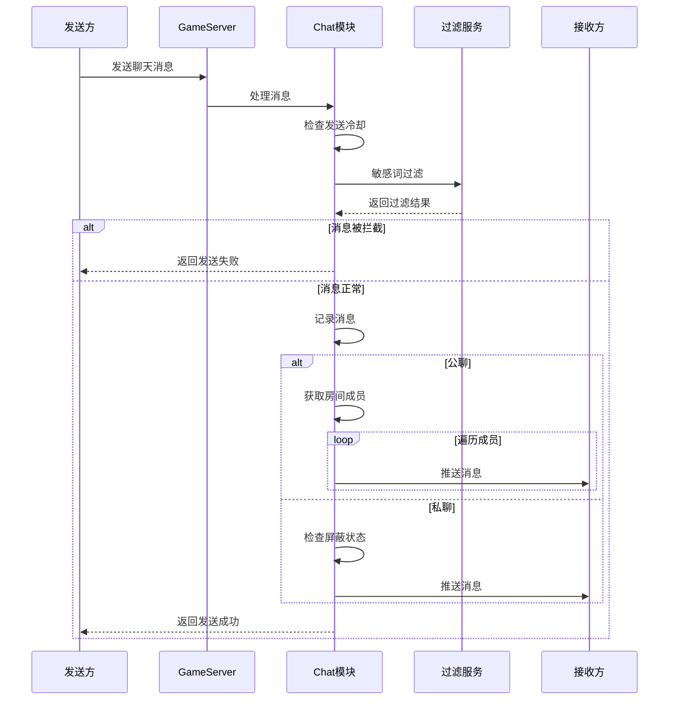
```mermaid
sequenceDiagram
    participant Sender as 发送方
    participant GS as GameServer
    participant Chat as Chat模块
    participant Filter as 过滤服务
    participant Receiver as 接收方

    Sender->>GS: 发送聊天消息
    GS->>Chat: 处理消息

    Chat->>Chat: 检查发送冷却
    Chat->>Filter: 敏感词过滤
    Filter-->>Chat: 返回过滤结果

    alt 消息被拦截
        Chat-->>Sender: 返回发送失败
    else 消息正常
        Chat->>Chat: 记录消息

        alt 公聊
            Chat->>Chat: 获取房间成员
            loop 遍历成员
                Chat->>Receiver: 推送消息
            end
        else 私聊
            Chat->>Chat: 检查屏蔽状态
            Chat->>Receiver: 推送消息
        end

        Chat-->>Sender: 返回发送成功
    end
```

---

## 五、任务系统交互

### 5.1 主线任务推进流程

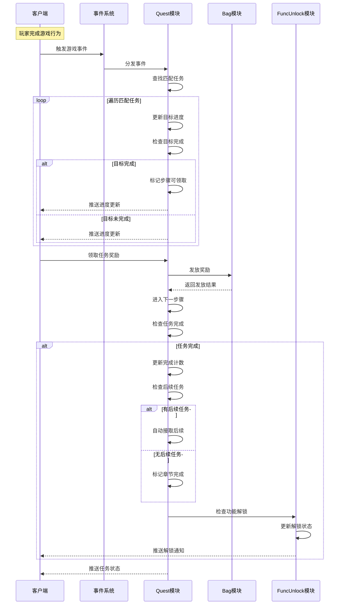
```mermaid
sequenceDiagram
    participant Client as 客户端
    participant Event as 事件系统
    participant Quest as Quest模块
    participant Bag as Bag模块
    participant FuncUnlock as FuncUnlock模块

    Note over Client: 玩家完成游戏行为
    Client->>Event: 触发游戏事件

    Event->>Quest: 分发事件
    Quest->>Quest: 查找匹配任务

    loop 遍历匹配任务
        Quest->>Quest: 更新目标进度
        Quest->>Quest: 检查目标完成

        alt 目标完成
            Quest->>Quest: 标记步骤可领取
            Quest-->>Client: 推送进度更新
        else 目标未完成
            Quest-->>Client: 推送进度更新
        end
    end

    Client->>Quest: 领取任务奖励
    Quest->>Bag: 发放奖励
    Bag-->>Quest: 返回发放结果

    Quest->>Quest: 进入下一步骤
    Quest->>Quest: 检查任务完成

    alt 任务完成
        Quest->>Quest: 更新完成计数
        Quest->>Quest: 检查后续任务

        alt 有后续任务
            Quest->>Quest: 自动接取后续
        else 无后续任务
            Quest->>Quest: 标记章节完成
        end

        Quest->>FuncUnlock: 检查功能解锁
        FuncUnlock->>FuncUnlock: 更新解锁状态
        FuncUnlock-->>Client: 推送解锁通知
    end

    Quest-->>Client: 推送任务状态
```

### 5.2 日常任务刷新流程

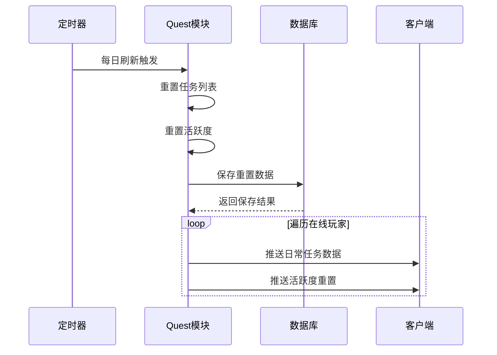
```mermaid
sequenceDiagram
    participant Timer as 定时器
    participant Quest as Quest模块
    participant DB as 数据库
    participant Client as 客户端

    Timer->>Quest: 每日刷新触发

    Quest->>Quest: 重置任务列表
    Quest->>Quest: 重置活跃度

    Quest->>DB: 保存重置数据
    DB-->>Quest: 返回保存结果

    loop 遍历在线玩家
        Quest->>Client: 推送日常任务数据
        Quest->>Client: 推送活跃度重置
    end
```

---

## 六、战斗系统交互

### 6.1 竞技场战斗流程

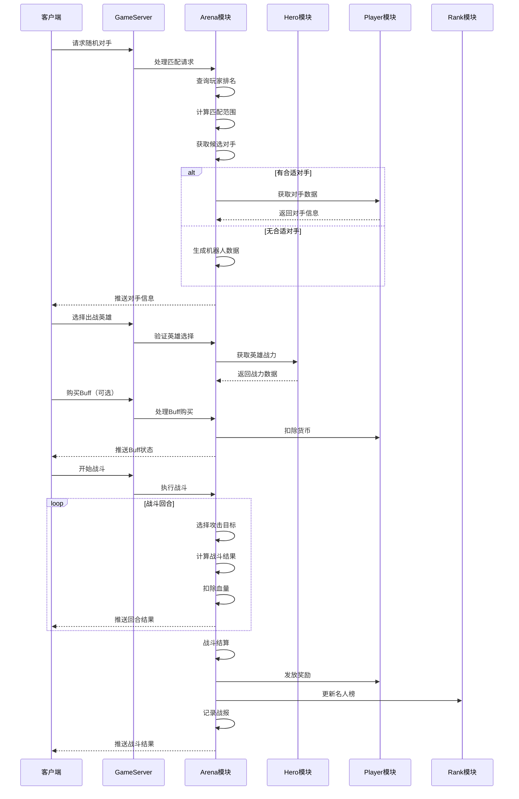
```mermaid
sequenceDiagram
    participant Client as 客户端
    participant GS as GameServer
    participant Arena as Arena模块
    participant Hero as Hero模块
    participant Player as Player模块
    participant Rank as Rank模块

    Client->>GS: 请求随机对手
    GS->>Arena: 处理匹配请求

    Arena->>Arena: 查询玩家排名
    Arena->>Arena: 计算匹配范围
    Arena->>Arena: 获取候选对手

    alt 有合适对手
        Arena->>Player: 获取对手数据
        Player-->>Arena: 返回对手信息
    else 无合适对手
        Arena->>Arena: 生成机器人数据
    end

    Arena-->>Client: 推送对手信息

    Client->>GS: 选择出战英雄
    GS->>Arena: 验证英雄选择
    Arena->>Hero: 获取英雄战力
    Hero-->>Arena: 返回战力数据

    Client->>GS: 购买Buff（可选）
    GS->>Arena: 处理Buff购买
    Arena->>Player: 扣除货币
    Arena-->>Client: 推送Buff状态

    Client->>GS: 开始战斗
    GS->>Arena: 执行战斗

    loop 战斗回合
        Arena->>Arena: 选择攻击目标
        Arena->>Arena: 计算战斗结果
        Arena->>Arena: 扣除血量
        Arena-->>Client: 推送回合结果
    end

    Arena->>Arena: 战斗结算
    Arena->>Player: 发放奖励
    Arena->>Rank: 更新名人榜
    Arena->>Arena: 记录战报

    Arena-->>Client: 推送战斗结果
```

### 6.2 副本挑战流程

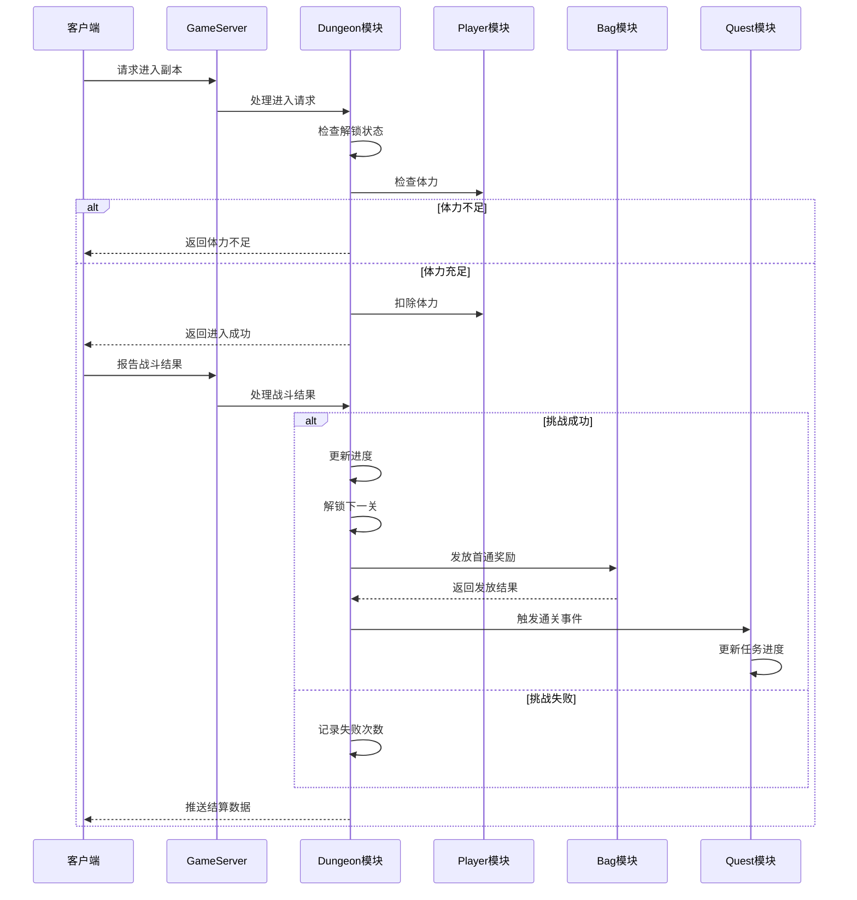
```mermaid
sequenceDiagram
    participant Client as 客户端
    participant GS as GameServer
    participant Dungeon as Dungeon模块
    participant Player as Player模块
    participant Bag as Bag模块
    participant Quest as Quest模块

    Client->>GS: 请求进入副本
    GS->>Dungeon: 处理进入请求

    Dungeon->>Dungeon: 检查解锁状态
    Dungeon->>Player: 检查体力

    alt 体力不足
        Dungeon-->>Client: 返回体力不足
    else 体力充足
        Dungeon->>Player: 扣除体力
        Dungeon-->>Client: 返回进入成功

        Client->>GS: 报告战斗结果
        GS->>Dungeon: 处理战斗结果

        alt 挑战成功
            Dungeon->>Dungeon: 更新进度
            Dungeon->>Dungeon: 解锁下一关

            Dungeon->>Bag: 发放首通奖励
            Bag-->>Dungeon: 返回发放结果

            Dungeon->>Quest: 触发通关事件
            Quest->>Quest: 更新任务进度
        else 挑战失败
            Dungeon->>Dungeon: 记录失败次数
        end

        Dungeon-->>Client: 推送结算数据
    end
```

---

## 七、经济系统交互

### 7.1 商店购买流程

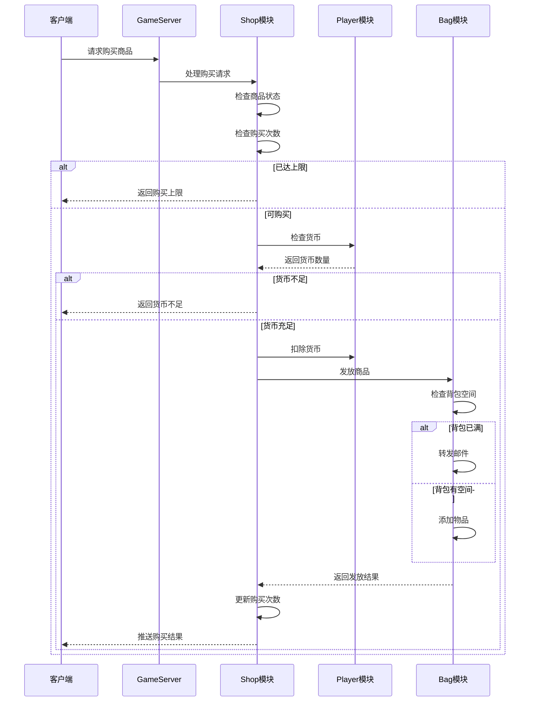
```mermaid
sequenceDiagram
    participant Client as 客户端
    participant GS as GameServer
    participant Shop as Shop模块
    participant Player as Player模块
    participant Bag as Bag模块

    Client->>GS: 请求购买商品
    GS->>Shop: 处理购买请求

    Shop->>Shop: 检查商品状态
    Shop->>Shop: 检查购买次数

    alt 已达上限
        Shop-->>Client: 返回购买上限
    else 可购买
        Shop->>Player: 检查货币
        Player-->>Shop: 返回货币数量

        alt 货币不足
            Shop-->>Client: 返回货币不足
        else 货币充足
            Shop->>Player: 扣除货币
            Shop->>Bag: 发放商品

            Bag->>Bag: 检查背包空间
            alt 背包已满
                Bag->>Bag: 转发邮件
            else 背包有空间
                Bag->>Bag: 添加物品
            end

            Bag-->>Shop: 返回发放结果
            Shop->>Shop: 更新购买次数
            Shop-->>Client: 推送购买结果
        end
    end
```

### 7.2 招募英雄流程

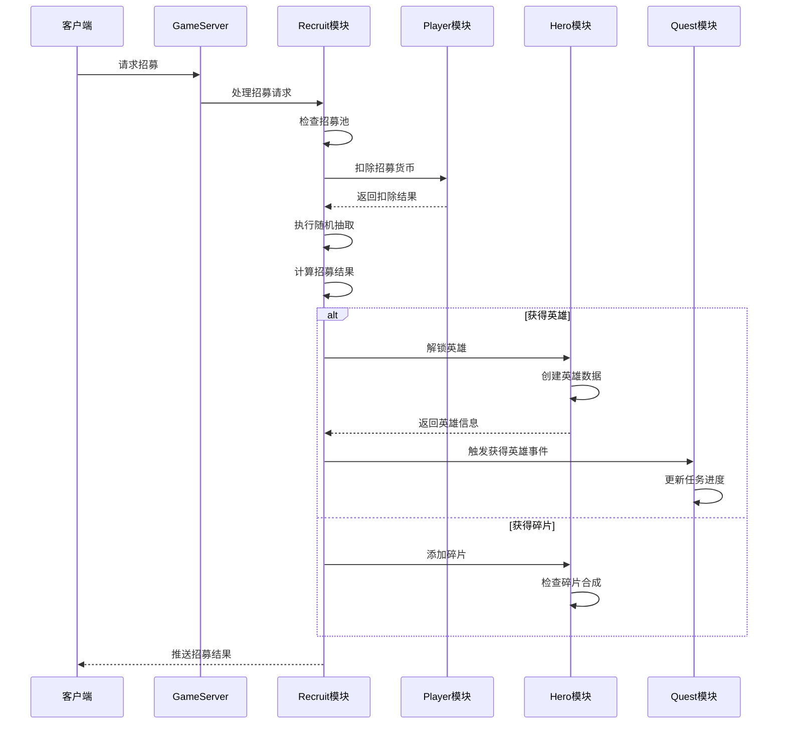
```mermaid
sequenceDiagram
    participant Client as 客户端
    participant GS as GameServer
    participant Recruit as Recruit模块
    participant Player as Player模块
    participant Hero as Hero模块
    participant Quest as Quest模块

    Client->>GS: 请求招募
    GS->>Recruit: 处理招募请求

    Recruit->>Recruit: 检查招募池
    Recruit->>Player: 扣除招募货币
    Player-->>Recruit: 返回扣除结果

    Recruit->>Recruit: 执行随机抽取
    Recruit->>Recruit: 计算招募结果

    alt 获得英雄
        Recruit->>Hero: 解锁英雄
        Hero->>Hero: 创建英雄数据
        Hero-->>Recruit: 返回英雄信息

        Recruit->>Quest: 触发获得英雄事件
        Quest->>Quest: 更新任务进度
    else 获得碎片
        Recruit->>Hero: 添加碎片
        Hero->>Hero: 检查碎片合成
    end

    Recruit-->>Client: 推送招募结果
```

---

## 八、活动系统交互

### 8.1 七日登录活动流程

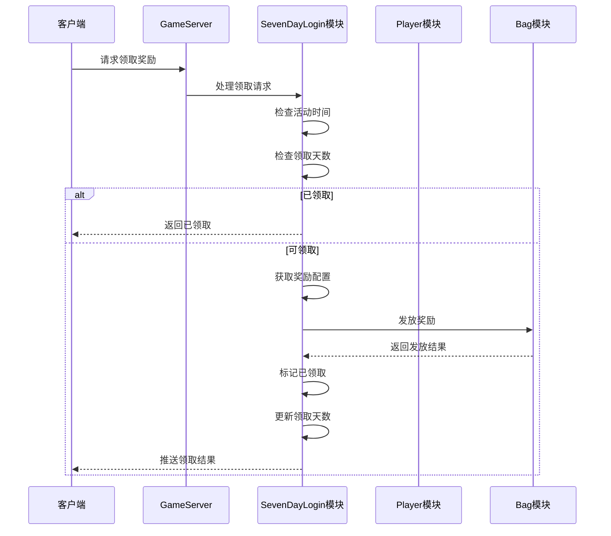
```mermaid
sequenceDiagram
    participant Client as 客户端
    participant GS as GameServer
    participant SDL as SevenDayLogin模块
    participant Player as Player模块
    participant Bag as Bag模块

    Client->>GS: 请求领取奖励
    GS->>SDL: 处理领取请求

    SDL->>SDL: 检查活动时间
    SDL->>SDL: 检查领取天数

    alt 已领取
        SDL-->>Client: 返回已领取
    else 可领取
        SDL->>SDL: 获取奖励配置
        SDL->>Bag: 发放奖励
        Bag-->>SDL: 返回发放结果

        SDL->>SDL: 标记已领取
        SDL->>SDL: 更新领取天数

        SDL-->>Client: 推送领取结果
    end
```

### 8.2 限时活动触发流程

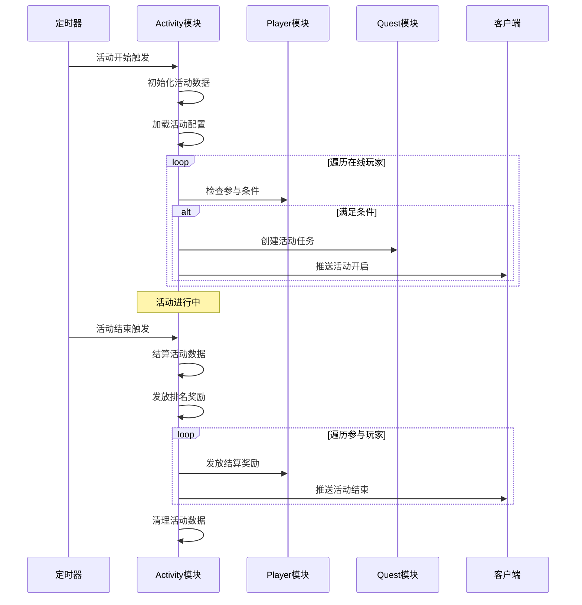
```mermaid
sequenceDiagram
    participant Timer as 定时器
    participant Activity as Activity模块
    participant Player as Player模块
    participant Quest as Quest模块
    participant Client as 客户端

    Timer->>Activity: 活动开始触发

    Activity->>Activity: 初始化活动数据
    Activity->>Activity: 加载活动配置

    loop 遍历在线玩家
        Activity->>Player: 检查参与条件
        alt 满足条件
            Activity->>Quest: 创建活动任务
            Activity->>Client: 推送活动开启
        end
    end

    Note over Activity: 活动进行中

    Timer->>Activity: 活动结束触发

    Activity->>Activity: 结算活动数据
    Activity->>Activity: 发放排名奖励

    loop 遍历参与玩家
        Activity->>Player: 发放结算奖励
        Activity->>Client: 推送活动结束
    end

    Activity->>Activity: 清理活动数据
```

---

## 九、数据同步机制

### 9.1 实时数据推送

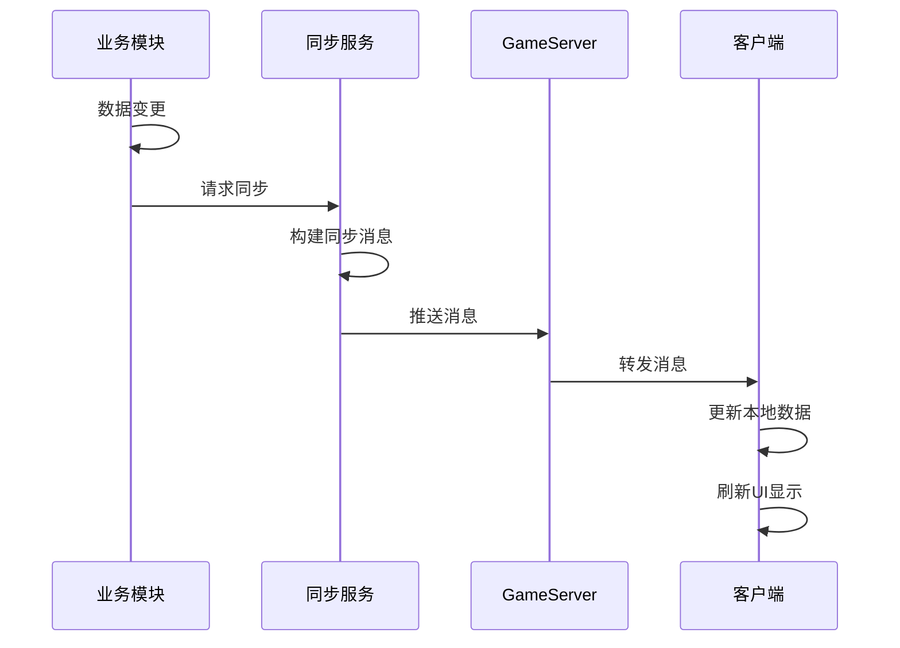
```mermaid
sequenceDiagram
    participant Module as 业务模块
    participant Sync as 同步服务
    participant GS as GameServer
    participant Client as 客户端

    Module->>Module: 数据变更
    Module->>Sync: 请求同步

    Sync->>Sync: 构建同步消息
    Sync->>GS: 推送消息
    GS->>Client: 转发消息

    Client->>Client: 更新本地数据
    Client->>Client: 刷新UI显示
```

### 9.2 跨服数据同步

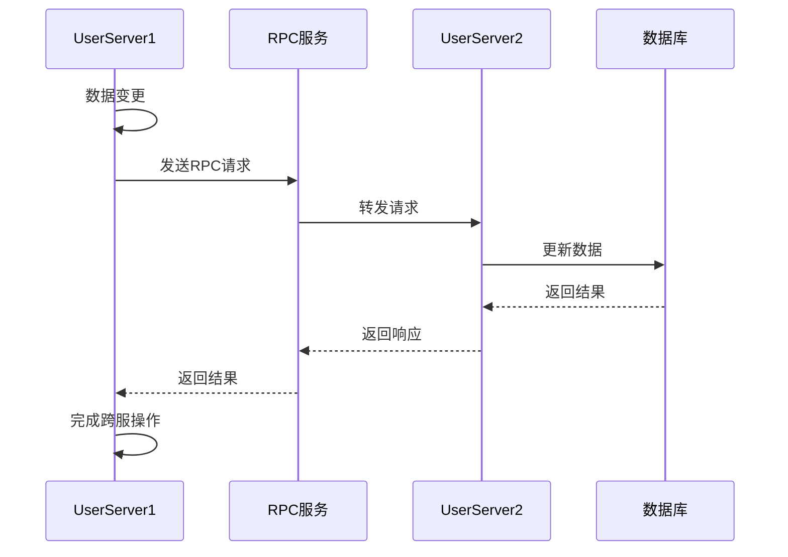
```mermaid
sequenceDiagram
    participant US1 as UserServer1
    participant RPC as RPC服务
    participant US2 as UserServer2
    participant DB as 数据库

    US1->>US1: 数据变更
    US1->>RPC: 发送RPC请求

    RPC->>US2: 转发请求
    US2->>DB: 更新数据

    DB-->>US2: 返回结果
    US2-->>RPC: 返回响应
    RPC-->>US1: 返回结果

    US1->>US1: 完成跨服操作
```

---

*文档生成时间: 2026-04-11*
