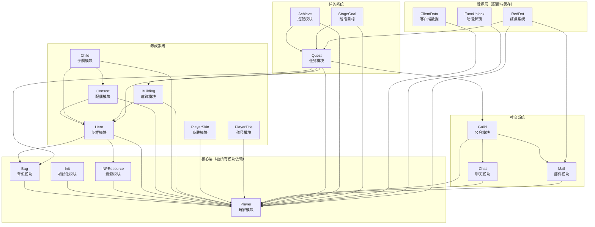
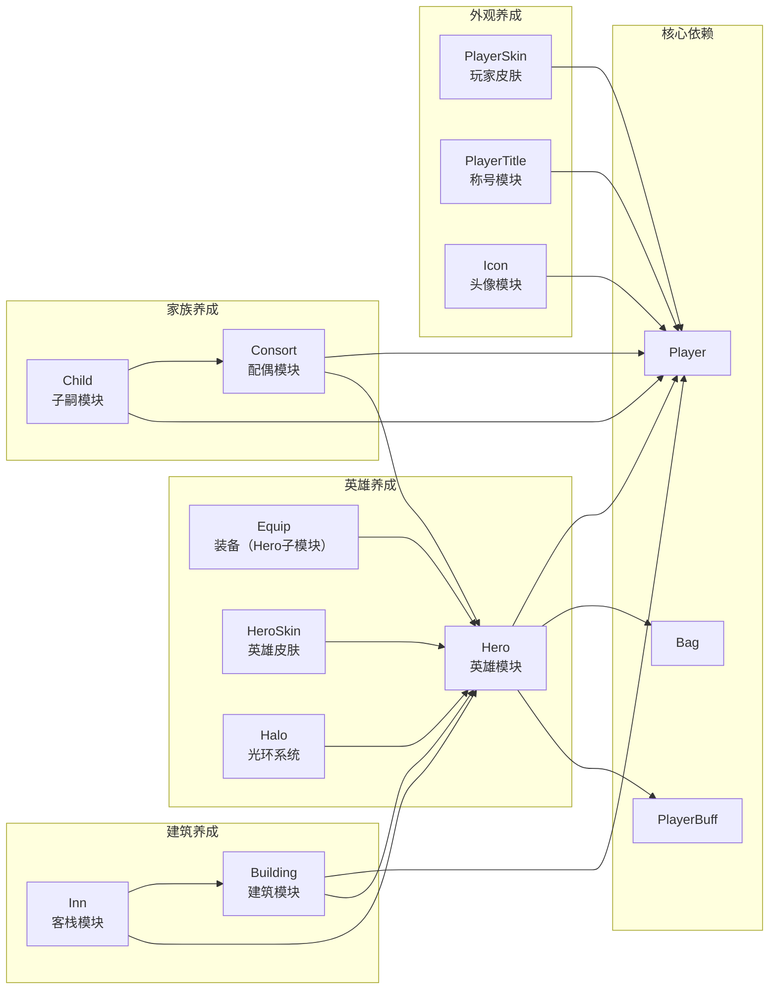
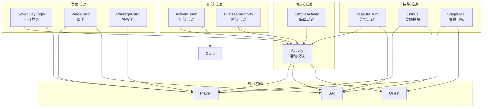
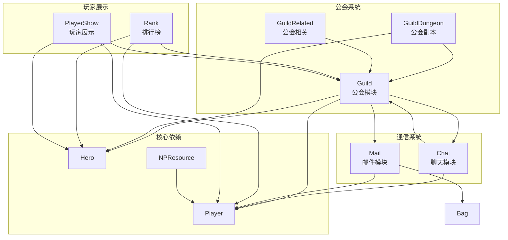
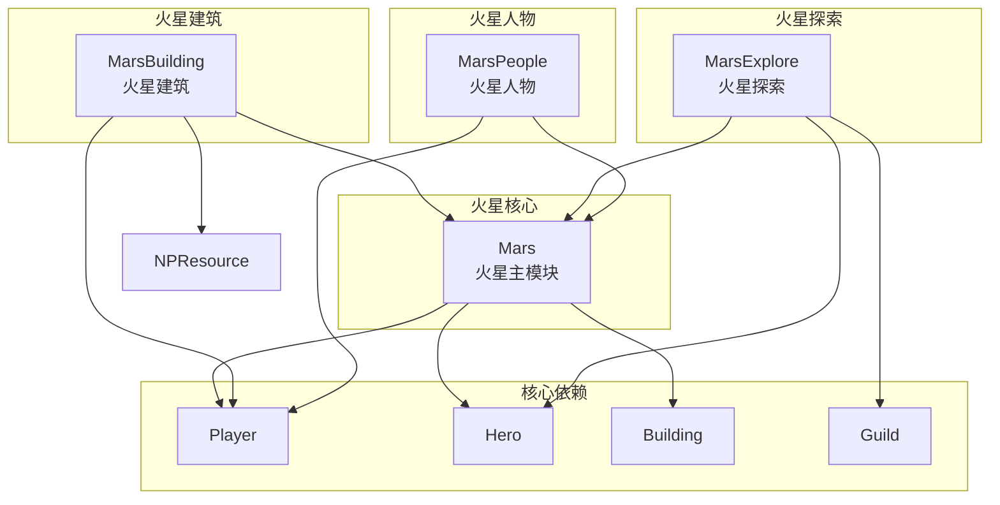
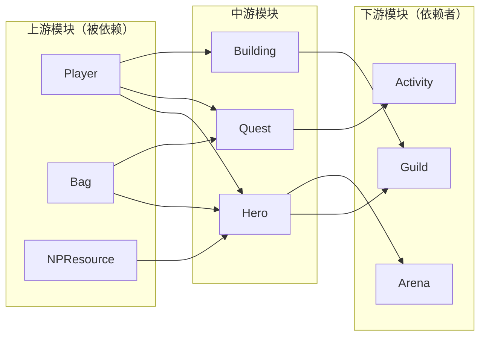
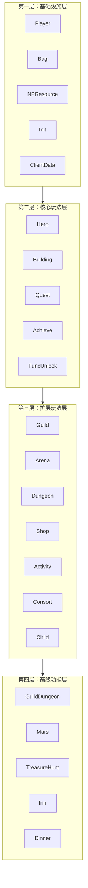
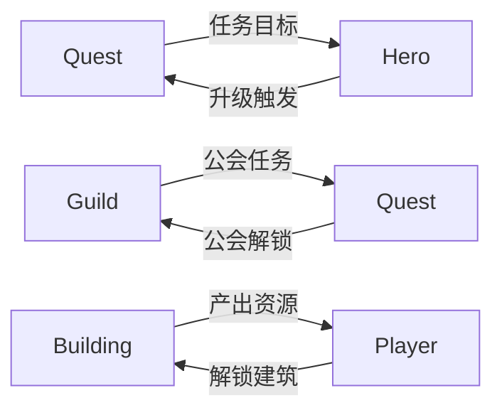

# K2C 游戏框架 - 模块依赖关系图

## 一、模块总览

K2C 游戏框架共包含 **49 个功能模块**，按功能可分为以下几类：

| 分类 | 模块 | 说明 |
|------|------|------|
| **核心基础** | Player, Bag, Init | 玩家基础数据、背包、初始化 |
| **养成系统** | Hero, Consort, Child, Building | 英雄、配偶、子嗣、建筑养成 |
| **社交系统** | Guild, Chat, Mail, Friend | 公会、聊天、邮件、好友 |
| **任务系统** | Quest, Achieve, StageGoal | 主线任务、成就、阶段目标 |
| **经济系统** | Shop, Recruit, Bonus | 商店、招募、奖励 |
| **活动系统** | Activity, SimpleActivity, SevenDayLogin, WeekCard | 各类活动模块 |
| **战斗系统** | Arena, Dungeon, GuildDungeon | 竞技场、副本、公会副本 |
| **资源系统** | NPResource, PlayerBuff, Rank | 资源管理、Buff、排行榜 |
| **特殊玩法** | Mars, MarsBuilding, MarsExplore, MarsPeople | 火星玩法系列 |
| **扩展功能** | Travel, Dinner, Inn, Museum, TreasureHunt | 旅行、宴席、客栈、博物馆、寻宝 |

---

## 二、模块依赖关系图

### 2.1 核心模块依赖关系

### 2.2 养成系统依赖关系

### 2.3 活动系统依赖关系

### 2.4 社交系统依赖关系

### 2.5 火星玩法系统依赖关系

---

## 三、模块依赖矩阵

### 3.1 核心依赖统计

| 模块 | 被依赖数 | 依赖模块数 | 核心程度 |
|------|----------|------------|----------|
| Player | 45+ | 0 | ⭐⭐⭐⭐⭐ 核心 |
| Bag | 30+ | 1 | ⭐⭐⭐⭐⭐ 核心 |
| Hero | 20+ | 3 | ⭐⭐⭐⭐ 重要 |
| Quest | 15+ | 5 | ⭐⭐⭐⭐ 重要 |
| Guild | 12+ | 4 | ⭐⭐⭐ 中等 |
| NPResource | 15+ | 1 | ⭐⭐⭐⭐ 重要 |
| Mail | 8+ | 2 | ⭐⭐⭐ 中等 |
| Chat | 6+ | 2 | ⭐⭐⭐ 中等 |
| Building | 8+ | 2 | ⭐⭐⭐ 中等 |
| Activity | 10+ | 3 | ⭐⭐⭐ 中等 |

### 3.2 依赖方向说明

---

## 四、模块分层架构

### 4.1 四层架构图

### 4.2 层级职责说明

| 层级 | 职责 | 模块特点 |
|------|------|----------|
| **基础设施层** | 提供基础数据存储和管理 | 被所有上层模块依赖，修改影响面大 |
| **核心玩法层** | 实现游戏核心养成循环 | 依赖基础层，被扩展层依赖 |
| **扩展玩法层** | 提供丰富的游戏内容 | 依赖核心层，功能相对独立 |
| **高级功能层** | 复杂系统组合和特殊玩法 | 依赖多层，功能高度集成 |

---

## 五、循环依赖检测

### 5.1 检测结果

经分析，以下模块存在潜在循环依赖：

### 5.2 解决方案

上述循环依赖通过以下方式避免实际循环：

1. **事件驱动**：使用事件系统解耦，模块间通过事件通信而非直接调用
2. **接口隔离**：定义清晰的接口边界，避免交叉调用
3. **延迟处理**：使用异步处理机制，打破调用链

---

## 六、模块独立性评估

### 6.1 高独立性模块

| 模块 | 独立性 | 说明 |
|------|--------|------|
| Travel | ★★★★★ | 旅行模块，仅依赖 Player |
| Dinner | ★★★★★ | 宴席模块，仅依赖 Player、Hero |
| Museum | ★★★★☆ | 博物馆模块，依赖较少 |
| TreasureHunt | ★★★★☆ | 寻宝模块，依赖较少 |
| Rank | ★★★★☆ | 排行榜模块，只读依赖 |

### 6.2 高耦合模块

| 模块 | 耦合度 | 主要耦合对象 |
|------|--------|--------------|
| Guild | ★★★★★ | Chat, Mail, Hero, Player, Quest |
| Activity | ★★★★☆ | Player, Bag, Quest, Guild |
| Mars | ★★★★☆ | Player, Hero, Building, Guild |
| Quest | ★★★★☆ | Player, Bag, Hero, Building, Guild |

---

*文档生成时间: 2026-04-11*
