# K2C 游戏框架状态机汇总

## 一、玩家相关状态机

### 1.1 玩家账号状态机

**所属模块**：Player

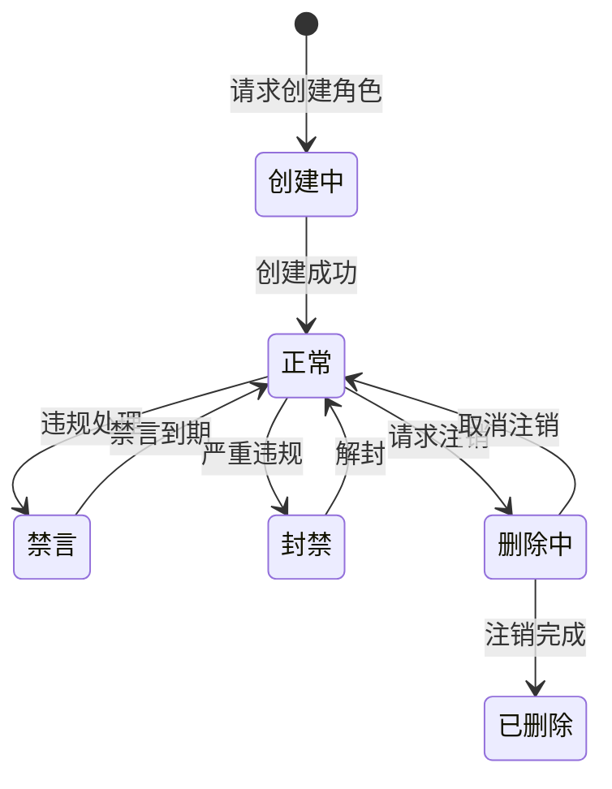

**状态说明**：

| 状态 | 说明 | 允许操作 |
|------|------|----------|
| 创建中 | 角色创建过程 | 无 |
| 正常 | 可正常游戏 | 所有操作 |
| 禁言 | 禁止聊天 | 除聊天外所有操作 |
| 封禁 | 无法登录 | 无 |
| 删除中 | 注销等待期 | 取消删除 |
| 已删除 | 数据已清除 | 无 |

**文档链接**：[Module_Player/06_实现细节.md](./Module_Player/06_实现细节.md)

---

### 1.2 玩家等级状态机

**所属模块**：Player

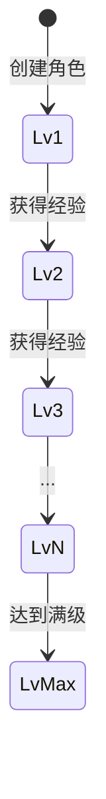

**状态说明**：
- 每个等级可能解锁新功能或玩法
- 满级后经验仍可获取但不再升级
- 最高等级：100级

**文档链接**：[Module_Player/06_实现细节.md](./Module_Player/06_实现细节.md)

---

## 二、英雄相关状态机

### 2.1 英雄状态机

**所属模块**：Hero

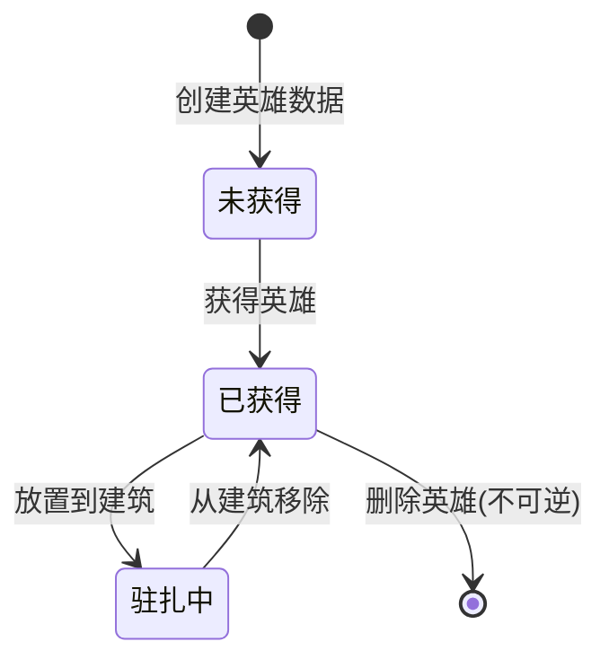

**状态说明**：

| 状态 | 说明 | 可执行操作 |
|------|------|------------|
| 未获得 | 数据存在但玩家未获取 | 无 |
| 已获得 | 英雄在玩家阵容中 | 升级、突破、觉醒、穿戴装备 |
| 驻扎中 | 英雄在建筑中工作 | 所有已获得操作 + 额外产出加成 |

**文档链接**：[Module_Hero/06_实现细节.md](./Module_Hero/06_实现细节.md)

---

### 2.2 英雄等级状态机

**所属模块**：Hero

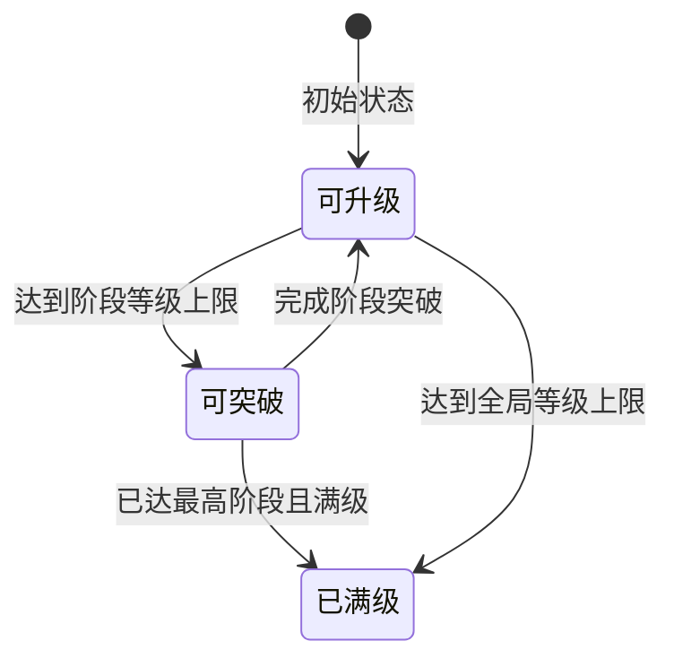

**状态说明**：

| 状态 | 说明 | 触发条件 |
|------|------|----------|
| 可升级 | 可以消耗资源升级 | 正常状态 |
| 可突破 | 需要突破才能继续升级 | level = 阶段上限 |
| 已满级 | 无法继续提升等级 | 达到最高等级 |

**文档链接**：[Module_Hero/06_实现细节.md](./Module_Hero/06_实现细节.md)

---

### 2.3 英雄觉醒状态机

**所属模块**：Hero

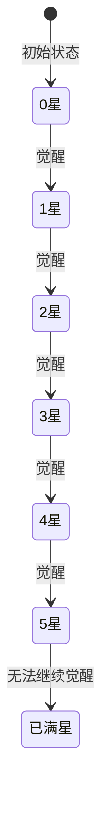

**状态说明**：
- 觉醒需要消耗特定材料
- 特定星级解锁觉醒技能
- 最高星级：5星

**文档链接**：[Module_Hero/06_实现细节.md](./Module_Hero/06_实现细节.md)

---

### 2.4 装备状态机

**所属模块**：Hero

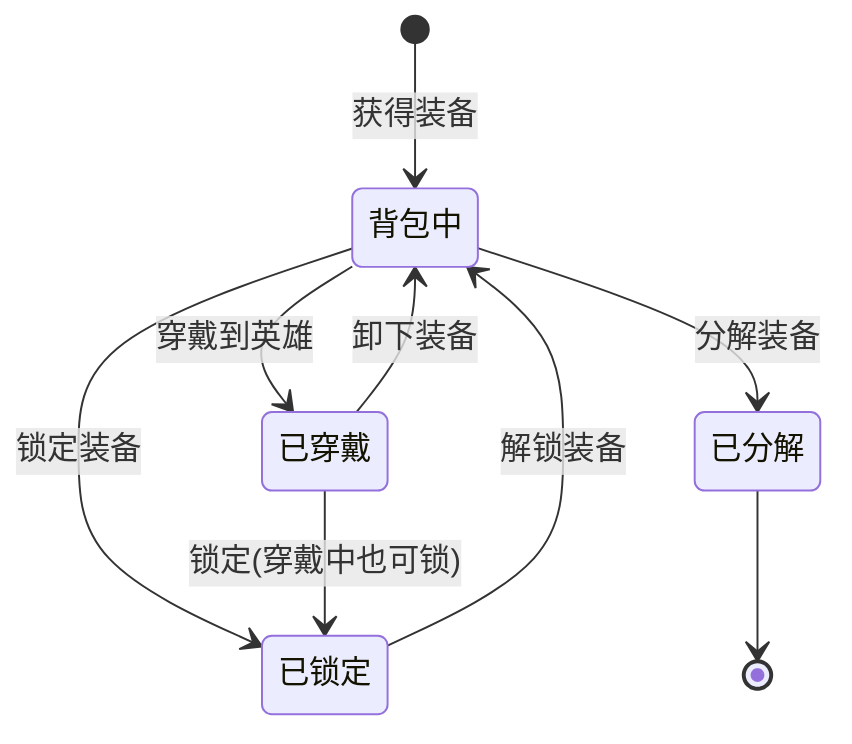

**状态说明**：

| 状态 | 说明 | 特性 |
|------|------|------|
| 背包中 | 装备在背包中 | 可穿戴、分解、锁定 |
| 已穿戴 | 装备在英雄身上 | 提供属性加成 |
| 已锁定 | 装备被锁定 | 无法分解，可穿戴/卸下 |
| 已分解 | 装备已分解 | 转化为材料 |

**文档链接**：[Module_Hero/06_实现细节.md](./Module_Hero/06_实现细节.md)

---

## 三、任务相关状态机

### 3.1 主线任务状态机

**所属模块**：Quest

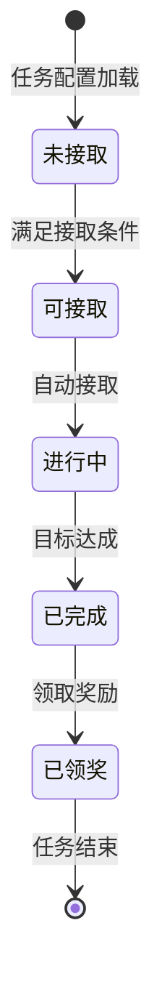

**状态说明**：

| 状态 | 说明 | 触发条件 |
|------|------|----------|
| 未接取 | 前置条件不满足 | 等级不足/前置任务未完成 |
| 可接取 | 可以接取任务 | 条件已满足 |
| 进行中 | 任务正在进行 | 已接取 |
| 已完成 | 目标已达成 | 进度达标 |
| 已领奖 | 奖励已领取 | 点击领取 |

**文档链接**：[Module_Quest/06_实现细节.md](./Module_Quest/06_实现细节.md)

---

### 3.2 日常任务状态机

**所属模块**：Quest

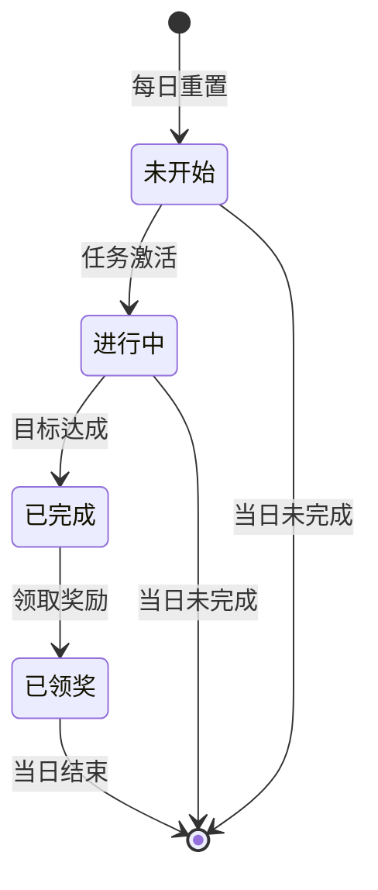

**状态说明**：
- 每日凌晨5点重置
- 未完成的任务次日重新开始
- 完成的任务计入活跃度

**文档链接**：[Module_Quest/06_实现细节.md](./Module_Quest/06_实现细节.md)

---

### 3.3 成就任务状态机

**所属模块**：Quest

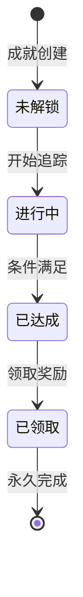

**状态说明**：
- 成就进度永久保存
- 不会重置
- 达成后可随时领取奖励

**文档链接**：[Module_Quest/06_实现细节.md](./Module_Quest/06_实现细节.md)

---

## 四、公会相关状态机

### 4.1 公会状态机

**所属模块**：Guild

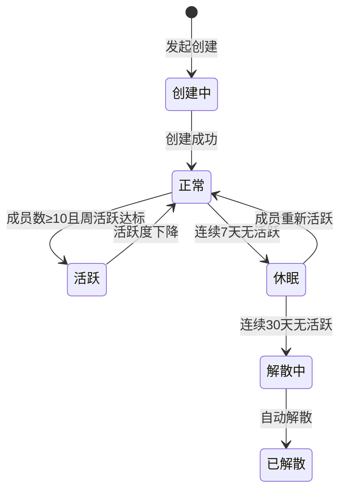

**状态说明**：

| 状态 | 说明 | 特性 |
|------|------|------|
| 正常 | 正常运营 | 全部功能可用 |
| 活跃 | 活跃公会 | 额外加成、特殊玩法 |
| 休眠 | 活跃度低 | 功能受限、无法招募 |
| 解散中 | 即将解散 | 提醒成员 |
| 已解散 | 公会消失 | 成员自动退出 |

**文档链接**：[Module_Guild/06_实现细节.md](./Module_Guild/06_实现细节.md)

---

### 4.2 公会成员状态机

**所属模块**：Guild

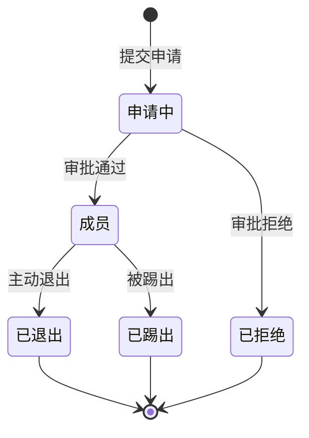

**状态说明**：

| 状态 | 说明 | 后续操作 |
|------|------|----------|
| 申请中 | 等待审批 | 可取消申请 |
| 成员 | 已加入公会 | 可参与公会活动 |
| 已退出 | 主动退出 | 24小时冷却后可加入其他公会 |
| 已踢出 | 被管理员踢出 | 同样有冷却时间 |

**文档链接**：[Module_Guild/06_实现细节.md](./Module_Guild/06_实现细节.md)

---

### 4.3 公会职位状态机

**所属模块**：Guild

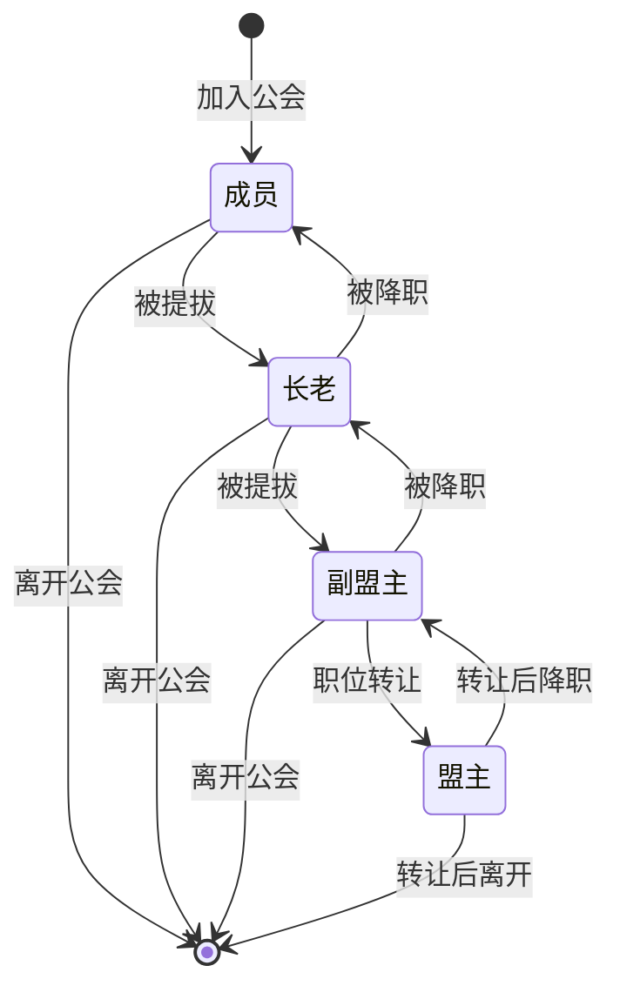

**职位权限**：

| 职位 | 人数限制 | 主要权限 |
|------|----------|----------|
| 盟主 | 1人 | 全部权限 |
| 副盟主 | 2人 | 审批、踢人、公告 |
| 长老 | 5人 | 审批、公告 |
| 成员 | 不限 | 基本权限 |

**文档链接**：[Module_Guild/06_实现细节.md](./Module_Guild/06_实现细节.md)

---

### 4.4 公会副本状态机

**所属模块**：Guild

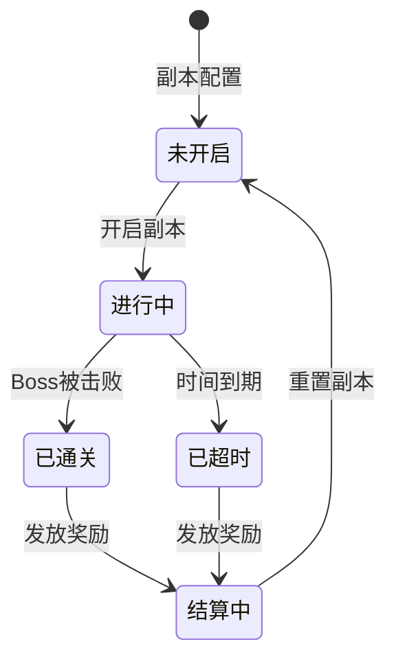

**状态说明**：

| 状态 | 说明 | 持续时间 |
|------|------|----------|
| 未开启 | 等待开启 | 无限制 |
| 进行中 | 可挑战 | 通常7天 |
| 已通关 | Boss被击败 | 等待结算 |
| 已超时 | 时间到未通关 | 等待结算 |
| 结算中 | 发放奖励 | 即时 |

**文档链接**：[Module_Guild/06_实现细节.md](./Module_Guild/06_实现细节.md)

---

## 五、状态机索引表

| 状态机名称 | 所属模块 | 状态数量 | 主要用途 |
|------------|----------|----------|----------|
| 玩家账号状态机 | Player | 6 | 账号状态管理 |
| 玩家等级状态机 | Player | 100+ | 等级进程管理 |
| 英雄状态机 | Hero | 3 | 英雄生命周期 |
| 英雄等级状态机 | Hero | 3 | 升级/突破状态 |
| 英雄觉醒状态机 | Hero | 7 | 觉醒星级管理 |
| 装备状态机 | Hero | 5 | 装备生命周期 |
| 主线任务状态机 | Quest | 6 | 任务流程管理 |
| 日常任务状态机 | Quest | 5 | 每日任务管理 |
| 成就任务状态机 | Quest | 5 | 成就系统管理 |
| 公会状态机 | Guild | 6 | 公会生命周期 |
| 公会成员状态机 | Guild | 5 | 成员状态管理 |
| 公会职位状态机 | Guild | 4 | 职位权限管理 |
| 公会副本状态机 | Guild | 6 | 副本周期管理 |

---

*文档生成时间: 2026-04-06*
